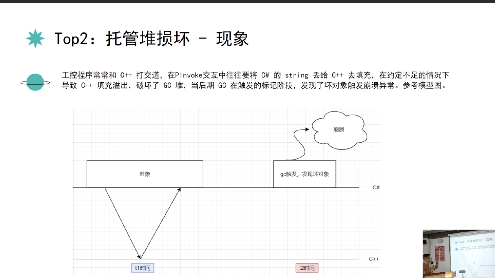
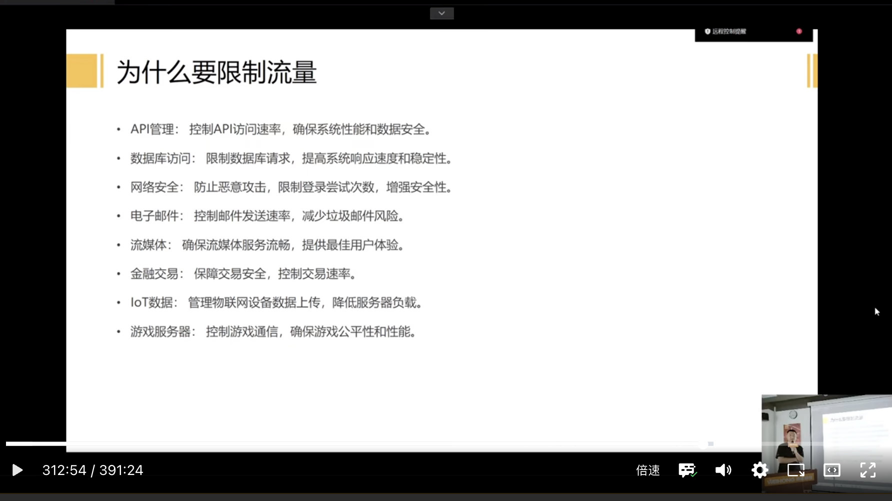
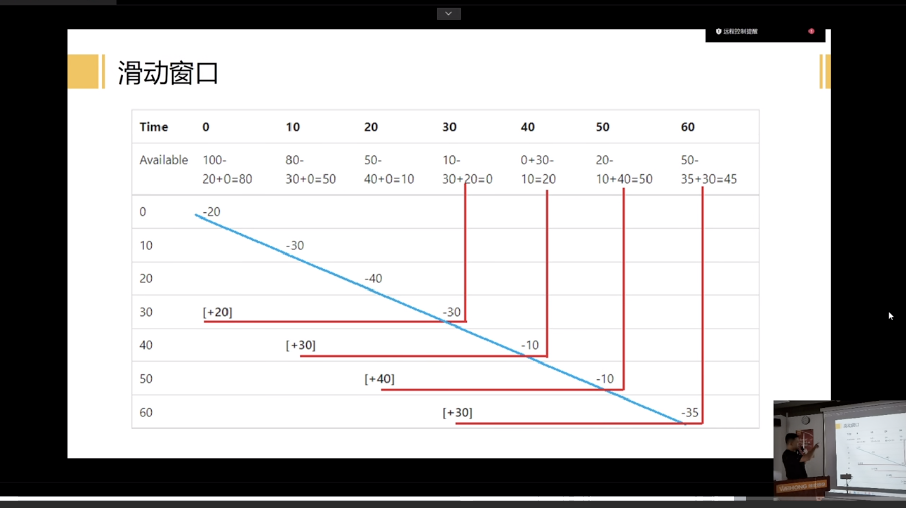

@[TOC](目录)

> 笔记总结
> 

# 一.Bootstrap Blazor UI组件库企业级应用介绍
## 1.Blazor是什么
> Blazor是一种.NET前端WEB框架，在单个编程模型中同时支持服务器端呈现和客户端交互性：
> * 使用C#创建丰富的交互式UI。
> * 共享使用.NET编写的服务器端和客户端应用逻辑。
> * 将UI呈现为HTML和CSS，以支持众多浏览器，其中包括移动浏览器。
> * 使用.NET和Blazor生成混合桌面和移动应用。

> 使用.NET进行客户端Web开发可提供以下优势：
> * 使用C#编写代码，这可以提高应用开发和维护的效率。
> * 利用现有的.NET库生态系统。
> * 受益于.NET的性能、可靠性和安全性。

> Blazor入门需要有前端知识储备：
> * 可以对组件进行简单或复杂的封装。
> * 可自行更改样式CSS。
> * 可以根据需要编写JavaScript。

## 2.为什么要用Blazor

> 为什么要用Blazor：
> * 数据和UI分离。
> * UI可复用性。
> * 业务逻辑剥离。
> * 单元测试。

## 3.Bootstrap Blazor是什么

> * 是基于Bootstrap样式的一套开源免费的Blazor组件库。
> * 不是快速开发框架。 
> * 网址为：https://www.blazor.zone。

> 1. Bootstrap Blazor团队由六名热爱开源的技术达人组成，其中有四名微软最有价值专家(Microsoft MVP)。
> 2. 成立了大约2000人的Blazor中文社区积极响应。
> 3. 组件库内置149个组件，一些公司的项目均在重度使用，大多数组件都是在实际项目中提炼出来，非常符合国人操作习惯，大大节约开发时间。
> 4. 版本更新频率：每天都有Beta版本；每周都有新版本发布；每月都有大版本更新。
# 二.使用WebAssembly运行、扩展.NET应用程序
## 1.WebAssembly简介
> WebAssembly，被许多开发者誉为Web开发的下一次革命。但为什么会有这样的说法呢？
## 2.WebAssembly的起源
> WebAssembly的起源可以追溯到为Web设计的各种尝试，这些尝试旨在超越传统的JavaScript性能。随着Web应用程序变得越来越复杂，对于更高的性能和更多的功能需求也随之增加。WebAssembly应运而生，作为一个全新的编程模型，它旨在满足这些需求。
## 3.为什么选择二进制格式？
> 与传统的文本格式（如JavaScript）相比，二进制格式有许多优势。首先，它的大小更小，这意味着加载时间更短。其次，二进制格式可以更快地被解码和执行。这为Web应用程序带来了前所未有的性能提升。
## 4.WebAssembly与传统JavaScript的对比
> 当我们谈论WebAssembly时，一个常见的问题是：“它会替代JavaScript吗？”答案是：不会。WebAssembly和JavaScript是互补的，而不是竞争关系。
## 5.执行速度
> 由于WebAssembly是静态类型的，并且使用二进制格式，它的执行速度通常比JavaScript更快。这对于需要大量计算的应用程序，如游戏或数据可视化工具，尤为重要。
## 6.语言选择
> JavaScript长久以来一直是Web开发的唯一选择。但是，有了WebAssembly，开发者现在可以使用其他语言，如C、C++或Rust。这为开发者提供了更多的灵活性，允许他们选择最适合特定任务的工具。
## 7.与现有技术的集成
> 尽管WebAssembly提供了许多新的功能，但它仍然可以与现有的Web技术无缝集成。例如，你可以在同一个应用程序中同时使用WebAssembly和JavaScript。
## 8.WebAssembly在前端开发中的优势
> WebAssembly的出现并不是为了取代JavaScript，而是为了与其协同工作，提供更多的功能和性能优势。那么，WebAssembly为前端开发带来了哪些具体的优势呢？
## 9.性能提升
> WebAssembly的最大优势之一是其出色的性能。由于其二进制格式和静态类型，Wasm代码的执行速度通常远远超过纯JavaScript代码。这使得WebAssembly非常适合运行计算密集型任务，如3D渲染、物理模拟或复杂的算法。
## 10.更广泛的语言支持
> 过去，Web开发者只能使用JavaScript。但现在，有了WebAssembly，开发者可以使用C、C++、Rust等多种语言进行Web开发。这为开发者打开了新的大门，允许他们利用其他语言的优势。
## 11.增强的安全性
> WebAssembly在一个受限的沙盒环境中运行，这为Web应用程序提供了额外的安全层。Wasm模块在执行前会进行验证，确保它们不会执行任何危险的操作。
## 12.与现有Web技术的无缝集成
> WebAssembly不是一个孤立的技术。它可以与现有的Web技术，如JavaScript、HTML和CSS无缝集成。这意味着开发者可以在他们的应用程序中混合使用Wasm和JS，从而获得两者的优势。
## 13. 如何开始使用WebAssembly 
> 对于那些希望开始使用WebAssembly的开发者，以下是一些基本的步骤和建议。
>
> 1. 选择合适的语言和工具
> 首先，你需要选择一个支持WebAssembly的语言。目前，C、C++和Rust是最受欢迎的选择。然后，你需要一个编译器，如Emscripten或Rust的wasm-bindgen，将你的代码编译为Wasm格式。
>2. 编写和编译代码
> 一旦你选择了语言和工具，就可以开始编写代码了。编写Wasm代码与编写其他类型的代码非常相似。当你完成代码编写后，可以使用编译器将其编译为Wasm格式。
>3.  在Web页面中加载和执行Wasm代码
> 加载和执行Wasm代码与加载和执行JS代码非常相似。你可以使用WebAssembly JavaScript API来加载和实例化Wasm模块，然后在你的Web页面中调用它。
## 14.WebAssembly的未来展望
> 随着WebAssembly的普及和发展，它在Web开发领域的影响力也在逐渐增强。那么，我们可以期待WebAssembly在未来会带来哪些变化和创新呢？
## 15.更丰富的API支持
> 当前，WebAssembly主要关注于性能优化和与JavaScript的互操作性。但随着时间的推移，我们可以期待更多的Web
> API将直接在WebAssembly中可用，这将进一步扩展其在Web开发中的应用范围。
## 16.多线程和并发
> 多线程是现代编程中的一个关键特性，它允许程序同时执行多个任务。WebAssembly的未来版本可能会增加对多线程的支持，从而为Web应用程序带来更高的并发性和响应性。
## 17.更好的垃圾回收
> 虽然WebAssembly目前不直接支持垃圾回收，但这是其未来发展的一个关键方向。通过与JavaScript的垃圾回收器集成，WebAssembly可以更有效地管理内存，减少浪费，并提高应用程序的性能。
## 18.更广泛的社区支持
> 随着更多的开发者和公司开始采用WebAssembly，我们可以预见到一个更加活跃和多样化的社区将围绕它形成。这将导致更多的工具、框架和资源的出现，进一步推动WebAssembly的发展和普及。
## 19.与物联网和边缘计算的结合
> WebAssembly的轻量级和高性能特性使其非常适合物联网（IoT）和边缘计算场景。在未来，我们可能会看到更多的IoT设备和边缘服务器使用WebAssembly来运行应用程序和服务。
## 20.结论
> WebAssembly为Web开发打开了新的大门，提供了前所未有的性能和功能。随着其不断的发展和普及，它将继续塑造Web的未来，为开发者和用户带来更多的可能性和机会。
# 三.使用Avalonia UI打造高性能跨平台应用

> Avalonia UI是是.NET和XAML的开源跨平台UI框架，支持 Windows、Linux、iOS 和 Android，与Net其他UI框架相比，如WPF（Windows平台）、MAUI跨平台控件（Android、iOS、macOS 和 Windows），主要优势是支持Linux。在国产化的需求下，对于C#开发的程序员，Avalonia适合用来开发Linux的桌面客户端。

> 更多可下载案例编写Demo体验Avalonia，交流群：

# 四.NET高级调试趣事和经验分享
## 1.NET程序故障鸟瞰
> 1 .NET市场份额：
> 

> 2. 故障分类
> 

## 2.程序员的内心独白

## 3.工控常见故障分析

## 4.调试工具之倚天屠龙

# 五.NET限流、监控与网关技术在企业中的应用与价值
## 1.限流

## 2.监控

## 3.网关

