@[TOC](目录)

> CSS基础知识学习。
> 


## 1.CSS简介
### 1.什么是CSS

> CSS是一组样式设置的规则，用于控制页面的外观样式.
### 2.为什么使用CSS
> 1. 实现内容与样式的分离，便于团队开发。
> 
> 2. 样式复用，便于网站的后期维护。
> 
> 3. 页面的精确控制，让页面更精美。
### 3.CSS作用
> 1. 页面外观美化。
> 2. 布局和定位。
## 2.基本用法
### 1.CSS语法
```html
<head>
	<style>
		选择器{
			属性名：属性值;
			属性名：属性值;
		}
	</style>
</head>
```

> 1. 选择器：要修饰的对象（东西）。
> 2. 属性名：修饰对象的哪一个属性（样式）。
> 3. 属性值：样式的取值。

> 例如：

```html
<!DOCTYPE html>
<html lang="en">
    <head>
        <meta charset="UTF-8">
        <title>Document</title>
        <style>
            p{
                color: red;
                background: #cccccc;
            }
            h2{
                color: blue;
            }
        </style>
    </head>
    <body>
        <p>CSS从入门到精通</p>
        <h2>摸鱼</h2>
    </body>
</html>
```

> 运行结果：
> 
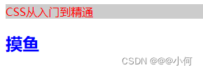
### 2.CSS应用方式
> 有三种方式：内部样式、行内样式、外部样式。
#### 1. 内部样式
> 也称为内嵌样式，在页面头部通过style标签定义。对当前页面中所有符合样式选择器的标签都起作用。
> 行内样式举例：

```html
<!DOCTYPE html>
<html lang="en">
    <head>
        <meta charset="UTF-8">
        <title>Document</title>
        <style>
            p{
                color: red;
                background: #cccccc;
            }
            h2{
                color: blue;
            }
        </style>
    </head>
    <body>
        <p>CSS从入门到精通</p>
        <h2>摸鱼</h2>
    </body>
</html>
```
#### 2.行内样式

> 也称为嵌入样式，使用HTML标签的style属性定义。只对设置style属性的标签起作用。
行内样式举例：
```html
<!DOCTYPE html>
<html lang="en">
    <head>
        <meta charset="UTF-8">
        <title>Document</title>
    </head>
    <body>
        <p style="color: rgb(34, 33, 33);">CSS从入门到精通</p>
        <h2 style="color: blue;">摸鱼</h2>
    </body>
</html>
```
#### 3.外部样式
> 使用单独的 .CSS 文件定义，然后在页面中使用 link标签 或 @import指令 引入。
##### 1.使用 link标签 链接外部样式文件
```html
<link rel="stylesheet" type="text/css" href="CSS样式文件的路径">
```
> 提示：type属性可以省略
##### 2.@import 指令 导入外部样式文件
```html
<style>
	@import "CSS样式文件路径";
	@import url(CSS样式文件路径);
</style>
```
##### 3.使用举例
```html
<!DOCTYPE html>
<html lang="en">
<head>
	<meta charset="UTF-8">
	<title>Document</title>
	<!-- <link rel="stylesheet" type="text/css" href="style/hello.css"> -->
	<style>
		@import url(style/hello.css);
	</style>
</head>
<body>
	<p>welcome to CSS!</p>
	<p>欢迎来到CSS课堂!</p>
	<hr>
	<h2 style="color:red;">WEB前段工程师</h2>
	<h2>JAVA开发工程师</h2>
	<hr>
	<div>嘿嘿</div>
	<div>哈哈</div>
</body>
</html>
```
## 3.选择器
### 1.基础选择器
#### 1.标签选择器

> 也称为元素选择器，使用HTML标签作为选择器的名称。以标签名作为样式应用的依据。
#### 2.类选择器
> 使用自定义的名称，以 . 号作为前缀，然后再通过HTML标签的class属性调用类选择器。
> 以标签的class属性作为样式应用的依据。

> 注意事项：
> 
> 1. 调用时不能添加 . 号 。
> 2. 同时调用多个类选择器时,以 空格 分隔 。
> 3. 类选择器名称不能以 数字 开头。
#### 3.ID选择器
> 使用自定义名称，以 # 作为前缀，然后通过HTML标签的id属性进行名称匹配。
> 
> 以标签的id属性作为样式应用的依据，一对一的关系。
#### 4.使用举例
```html
<!DOCTYPE html>
<html lang="en">
<head>
	<meta charset="UTF-8">
	<title>Document</title>
	<style>
		p{
			color:red;
			font-size:20px;
		}
		h2{
			color:yellow;
		}
		.hello{
			background: #cccccc;
		}
		.world{
			font-weight:bold;
		}
		#haha{
			color:blue;
		}
	</style>
</head>
<body>
	<p>welcome to css!</p>
	<p>hello world!</p>
	<hr>
	<p class="hello">welcome to css!</p>
	<p>hello world!</p>
	<h2>前端开发</h2>
	<h3>后端开发</h3>
	<div class="hello">张三</div>
	<div class="world">李四</div>
	<hr>
	<h1 id="haha">哈哈</h1>
</body>
</html>
```
> 运行结果：
> 
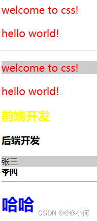
### 2.复杂选择器
#### 1.复合选择器
> 标签选择器和类选择器、标签选择器和ID选择器，一起使用。
> 
> 必须同时满足两个条件才能应用样式。
#### 2.组合选择器
> 也称为集体声明。
>  将多个具有相同样式的选择器放在一起声明，使用逗号隔开。
#### 3.嵌套选择器
> 在某个选择器内部再设置选择器，通过空格隔开。
> 
> 只有满足层次关系最里层的选择器所对应的标签才会应用样式。
> 
> 注意：使用 空格 时不区分父子还是后代，使用CSS3中新增的 > 时必须是父子关系才行。

#### 4.使用举例

```html
<!DOCTYPE html>
<html lang="en">
<head>
	<meta charset="UTF-8">
	<title>Document</title>
	<style>
		/* 1.标签选择器和类选择器合起来使用----复合选择器 */
		h1.aaa{
			color:red;
		}
		/* 1.标签选择器和ID选择器合起来使用----复合选择器 */
		p#bbb{
			color:blue;
		}
		/* 2.组合选择器 */
		h1,p,div,span,.ccc{
			font-size:30px;
		}
		div{
			background:violet;
		}
		.ccc{
			font-weight:bold;
		}
		/* 3.嵌套选择器 */
		/* div p{
			color:green;
			text-decoration:underline;
		} */
		div>p{
			color:green;
			text-decoration:underline;
		}
		div h3.ddd{
			color:red;
		}
	</style>
</head>
<body>
	<!-- 需求：只想修饰class属性为aaa的h1标签 -->
	<h1 class="aaa">welcome</h1>
	<h4 class="aaa">css</h4>
	<h1>hello</h1>
	<hr>
	<!-- 我要修饰ID属性为bbb的p标签 -->
	<p id="bbb">world</p >
	<p>html</p>
	<hr>
	<!-- 给h1、p、div、span标签中的内容设置字号为30px -->
	<h1>hello</h1>
	<p>CSS</p>
	<div>WEB开发</div>
	<span class="ccc">JAVA开发</span>
	<hr>
	<!-- 需求：修饰div内部的p标签 -->
	<div>
		<p>div内部的p标签</p>
		<h3>div内部的h3标签</h3>
	</div>
	<hr>
	<div>
		<h3>
			<p>div内部的h3内部的p标签</p>
		</h3>
	</div>
	<hr>
	<!-- 需求：修饰div内部的class为ddd的标签 -->
	<div>
		<p>div内部的p</p>
		<h3 class="ddd">div内部的h3</h3>
		<p class="ddd">PPPP</p>
	</div>
	<h3 class="ddd">h3h3h3</h3>
</body>
</html>
```

> 运行结果：

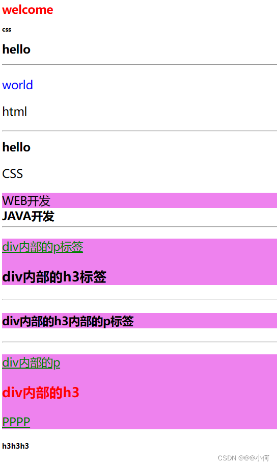
#### 5.伪类选择器

> 根据不同的状态显示不同的样式，一般多用于标签。

> 四种状态：
> 
> :link 未访问的链接 。
> :visited 已访问的链接。
>  :hover 鼠标悬浮到连接上，即移动在连接上。
>   :active 选定的链接，被激活。

> 注：默认超链接为：蓝色、下划线。

```html
<!DOCTYPE html>
<html lang="en">
<head>
	<meta charset="UTF-8">
	<title>伪类选择器</title>
	<style>
		/*a:link{
			font-size: 12px;
			color:black;
			text-decoration: none;
		}
		a:visited{
			font-size: 15px;
			color:;
		}
		a:hover{
			font-size: 20px;
			color:blue;
		}
		a:active{
			font-size: 40px;
			color:green;
		}*/
		a:link,a:visited{
			color:#666666;
			font-size: 13px;
			text-decoration: none;
		}
		a:hover,a:active{
			color:#ff7300;
			text-decoration: underline;
		}
		/*普通的标签也可以使用伪类选择器*/
		p:hover{
			color:red;
		}
		p:active{
			color:blue;
		}
	</style>
</head>
<body>
	<a href="复杂选择器.html">复杂选择器.html</a>
	<p>CSS从入门到精通！</p>
</body>
</html>
```
#### 6.伪元素选择器

> :first-letter 为第一个字符的样式。
:first-line 为第一行添加样式。
:before 在元素内容的最前面添加的内容，需要配合content属性使用。
:after 在元素内容的最后面添加的内容，需要配合content属性使用。

```html
<!DOCTYPE html>
<html lang="en">
<head>
	<meta charset="UTF-8">
	<title>Document</title>
	<style>
		p:first-letter{
			color:red;
			font-size:30px;
		}
		p:first-line{
			background:pink;
		}
		p:before{
			content:"嘿嘿";
		}
		p:after{
			content:"哈哈";
		}
	</style>
</head>
<body>
	<p>hello world!</p>
	<hr>
	<p>
		hello world! <br>
		welcome to css!
	</p>
</body>
</html>
```

> 运行结果：
> 
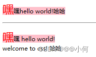
### 3.选择器优先级
#### 1.优先级
> 行内样式>ID选择器>类选择器>标签选择器。

> 
> 原因：首先加载标签选择器,再加载类选择器，然后加载ID选择器，最后加载行内样式。 后加载会覆盖先加载的同名样式。
#### 2.可以使用!important使某个样式有最高的优先级

## 4.常用CSS属性
### 1.字体属性
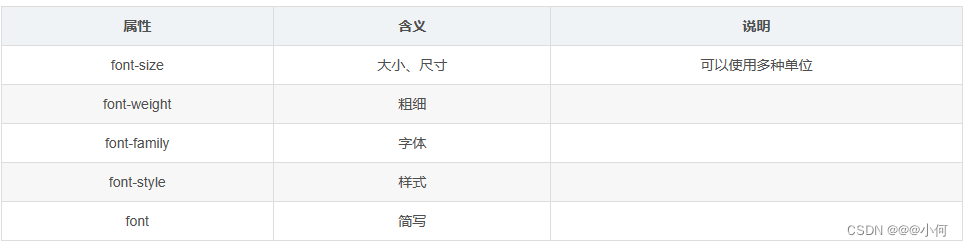

#### 1.font-size:大小、尺寸

> 取值：
>  1. inherited继承，默认从父标签继承字体大小（默认值），所有CSS属性的默认值都是inherited：
> 1. px像素 pixel。
> 2. %百分比，相对父标签字体大小的百分比。
> 3. em倍数，相对于父标签字体大小的倍数。
> 4. HTML根元素默认字体的大小为16px,也称为基础字体大小。
#### 2.font-weight:粗细
#### 3.font-family:字体
#### 4.font-style:样式
#### 5.font:组合
> 是font-style、font-weight、font-size、font-family的组合编写。
> 必须按照先后顺序来，顺序为：font-style、font-weight、font-size、font-family,例子如下：

```html
<!DOCTYPE html>
<html lang="en">
<head>
	<meta charset="UTF-8">
	<title>Document</title>
	<style>
		div{
			font-size: 30px;
		}
		p{
			/*font-size: 20px;*/
			font-size: 80%;
		}
		body{
			font-size: 62.5%;
		}
		ul li{
			/*font-size: 30px;
			font-weight: bold;
			font-family: 华文行楷,宋体,黑体;
			font-style: italic;*/
			font: italic bold 30px 微软雅黑;
		}
	</style>
</head>
<body>
	<p>
		CSS从入门到精通！
	</p>
	<hr>

	<div>
		我的DIV
		<p>
			CSS从入门到精通
		</p>
	</div>
	<hr>
	<hr>

	<ul>
		<li>
			嘿嘿
		</li>
	</ul>
</body>
</html>
```
### 2.文本属性
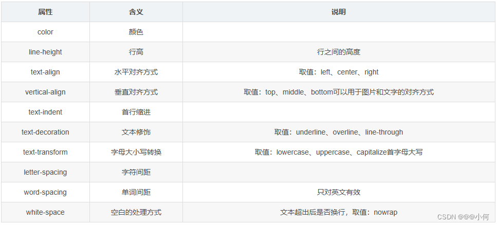
#### 1.使用举例

```html
<!DOCTYPE html>
<html lang="en">
<head>
	<meta charset="UTF-8">
	<title>Document</title>
	<style>
		p{
			color: red;
			/*background-color: #ccc;*/
			/*background-color: rgba(0,255,0,0.5);*/
			background-color: rgba(0, 237, 255, 0.5);
			line-height: 50px;
			text-align: center;
		}
		img{
			vertical-align: middle;
		}
		div{
			text-indent: 30px;
		}
		span{
			font-size: 30px;
			text-decoration: underline;
			text-transform: capitalize;
			letter-spacing: 10px;
			world-spacing:;
		}
		h3{
			width: 300px;
			height: 200px;
			background-color:#ccc;
			white-space: nowrap;
			overflow:hidden;
		}
	</style>
</head>
<body>
	<p>welcome to css!</p>
	<p>welcome to css!</p>
	<p>welcome to css!</p>
	<hr>

	
	HTML和CSS很简单吗？
	<hr>


	<div>&nbsp;&nbsp;welcome to CSS welcome to CSS welcome to CSS welcome to CSS welcome to CSS welcome to CSS welcome to CSS welcome to CSS welcome to CSS welcome to CSS welcome to CSS welcome to CSS welcome to CSS welcome to CSS welcome to CSS welcome to CSS welcome to CSS welcome to CSS welcome to CSS</div>
	<hr>
	<div>welcome to CSS welcome to CSS welcome to CSS welcome to CSS welcome to CSS welcome to CSS welcome to CSS welcome to CSS welcome to CSS welcome to CSS welcome to CSS welcome to CSS welcome to CSS welcome to CSS welcome to CSS welcome to CSS welcome to CSS welcome to CSS welcome to CSS</div>
	<hr>

	<span>hello world</span>
	<hr>

	<h3>welcome to CSS welcome to CSS welcome to CSS welcome to CSS welcome to CSS welcome to CSS welcome to CSS welcome to CSS welcome to CSS welcome to CSS welcome to CSS welcome to CSS welcome to CSS welcome to CSS welcome to CSS welcome to CSS welcome to CSS welcome to CSS welcome to CSS</h3>
	<hr>
</body>
</html>
```

> 运行结果：
> 
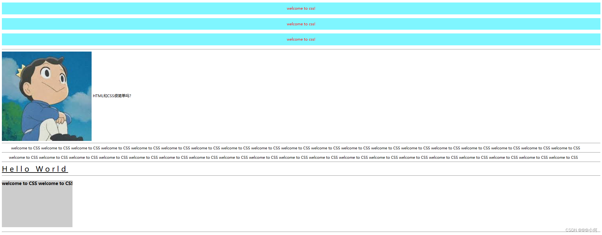
### 3.背景属性

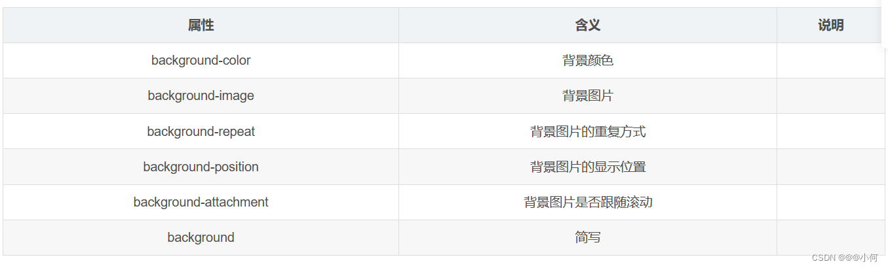
### 4.列表属性
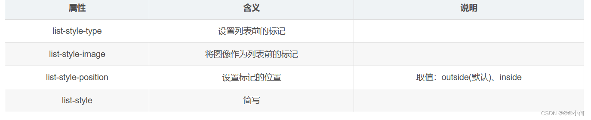
### 5.表格属性

> border-collapse:表格中相邻的边框是否合并（折叠）为单一边框。

```html
<!DOCTYPE html>
<html lang="en">
<head>
	<meta charset="UTF-8">
	<title>Document</title>
	<style>
		table{
			width:500px;
			border:1px solid blue;
			border-collapse:collapse;
		}
		td{
			border:1px solid blue;
		}
	</style>
</head>
<body>
	<!-- table>(tr>td{td$}*5)*4 -->
	<table cellspacing="0px"cellpadding="0px">
		<tr>
			<td>bbb</td>
			<td>aaa</td>
			<td>aaa</td>
			<td>td4</td>
			<td>td5</td>
		</tr>
		<tr>
			<td>aaa</td>
			<td>aaa</td>
			<td>bbb</td>
			<td>td4</td>
			<td>td5</td>
		</tr>
		<tr>
			<td>td1</td>
			<td>td2</td>
			<td>td3</td>
			<td>td4</td>
			<td>td5</td>
		</tr>
		<tr>
			<td>td1</td>
			<td>td2</td>
			<td>td3</td>
			<td>td4</td>
			<td>td5</td>
		</tr>
	</table>
</body>
</html>
```

> 运行结果：
> 
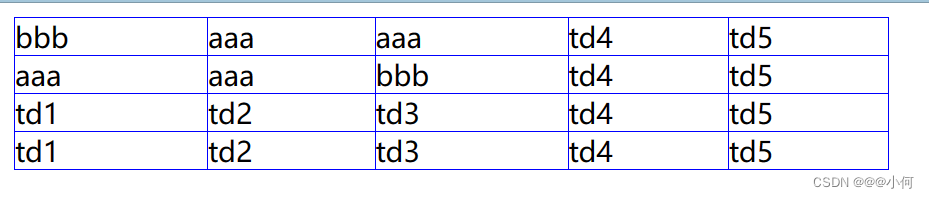
## 5.盒子模型
### 1.简介
> 盒子模型是网页布局的基础，将页面中所有元素都看作是一个盒子，盒子都包含以下几个属性：
> 
> 1. width 宽度。
>  2. height 高度 。
>  3. border 边框 。
>  4. padding 内边距。
>   5. margin 外边距。
### 2.border
> 表示盒子的边框。

> 分为四个方向： 上top、右right、下bottom、左left。
> border-top、border-right、border-bottom、border-left。

> 每个边框包含三种样式：
>  border-top-color、border-top-width、border-top-style
> border-right-color、border-right-width、border-right-style
> border-bottom-color、border-bottom-width、border-bottom-style
> border-left-color、border-left-width、border-left-style

> 样式style的取值：
> solid实线、dashed虚线、dotted点线、double双线、inset内嵌的3D线、outset外嵌的3D线。
### 3.padding
> 表示盒子的内边距，即内容与边框之间的距离。
> 
> 同样也分为四个方向，也可以简写（按顺时针方向，默认上下一样，左右一样）。
### 4.margin
> 表示盒子的外边距，即盒子与盒子之间的距离。
> 
> 同样也分为四个方向，也可以简写（按顺时针方向，默认上下一样，左右一样）。
## 6.定位方式
> 通过position属性实现对元素的定位，有四种定位方式。

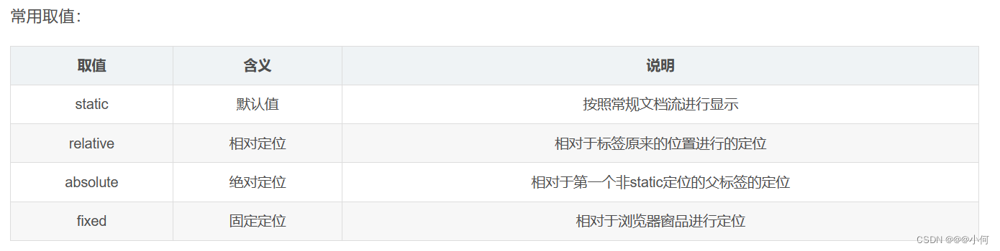

> 代码举例：

```html
<!DOCTYPE html>
<html lang="en">

<head>
    <meta charset="UTF-8">
    <title>Document</title>
    <style>

        /* id选择器 */
        #container {
            width: 800px;
            border: 2px solid #000000;
            position:relative;
        }
        /* 类选择器 */
        .div1,
        .div2,
        .div3,
        .div4 {
            width: 100px;
            height: 50px;
        }

        .div1 {
            background: red;
            position: relative;
            top: 20px;
            left: 50px;
            z-index: -5;
        }

        .div2 {
            background: blue;
            position: absolute;
            left: 100px;
            bottom: 50px;
            z-index: 100px;
        }

        .div3 {
            background: green;
            position: fixed;
            bottom: 50px;
            left: 100px;
        }

        .div4 {
            background: cyan;
        }
    </style>
</head>

<body>
    <div id="container">
        <div class="div1">div1</div>
        <div class="div2">div2</div>
        <div class="div3">div3</div>
        <div class="div4">div4</div>
    </div>
</body>

</html>
```

> 运行结果：
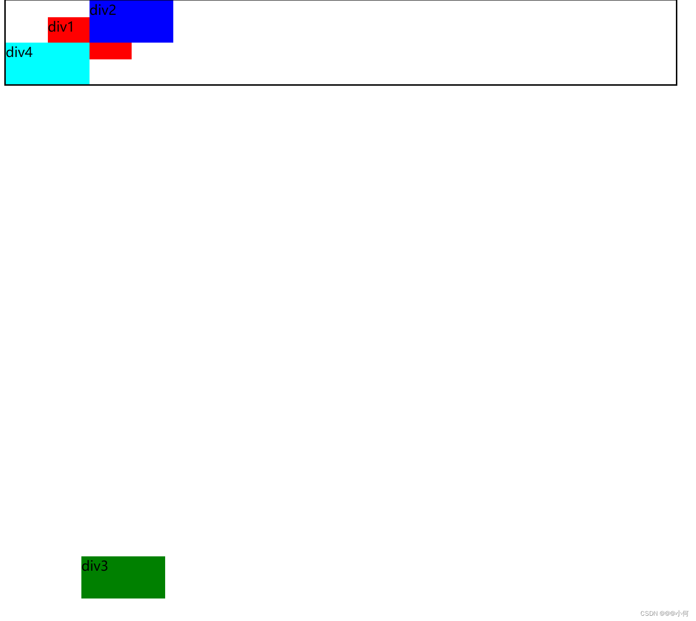
## 7.其他CSS属性
### 1.浮动属性和清除属性
>1.  通过float属性来实现元素的浮动，可以让块级元素脱离常规的文档流，向左或向右移动，在同一行显示，如果一行显示不下，则会换行显示。
> 2. 通过clear属性来实现清除，设置元素的哪一侧不允许有浮动元素。
### 2.元素的显示和隐藏
#### 1.display
> 通过display属性设置元素是否显示，以及是否独占一行。

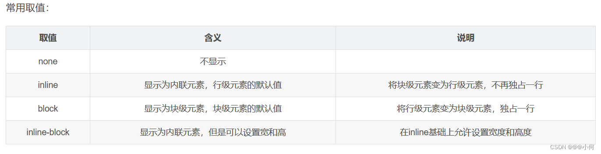
#### 2.visibility

> 也可以通过visibility属性设置元素的显示和隐藏。

> 常用属性：

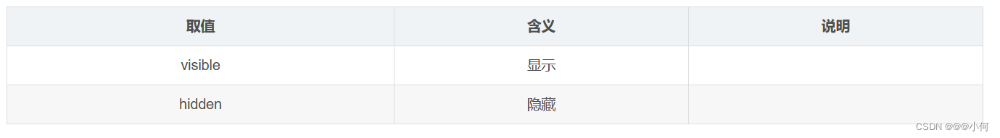
#### 3.display和display的区别

> 1. display隐藏时不再占据页面中的空间，后面的元素会占用其位置。
> 
> 2. visibility隐藏时会占据页面中的空间，位置还保留在页面中，只是不显示。
#### 4.代码举例

```html
<!DOCTYPE html>
<html lang="en">
    <head>
        <meta charset="UTF-8">
        <title>Document</title>
        <style>
            .div1{
                width:100px;
                height: 100px;
                background: blue;
                display: inline;
            }
            span{
                width: 100px;
                height: 100px;
                background: 50px;
                display: inline-block;
            }
            i{
                display: block;
                width: 100px;
                height: 50px;
                background: red;
            }
            p{
                width: 50px;
                height: 50px;
                background: red;
            }
            .p1{
                visibility: hidden;
            }
            .login{
                display: inline-block;
                text-decoration: none;
                background: rgba(255, 0,0, 0);
                color: #940ff2;
                padding: 10px;
                text-align: center;
                border-radius: 10px;
            }
            .login:hover{
                background: #05f14c;
            }
        </style>
    </head>
    <body>
        <div class="div1">div1</div>
        <span>span1</span>
        <i>呵呵</i>
        <hr>
        <p class="p1">Hello</p>
        <p class="p2">World</p>
        <hr>
        <a href="javascript:alert('欢迎光临')" class="login">登&nbsp;&nbsp;录</a>
    </body>
</html>
```

> 运行结果：
> 
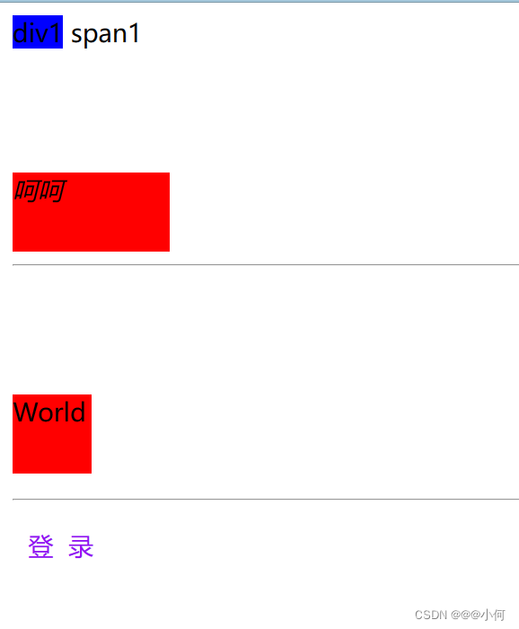
### 3.轮廓属性
#### 1.简介
轮廓outline,用于在元素周围绘制一个轮廓，位于border外围，可以突出显示元素。
#### 2.基本用法
> 常用属性:
> 
> outline-width:轮廓宽度 。
> outline-color:轮廓颜色。
>  outline-style:轮廓样式。
>   outline简写。

> 在浏览器中，当鼠标单击或使用TAB键让一个表单或链接获得焦点时，该元素会有一个轮廓outline
> 
> 优点：可以提高使用表单的用户体验。 
> 缺点：有时会影响美观。
#### 3.outline和border的区别
> 1. border可以应用于所有html元素，而outline主要用于表单元素、超链接元素。
> 2. 当元素获得焦点时会自动出现outline轮廓效果，当失去焦点时会自动消失，这是浏览器默认行为。
> 3. outline不影响元素的尺寸和位置，而border会影响。
#### 4.代码举例

```html
<!DOCTYPE html>
<html lang="en">
    <head>
        <meta charset="UTF-8">
        <title>Documnet</title>
        <style>
            span{
                border: 2px solid red;
                outline: 4px dashed green;
            }
            .userName{
                border: 1px solid red;
                outline: none;
                padding-left: 3px;
                width: 80px;
            }
            .email{
                border: 0;
                outline: 0;
                border-bottom: 1px solid #000;
            }
            .btnsubmit{
                border: 0;
                padding: 5px;
                width: 100px;
            }
            .mydiv{
                width: 100px;
                background: #ccc;
                border: 2px solid red;
            }
        </style>
    </head>
<body>
	<span>welcome to CSS</span>
	<hr>
	用户名：<input type="text" class="username">
	<a href="#">CSS</a>
	<hr>
	邮箱：<input type="text" class="email">
	<input type="submit" value="提交" class="btnsubmit">
	<hr>
	<div class="mydiv">div</div>
</body>
</html>
```

> 运行结果：

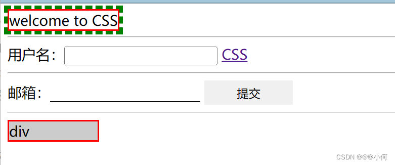
### 4.宽高相关

> 1. max-width:设置元素的最大宽度 。
> 2. max-height:设置元素的最大高度。
>  3. min-width设置元素的最小宽度。
> 4. min-height设置元素的最小高度。

### 5.overflow属性

> 当元素内容溢出时该如何处理。

> 常用取值：
> 
> 1. visible溢出时可见，显示在元素外，默认值。
>  2. hidden溢出的部分不可见（常用）。
>   3. scroll无论是否出现溢出始终出现滚动条。
> 4. auto溢出时自动出现滚动条。
### 6.cursor属性
> 用于设置光标的形状。

> 常用属性：
> 
> 1. default默认光标，一般为箭头。
> 2. pointer手形，光标移动超链接上时一般显示为手形。
> 3. move表示可移动。
> 4. text表示文本。
> 5. wait表示程序正忙，需要等待。
> 6. hep表示帮助。

> 代码举例：

```html
<!DOCTYPE html>
<html lang="en">
<head>
	<meta charset="UTF-8">
	<title>Document</title>
	<style>
		p{
			border:1px solid red;
			min-width:500px;
		}
		div{
			border:1px solid blue;
			width: 300px;
			height: 100px;
			overflow:auto;
		}
		span{
			cursor:help;
		}
	</style>
</head>
<body>
	<p>
		welcome to css welcome to css welcome to css welcome to css
		welcome to css welcome to css welcome to css welcome to css
		welcome to css welcome to css welcome to css welcome to css
		welcome to css welcome to css welcome to css welcome to css
	</p>
	<hr>
	<div>
		welcome to css welcome to css welcome to css welcome to css
		welcome to css welcome to css welcome to css welcome to css
		welcome to css welcome to css welcome to css welcome to css
		welcome to css welcome to css welcome to css welcome to css
	</div>
	<hr>
	<span>光标形状</span>
</body>
</html>

```

> 运行结果：

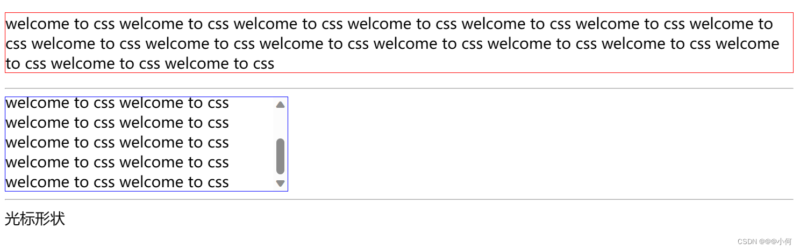
## 8.css布局
### 1.简介

> CSS常见的布局方式包括弹性布局、固定布局、流体布局、混合布局、绝对定位布局等。
> 1. 弹性布局：总体宽度及其中所有栏的值都以单位编写。这应使布局能够使用浏览器的指定基本字体大小缩放。 栏宽度将变得更宽, 能以任何大小显示更舒适、更可读的行长度。
> 2. 固定布局：总体宽度及其中所有栏的值都以像素单位编写，布局位于用户浏览器的中心。
> 3. 流体布局：总体宽度及其中所有栏的值都以百分比编写，百分比通过用户浏览器窗口的大小计算。
> 4. 混合布局：混合布局组合两种其他类型的布局，弹性和流体。页面的总宽度为 100%,，但侧栏值设置为em单位。
> 5. 绝对定位布局：所有前述布局的外栏使用浮动内容。 而绝对定位布局完全如其名，有绝对定位的外栏。 必须记住, 当使用这些布局时，侧栏会“提出文档流程”, 因而可能有一些不合适的结果。
### 2.案例
>1. 两栏布局：
>  两栏布局是将网页分为左侧和右侧两列，这种布局方式也是网络中用得比较多的布局。两栏布局的实现方法如下:
  (1)创建两个层，再设置两个层的宽度。
  (2)设置两栏并列显示。

> 例如：

```html
<!DOCTYPE html>
<html>
<head>
	<meta charset="utf-8">
	<meta name="viewport" content="width=device-width, initial-scale=1">
	<title></title>
	<style type="text/css">
		*{
			margin: 0;
			padding: 0;
		}
		.content{
			width: 410px;
			height: 200px;
		}
		.left{
			background-color: yellow;
			float: left;
			height: 100%;
			width: 100px;
			
 
		}
		.right{
			background-color: red;
			width: 300px;
			height: 100%;
			float: left;
			margin-left: 10px;
		}
		.content::after{
			content: '';
			display: block;  //display属性设置为快属性
			visibility: hidden;  //可见性为隐藏
			clear: both;     //清楚块两侧的浮动
		}
	</style>
</head>
<body>
	<div class="content">
		<div class="left">左</div>
		<div class="right">右</div>
	</div>
</body>
</html>
```

> 效果：
> 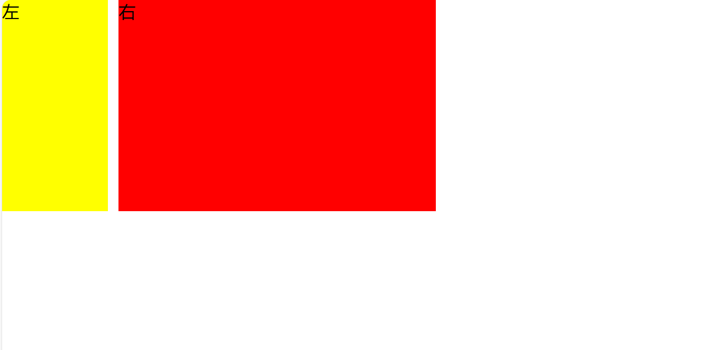

>2. 多栏布局
>将一个元素中的内容分为两栏或多栏显示，并且确保各栏中内容的底部对齐，叫作多栏布局。
多栏布局先把网页通过DIV块划分成多个区域，再在这些区域内添加相关内容，以达到网页制作的要求。

> 例如：把网页分成三行，分别是头部、内容和页脚;再把内容部分分成左、中、右三列;最后把内容部分的中间那列分成两行。

```html
<!DOCTYPE html>
<html>
<head>
	<meta charset="utf-8">
	<meta name="viewport" content="width=device-width, initial-scale=1">
	<title>
		
	</title>
	<style type="text/css">
		.header,.footer{
			width: 500px;
			height: 100px;
			background: pink;
		}
		.main{
			width: 500px;
			height: 300px;
 
		}
		.left,.right{
			width: 100px;
			height: 300px;
		}
		.content-top,.content-bot{
			width: 300px;
			height: 150px;
		}
		.left{
			background: #c9e143;
			float: left;
		}
		.content-top{
			background: #ff0000;
 
		}
		.content-bot{
			background: #ffa500;
 
		}
		.right{
			float: right;
			background: black;
			}
			.content{
				float: left;
			}
	</style>
</head>
<body>
	<div class="header"></div>
	<div class="main">
		<div class="left"></div>
		<div class="content">
			<div class="content-top"></div>
			<div class="content-bot"></div>
		</div>
		<div class="right"></div>
	</div>
	<div class="footer"></div>
</body>
</html>
```

> 效果：
> 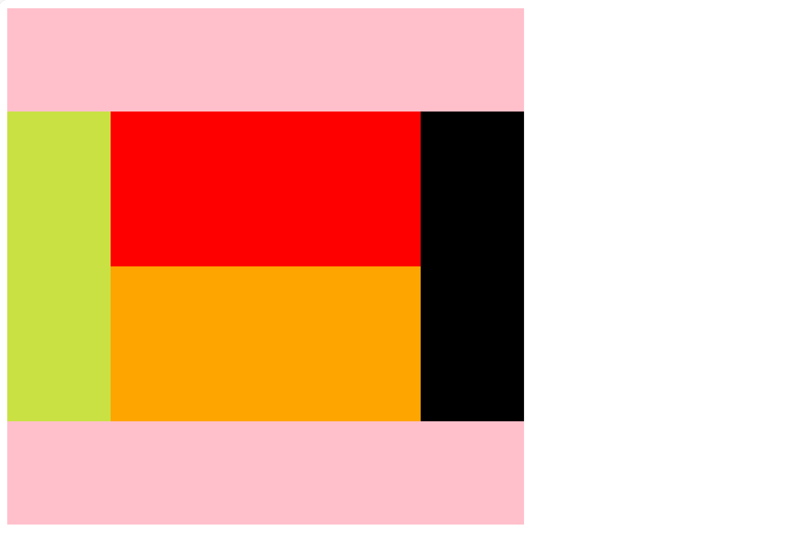
## 9.px、em、rem、%、vw、vh、vm、rpx 区别

> 1. px：像素 绝对·长度单位，相对于显示器屏幕分辨率(推荐使用)。
> 2. vw：viewpoint width，视窗宽度，1vw等于视窗宽度的1%。
> 3. vh：viewpoint height，视窗高度，1vh等于视窗高度的1%。

> 在css单位中，可以分为长度单位、绝对单位，如下表所指示：
> 
| CSS单位 |  |
|--|--|
|  相对长度单位|  em、ex、ch、rem、vw、vh、vmin、vmax、%|
|  绝对长度单位| em、ex、ch、rem、vw、vh、vmin、vmax、% |
## 10.nth-child(n)
> nth-child(n) 选择器匹配父元素中的第 n 个子元素，元素类型没有限制。
> n 可以是一个数字，一个关键字，或者一个公式。注释：n从1开始。

>比如，下面代码就是给left-menu中的第3个元素设置字体大小：
```css
/** 导航栏 */
.left-menu>div:nth-child(3) {
    font-size: 1.4rem;
}
```
## 11.@media用法
> 举例：
> 1. 设备屏幕宽度小于等于960px时应用css样式：
```css
@media screen and (max-device-width:960px){
    body{background:red;}
}
```
> 2. 浏览器宽度大于等于960px且小于等于1200px时使用样式:

```css
@media screen and (min-width:960px) and (max-width:1200px){
    body{background:yellow;}
}
```

## 12.@import用法

> @import 用来导入指定的外部样式文件并指定目标的媒体类型，示例代码如下：

```css
@import url("css/screen.css") screen;   /* 引入外部样式，该样式仅会应用于电脑显示器 */
@import url("css/print.css") print;     /* 引入外部样式，该样式仅会应用于打印设备 */
body {
    background: #f5f5f5;
    line-height: 1.2;
}
```
## 13.display: inline-block

> display: inline-block是一种 CSS 属性，用于设置元素的显示方式。
&emsp;当你将一个元素的 display 属性设置为 inline-block 时，它将以内联块级元素的方式显示。这意味着元素会在一行上显示，并且可以设置宽度、高度、内外边距等属性，同时仍保留内联元素的特性，可以与其他元素在同一行内显示。
&emsp;与普通的块级元素相比，inline-block 元素不会独占一行，而是根据其内容的宽度来决定自身的宽度，可以在一行内与其他元素并排显示。

> display: inline-block; 常用于以下场景：
> 
> 创建水平排列的元素：通过将多个元素的显示方式设置为 inline-block，可以在一行内创建水平排列的元素，类似于菜单、按钮组等。
> 
> 设置宽度和高度：与普通的内联元素相比，inline-block 元素可以设置宽度、高度以及内外边距等属性，使其具备块级元素的特性。
> 
> 保留行内元素的特性：与块级元素相比，inline-block
> 元素可以在一行内显示，并且可以与其他元素共享一行，适用于需要结合文本或其他内联元素进行布局的情况。

## 14. css style上的lang和scoped

> less：设置使用的预编译语言。
> scoped：指定当前样式，只能在当前组件使用。

## 15.
