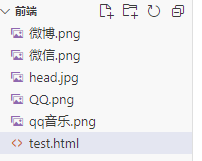
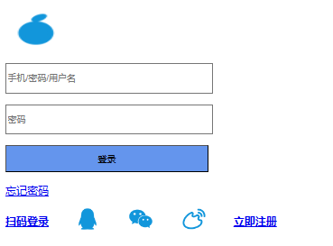
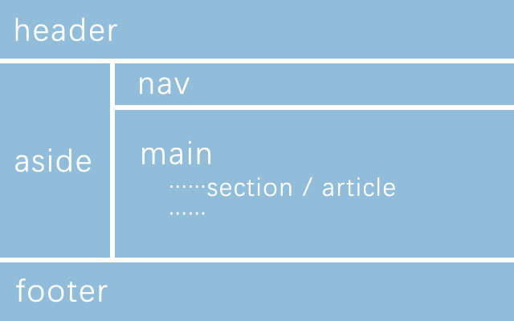

@[TOC](目录)

> HTML基础知识学习。
> 


## 1.HTML简介

> HTML 是用来描述网页的一种语言。HTML 是一种在 Web 上使用的通用标记语言。HTML 允许格式化文本，添加图片，创建链接、输入表单、框架和表格等等，并可将之存为文本文件，浏览器即可读取和显示。

## 2.实例介绍

```html
<!DOCTYPE html>
<html>
    <head>
        <meta charset="utf-8">
        <title>TestView</title>
    </head>
    <body>
        <h1>我得第一个元素</h1>
        <p>我的第一个段落</p>
    </body>
</html>
```

> 其中：
> 1. < !DOCTYPE html>声明为HTML5文档。
> 2. < html>元素是HTML页面的根元素。
> 3. < head>元素包含了文档的元数据，如< meta charset="utf-8">定义网页编码格式为utf-8(防止出现中文乱码)。
> 4. < title>元素描述了文档的标题。
> 5. < body>元素包含了可见的页面内容。
> 6. < h1>元素定义了一个大标题。
> 7. < p>元素定义了一个段落。

## 3.标题

> HTML标题是通过< h1>~< h6>标签来定义的。例如：

```html
<!DOCTYPE html>
<html>
    <head>
        <meta charset="utf-8">
        <title>TestView</title>
    </head>
    <body>
        <h1>这是标题1</h1>
        <h2>这是标题2</h2>
        <h3>这是标题3</h3>
        <h4>这是标题4</h4>
        <h5>这是标题5</h5>
        <h6>这是标题6</h6>
    </body>
</html>
```
## 4.段落

> HTML段落是通过标签< p>来定义的。例如：

```html
<!DOCTYPE html>
<html>
    <head>
        <meta charset="utf-8">
        <title>TestView</title>
    </head>
    <body>
        <p>这是一个段落。</p>
        <p>这是一个段落。</p>
        <p>这是一个段落。</p>
    </body>
</html>
```
## 5.链接

> HTML链接是通过标签< a>来定义的。例如：

```html
<!DOCTYPE html>
<html>
    <head>
        <meta charset="utf-8">
        <title>TestView</title>
    </head>
    <body>
        <a href="https://www.zhihu.com/">这是一个知乎主页链接</a>
    </body>
</html>
```

## 6.图像

> HTML图像是通过标签< img>来定义的。注意：图像的名称和尺寸是以属性的形式提供的。例如：

```html
<!DOCTYPE html>
<html>
    <head>
        <meta charset="utf-8">
        <title>TestView</title>
    </head>
    <body>
        
    </body>
</html>
```
## 7.表格

> 表格由 < table> 标签来定义。每个表格均有若干行（由 < tr> 标签定义），每行被分割为若干单元格（由 < td> 标签定义）。字母 td 指表格数据（table data），即数据单元格的内容。数据单元格可以包含文本、图片、列表、段落、表单、水平线、表格等等。表格的表头使用 < th> 标签进行定义。如果不定义边框属性，表格将不显示边框。有时这很有用，但是大多数时候，我们希望显示边框。使用边框属性来显示一个带有边框的表格：

```html
<!DOCTYPE html>
<html>
    <head>
        <meta charset="utf-8">
        <title>TestView</title>
    </head>
    <body>
        <table border="3">
            <tr>
                <th>Header 1</th>
                <th>Header 2</th>
            </tr>
            <tr>
                <td>row 1,cell 1</td>
                <td>row 1,cell 2</td>
            </tr>
            <tr>
                <td>row 2,cell 1</td>
                <td>row 2,cell 2</td>
            </tr>
        </table>
    </body>
</html>
```
## 8.速查列表
### 1.基本文档

```html
<!DOCTYPE html>
<html>
<head>
<title>文档标题</title>
</head>
<body>
可见文本...
</body>
</html>
```
### 2.基本标签

```html
<!DOCTYPE html>
<html>
<head>
<title>文档标题</title>
</head>
<body>
    <h1>最大的标题</h1>
    <h2> . . . </h2>
    <h3> . . . </h3>
    <h4> . . . </h4>
    <h5> . . . </h5>
    <h6>最小的标题</h6>
     
    <p>这是一个段落。</p>
    <br> （换行）
    <hr> （水平线）
    <!-- 这是注释 -->
</body>
</html>
```
### 3.文本格式化

```html
<!DOCTYPE html>
<html>
<head>
<title>文档标题</title>
</head>
<body>
    <b>粗体文本</b>
    <code>计算机代码</code>
    <em>强调文本</em>
    <i>斜体文本</i>
    <kbd>键盘输入</kbd> 
    <pre>预格式化文本</pre>
    <small>更小的文本</small>
    <strong>重要的文本</strong>
     
    <abbr> （缩写）
    <address> （联系信息）
    <bdo> （文字方向）
    <blockquote> （从另一个源引用的部分）
    <cite> （工作的名称）
    <del> （删除的文本）
    <ins> （插入的文本）
    <sub> （下标文本）
    <sup> （上标文本）
</body>
</html>
```
### 4.链接

```html
<!DOCTYPE html>
<html>
<head>
<title>文档标题</title>
</head>
<body>
    普通的链接：<a href="http://www.example.com/">链接文本</a>
    图像链接： <a href="http://www.example.com/"></a>
    邮件链接： <a href="mailto:webmaster@example.com">发送e-mail</a>
    书签：
    <a id="tips">提示部分</a>
    <a href="#tips">跳到提示部分</a>
</body>
</html>
```
### 5.图片

```html
<!DOCTYPE html>
<html>
<head>
<title>文档标题</title>
</head>
<body>
    
</body>
</html>
```
### 6.无序列表

```html
<!DOCTYPE html>
<html>
<head>
<title>文档标题</title>
</head>
<body>
    <ul>
        <li>项目</li>
        <li>项目</li>
    </ul>
</body>
</html>
```
### 7.有序列表

```html
<!DOCTYPE html>
<html>
<head>
<title>文档标题</title>
</head>
<body>
    <ol>
        <li>第一项</li>
        <li>第二项</li>
    </ol>
</body>
</html>
```
### 8.定义列表

```html
<!DOCTYPE html>
<html>
<head>
<title>文档标题</title>
</head>
<body>
    <dl>
        <dt>项目 1</dt>
          <dd>描述项目 1</dd>
        <dt>项目 2</dt>
          <dd>描述项目 2</dd>
      </dl>
</body>
</html>
```
### 9.表格

```html
<!DOCTYPE html>
<html>
<head>
<title>文档标题</title>
</head>
<body>
    <table border="1">
        <tr>
          <th>表格标题</th>
          <th>表格标题</th>
        </tr>
        <tr>
          <td>表格数据</td>
          <td>表格数据</td>
        </tr>
      </table>
</body>
</html>
```
### 10.框架

```html
<iframe src="demo_iframe.htm"></iframe>
```
### 11.表单
#### 1.表单简介
> 一个表单通常由3各部分组成：
> 1. **表单标签**：这里面包含了处理表单数据所用程序的URL地址以及数据提交到服务器的方法。
> 2. **表单域**：包含了文本框、密码框、隐藏框、多行文本框、复选框、单选框、下拉选择框和文件上传框等。
> 3. **表单按钮**：包括提交按钮、复位按钮和一般按钮。
#### 2.表单语法


```html
<!DOCTYPE html>
<html>
	<head>
		<title>登录页面</title>
	</head>
	<body>
		<p></p>
		<form action="https://www.baidu.com" method="post">
			<p><input type="text" style="width: 300px; height: 40px;" name="bd" placeholder="手机/密码/用户名"></p>
			<p><input type="password" style="width: 300px;height: 40px;" name="mm" placeholder="密码"></p>
			<p><input type="submit" style="width: 300px; height: 40px; background: cornflowerblue;" name="dl" value="登录"></p>
		</form>
		<a href="#">忘记密码</a>
		<br><br>
		<a href="#"><b>扫码登录</b></a>
		&emsp;&emsp;
		&emsp;&emsp;
		&emsp;&emsp;
		&emsp;&emsp;<a href="#"><b>立即注册</b></a>
	</body>
</html>
```

> 运行结果：
> 

#### 3.表单详解
> < form>标签是表示采集数据的范围。
> < form action=" " method=" "></ form>
> 属性：
> 
> 1. action  采集的数据提交的路径。
> 2.  method  采集的数据提交的方式（get/post 不标注默认为get）
>        * get   保密信息不推荐使用，提交可以在上方地址栏看到相关信息。
>        * post  在实际网页开发中通常采用post方式提交表单数据。

### 12.HTML标签使用综合

```html
<!DOCTYPE html>
<html lang="en">
<head>
    <meta charset="UTF-8">
    <title>HTML综合实例</title>
</head>
<body>
<!--3.1、标题标签-->
<h1>这是一级标题</h1>
<h2>这是二级标题</h2>
<h3>这是三级标题</h3>
<h4>这是四级标题</h4>
<h5>这是五级标题</h5>
<h6>这是六级标题</h6>

<!--段落标签-->
<p>这是一个段落</p>

<!--链接标签-->
<a href="https://www.baidu.com">打开百度，你就知道！</a>

<!--图像标签-->


<br>

<!--表格标签-->
<table border="1px" cellpadding="0px" cellspacing="0px">
    <tr>
        <th>表头一</th>
        <th>表头二</th>
        <th>表头三</th>
        <th>表头四</th>
    </tr>
    <tr>
        <td>单元格一</td>
        <td>单元格二</td>
        <td>单元格三</td>
        <td>单元格四</td>
    </tr>
</table>

<!--列表标签-->
<ul>
    <li>列表项</li>
    <li>列表项</li>
    <li>列表项</li>
    <li>列表项</li>
</ul>
<ol>
    <li>列表项</li>
    <li>列表项</li>
    <li>列表项</li>
    <li>列表项</li>
</ol>
<dl>
    <dt>+</dt>
    <dd>列表项</dd>
    <dt>+</dt>
    <dd>列表项</dd>
    <dt>+</dt>
    <dd>列表项</dd>
</dl>

<!--分组标签-->
<div>具体内容</div>

<span>具体内容</span>

<!--表单标签-->
<form action="" method="get">
    <p>
        <label for="username">账户：</label>
        <input type="text" name="username" id="username">
    </p>
    <p>
        <label for="password">密码：</label>
        <input type="password" name="password" id="password">
    </p>
    <p><input type="submit"></p>
</form>

<form action="" method="post">
    <textarea name="mycontext" cols="30" rows="10"></textarea>
    <input type="submit">
</form>

<form action="" method="post">
    <fieldset>
        <legend>请选择你的爱好：</legend>

        <select name="myhobby" id="myhobby">
            <optgroup label="运动">
                <option value="篮球">篮球</option>
                <option value="足球">足球</option>
            </optgroup>
            <optgroup label="电子">
                <option value="看电影">看电影</option>
                <option value="看电视">看电视</option>
            </optgroup>
        </select>
    </fieldset>
</form>

<form action="" method="post">
    <input list="browsers">
    <datalist id="browsers">
        <option value="Internet Explorer">
        <option value="Firefox">
        <option value="Chrome">
        <option value="Opera">
        <option value="Safari">
    </datalist>
</form>

<form action="" method="post">
    <input type="radio" name="sex" id="male" value="male" checked>
    <label for="male">Male</label>

    <input type="radio" name="sex" id="female" value="female">
    <label for="female">female</label>
</form>

<form action="" method="post">
    <input type="checkbox" name="vehicle" id="bike" value="bike">
    <label for="bike">I have a bike</label>

    <input type="checkbox" name="vehicle" id="car" value="car">
    <label for="car">I have a car</label>
</form>

<!--框架标签-->
<iframe src="https://www.baidu.com" frameborder="0" width="500px" height="500px"></iframe>

<!--音频标签-->
<audio controls>
    <source src="horse.ogg" type="audio/ogg">
    <source src="horse.mp3" type="audio/mpeg">
    您的浏览器不支持 audio 元素。
</audio>

<!--视频标签-->
<video width="320" height="240" controls>
    <source src="movie.mp4" type="video/mp4">
    <source src="movie.ogg" type="video/ogg">
    您的浏览器不支持Video标签。
</video>

<!--其它标签-->
水平线：<hr>
换行：<br>
<b>粗体文本</b>
<code>计算机代码</code>
<em>强调文本</em>
<i>斜体文本</i>
<kbd>键盘输入</kbd>
<pre>预格式化文本</pre>
<small>更小的文本</small>
<strong>重要的文本</strong>
<abbr>缩写词或者首字母缩略词</abbr>
<address>联系信息</address>
<bdo>文字方向</bdo>
<blockquote>从另一个源引用的部分</blockquote>
<cite>工作的名称</cite>
<del>删除的文本</del>
<ins>插入的文本</ins>
<sub>下标文本</sub>
<sup>上标文本</sup>

</body>
</html>
```
### 13.body结构


```html
<body>
    <header>

    </header>
    <aside>

    </aside>
    <nav>

    </nav>
    <main>

    </main>
    <footer>
        
    </footer>
</body>
```

### 14.
