@[TOC](目录)

> JavaScript基础知识学习。
> 


## 1.简介

> 1. 解释性语言。
> 2. 动态语言。
> 3. 面向对象的语言。
> 4. 严格区分大小写。
## 2.使用方式
### 1.标签引用
> 直接在HTML中引入script标签就可以使用JS代码。例如：

```html
<!DOCTYPE html>
<html lang="en">
<head>
	<meta charset="UTF-8">
	<title>Document</title>
	
</head>
<body>
	<script>
		alert('Hello World!')
	</script>
	<input type="button" value="hello" />
</body>
</html>

```
### 2.文件引入

> 在一个单独的JS文件中编写代码，然后在HTMl中引入该文件。例如：

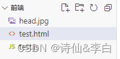

```html
<!DOCTYPE html>
<html lang="en">
<head>
	<meta charset="UTF-8">
	<title>Document</title>
	<script src="test.js"></script>	
</head>
<body>
	<input type="button" value="hello" />
</body>
</html>

```
## 3.输出
### 1.向页面输出

```html
<!DOCTYPE html>
<html lang="en">
<head>
	<meta charset="UTF-8">
	<title>Document</title>
</head>
<body>
	<script>
		document.write("测试!");//向页面输出
	</script>
	<input type="button" value="hello" />
</body>
</html>

```

### 2.向控制台输出

```html
<!DOCTYPE html>
<html lang="en">
<head>
	<meta charset="UTF-8">
	<title>Document</title>
</head>
<body>
	<script>
		console.log("这是第1条测试信息");
		console.log("这是第2条测试信息");
	</script>
	<input type="button" value="hello" />
</body>
</html>

```

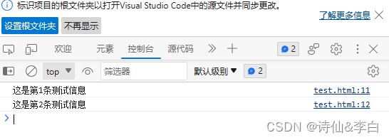
### 3.弹出窗口输出
```html
<!DOCTYPE html>
<html lang="en">
<head>
	<meta charset="UTF-8">
	<title>Document</title>
</head>
<body>
	<script>
		alert("测试弹窗!");
	</script>
	<input type="button" value="hello" />
</body>
</html>

```
## 4.使用var关键字声明一个变量
## 5.数据类型
### 1.类型分类

> JavaScript中一共有6种基本数据类型：
> 1. 字符串型（String）。
> 2. 数值型（Number）。
> 3. 布尔型（Boolean）。
> 4. undefined型（Undefined）。
> 5. null型（Null）。
> 6. Object类型
### 2.typeof运算符
> 使用typeof操作符可以用来检查一个变量的数据类型。

```html
<!DOCTYPE html>
<html lang="en">
<head>
	<meta charset="UTF-8">
	<title>Document</title>
</head>
<body>
	<script>
		console.log(typeof 123);
		console.log(typeof "Hello,World!");
		console.log(typeof true);
		console.log(typeof undefined);
		console.log(typeof null);
	</script>
	<input type="button" value="hello" />
</body>
</html>

```
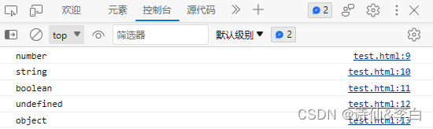
## 6.对象基础
### 1.创建对象

> 有2种方式来创建对象：

> 方式1：

```html
<script>
		var person = new Object();
		person.name = "孙悟空";
		person.age = 18;
		console.log(person);
	</script>`
```

> 方式2：

```html
	<script>
		var person = {
			name: "孙悟空",
			age: 18
		};
		console.log(person);
	</script>
```
### 2.访问属性

> 有2种方式来放访问属性： 
> 
> 方式1：使用 . 来访问

```html
对象.属性名
```

> 方式2：使用 [] 来访问

```html
对象[‘属性名’]
```
### 3.删除属性

> 删除对象的属性可以用delegate关键字，格式如下：

```html
delete 对象.属性名
```

> 代码举例：

```html
<!DOCTYPE html>
<html lang="en">
<head>
	<meta charset="UTF-8">
	<title>Document</title>
</head>
<body>
	<script>
		var person=new Object();
		person.name="孙悟空";
		person.age=18;
		console.log(person);

		delete person.name;
		console.log(person);
	</script>
	<input type="button" value="hello" />
</body>
</html>
```
### 4.遍历对象
语法格式：

```javascript
for (var 变量 in 对象) {

}
```
代码举例：

```html
<!DOCTYPE html>
<html lang="en">
<head>
	<meta charset="UTF-8">
	<title>Document</title>
</head>
<body>
	<script>
		var person={
			age:18,
			name:"李四"
		};

		for(var item in person){
			var personval=person[item];
			console.log(item+":"+personval);
		}
	</script>
	<input type="button" value="hello" />
</body>
</html>
```
## 7.函数
### 1.函数创建

> 1. 使用 函数声明 来创建一个函数：

```javascript
function 函数名([形参1,形参2,...,形参N]) {
    语句...
}
```

> 代码示例：

```javascript
function fun(){
    console.log("这是我的第二个函数");
}
```

> 2.使用函数表达式来创建一个函数：
> 

```javascript
var 函数名  = function([形参1,形参2,...,形参N]) {
    语句....
}
```

> 代码示例：

```javascript
var fun  = function() {
    console.log("这是我的第三个函数");
}
```
### 2.函数调用

```javascript
	<script>
		// 函数声明
		var fun = function () {
			console.log("哈哈，我执行啦！");
		}

		// 函数声明
		var sum = function (num1, num2) {
			var result = num1 + num2;
			console.log("num1 + num2 = " + result);
		}

		// 函数调用
		fun();
	    sum(10, 20);
	</script>
```
### 3.匿名函数

> 匿名函数：没有名字的函数就是匿名函数，它可以让一个变量来接收，也就是用 “函数表达式” 方式创建和接收。

> 代码示例：

```javascript
var fun = function () {
    alert("我是一个匿名函数");
}

fun();
```
## 8.垃圾回收

> 垃圾回收（GC）：就像人生活的时间长了会产生垃圾一样，程序运行过程中也会产生垃圾，这些垃圾积攒过多以后，会导致程序运行的速度过慢，所以我们需要一个垃圾回收的机制，来处理程序运行过程中产生垃圾。

> 当一个对象没有任何的变量或属性对它进行引用，此时我们将永远无法操作该对象，此时这种对象就是一个垃圾，这种对象过多会占用大量的内存空间，导致程序运行变慢，所以这种垃圾必须进行清理。

> 在JS中拥有自动的垃圾回收机制，会自动将这些垃圾对象从内存中销毁，我们不需要也不能进行垃圾回收的操作，我们需要做的只是要将不再使用的对象设置null即可。

```javascript
// 使用构造函数来创建对象
function Person(name, age) {
    // 设置对象的属性
    this.name = name;
    this.age = age;
}

var person1 = new Person("孙悟空", 18);
var person2 = new Person("猪八戒", 19);
var person3 = new Person("沙和尚", 20);

person1 = null;
person2 = null;
person3 = null;

```
## 9.数组对象
### 1.创建数组
```javascript
var arr = new Array();
arr[0] = 1;
arr[1] = "2";
arr[2] = 3;
arr[3] = "4";
arr[4] = 5;
arr[5] = "6";
arr[6] = 7;
arr[7] = "8";
arr[8] = 9;
```
### 2.遍历数组

```javascript
	<script>
		var arr = new Array();
		arr[0] = 1;
		arr[1] = "你好";
		arr[2] = 3;
		arr[3] = "4";
		arr[4] = 5;
		arr[5] = "6";
		arr[6] = 7;
		arr[7] = "张三";
		arr[8] = 9;

		for(var item in arr){
			console.log(arr[item]);
		}

	</script>
```
### 3.数组方法

> 1. push()方法：该方法可以向数组的末尾添加一个或多个元素，并返回数组的新的长度。
> 2. pop()方法：该方法可以删除数组的最后一个元素，并将被删除的元素作为返回值返回。
> 3. unshift()方法演示：该方法向数组开头添加一个或多个元素，并返回新的数组长度。
> 4. shift()方法演示：该方法可以删除数组的第一个元素，并将被删除的元素作为返回值返回。
> 5. forEach()方法演示：该方法可以用来遍历数组。
> 6. slice()方法演示：该方法可以用来从数组提取指定元素，该方法不会改变元素数组，而是将截取到的元素封装到一个新数组中返回。
> 7. splice()方法演示：该方法可以用于删除数组中的指定元素，该方法会影响到原数组，会将指定元素从原数组中删除，并将被删除的元素作为返回值返回。
> 8. concat()方法演示：该方法可以连接两个或多个数组，并将新的数组返回，该方法不会对原数组产生影响。
> 9. oin()方法演示：该方法可以将数组转换为一个字符串，该方法不会对原数组产生影响，而是将转换后的字符串作为结果返回，在join()中可以指定一个字符串作为参数，这个字符串将会成为数组中元素的连接符，如果不指定连接符，则默认使用，作为连接符。
> 10. reverse()方法演示：该方法用来反转数组（前边的去后边，后边的去前边），该方法会直接修改原数组。
> 11. sort()方法演示：该方法可以用来对数组中的元素进行排序，也会影响原数组，默认会按照Unicode编码进行排序。
> 注意：对于sort方法，即使对于纯数字的数组，使用sort()排序时，也会按照Unicode编码来排序，所以对数字进排序时，可能会得到错误的结果。

## 10.Date对象
> 在JavaScript中使用Date对象来表示一个时间，如果直接使用构造函数创建一个Date对象，则会封装为当前代码执行的时间。

```html
	<script>
		var date = new Date();
		console.log(date);

		console.log(date.getFullYear());//获取当前日期对象的年份(四位数字年份)
		console.log(date.getMonth());//获取当前日期对象的月份(0 ~ 11)
		console.log(date.getDate());//获取当前日期对象的日数(1 ~ 31)
		console.log(date.getHours());//获取当前日期对象的小时(0 ~ 23)
		console.log(date.getMinutes());//获取当前日期对象的分钟(0 ~ 59)
		console.log(date.getSeconds());//获取当前日期对象的秒钟(0 ~ 59)
		console.log(date.getMilliseconds());//获取当前日期对象的毫秒(0 ~ 999)
	</script>
```

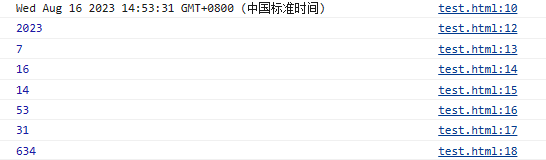
## 11.Math对象
> Math和其它的对象不同，它不是一个构造函数，它属于一个工具类不用创建对象，它里边封装了数学运算相关的属性和方法。

```javascript
/*固定值*/
console.log("PI = " + Math.PI);
console.log("E  = " + Math.E);
console.log("===============");
/*正数*/
console.log(Math.abs(1));        //可以用来计算一个数的绝对值
console.log(Math.ceil(1.1));     //可以对一个数进行向上取整，小数位只有有值就自动进1
console.log(Math.floor(1.99));   //可以对一个数进行向下取整，小数部分会被舍掉
console.log(Math.round(1.4));    //可以对一个数进行四舍五入取整
console.log("===============");
/*负数*/
console.log(Math.abs(-1));       //可以用来计算一个数的绝对值
console.log(Math.ceil(-1.1));    //可以对一个数进行向上取整，小数部分会被舍掉
console.log(Math.floor(-1.99));  //可以对一个数进行向下取整，小数位只有有值就自动进1
console.log(Math.round(-1.4));   //可以对一个数进行四舍五入取整
console.log("===============");
/*随机数*/
//Math.random()：可以用来生成一个0-1之间的随机数
//生成一个0-x之间的随机数：Math.round(Math.random()*x)
//生成一个x-y之间的随机数：Math.round(Math.random()*(y-x)+x)
console.log(Math.round(Math.random() * 10));            //生成一个0-10之间的随机数
console.log(Math.round(Math.random() * (10 - 1) + 1));  //生成一个1-10之间的随机数
console.log("===============");
/*数学运算*/
console.log(Math.pow(12, 3));   //Math.pow(x,y)：返回x的y次幂
console.log(Math.sqrt(4));      //Math.sqrt(x) ：返回x的平方根

```
## 12.RegExp对象

> 正则表达式用于定义一些字符串的规则，计算机可以根据正则表达式，来检查一个字符串是否符合规则，获取将字符串中符合规则的内容提取出来。
## 13.JavaScript DOM
### 1.DOM简介
> 当网页被加载时，浏览器会创建页面的文档对象模型（Document Object Model）。
> 
> HTML DOM 模型被结构化为 对象树 ：

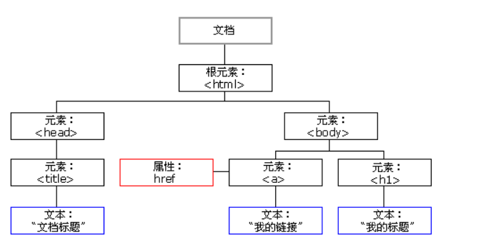
通过这个对象模型：

> 1. JavaScript 能改变页面中的所有 HTML 元素。
> 2. JavaScript 能改变页面中的所有 HTML 属性。
> 3. JavaScript 能改变页面中的所有 CSS 样式。
> 4. JavaScript 能删除已有的 HTML 元素和属性。
> 5. JavaScript 能添加新的 HTML 元素和属性。
> 6. JavaScript 能对页面中所有已有的 HTML 事件作出反应。
> 7. JavaScript 能在页面中创建新的 HTML 事件。

### 2.DOM文档操作

> 文档对象网页，希望访问 HTML 页面中的任何元素，总是会从访问 document 对象开始。
> 
> 下面是一些如何使用 document 对象来访问和操作 HTML 的实例。
#### 1.查找HTML元素
##### 1.方法介绍
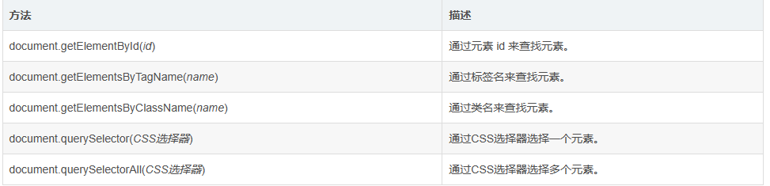
##### 2.方法演示
> 1. 需求描述：创建一个按钮，通过id获取按钮节点对象。

```html
<!DOCTYPE html>
<html lang="en">
<head>
	<meta charset="UTF-8">
	<title>Document</title>
</head>
<body>
	<button id="btn01">我是1号按钮</button>
	<script>
		var btn=document.getElementById("btn01");
		console.log(btn);
	</script>
</body>
</html>
```

> 2. 需求描述：创建一个按钮，通过标签名获取按钮节点对象数组。

```html
<!DOCTYPE html>
<html>
<head>
    <meta charset="UTF-8">
    <title></title>
</head>
<body>
<button>我是按钮</button>

<!-- 在这里写JavaScript代码，因为JavaScript是由上到下执行的 -->
<script>
    var btn = document.getElementsByTagName("button");
    console.log(btn);
</script>
</body>
</html>
```

> 3. 需求描述：创建一个按钮，通过类名获取按钮节点对象数组。

```html
<!DOCTYPE html>
<html>
<head>
    <meta charset="UTF-8">
    <title></title>
</head>
<body>
<button class="btn">我是按钮</button>

<!-- 在这里写JavaScript代码，因为JavaScript是由上到下执行的 -->
<script>
    var btn = document.getElementsByClassName("btn");
    console.log(btn);
</script>
</body>
</html>
```

> 4. 需求描述：创建一个按钮，通过CSS选择器选择该按钮。

```html
<!DOCTYPE html>
<html>
<head>
    <meta charset="UTF-8">
    <title></title>
</head>
<body>
<button class="btn">我是按钮</button>

<!-- 在这里写JavaScript代码，因为JavaScript是由上到下执行的 -->
<script>
    var btn = document.querySelector(".btn");
    console.log(btn);
</script>
</body>
</html>

```

> 5. 需求描述：创建一个无序列表，通过CSS选择器选择该列表的所有li。

```html
<!DOCTYPE html>
<html>
<head>
    <meta charset="UTF-8">
    <title></title>
</head>
<body>
<ul class="list">
    <li>列表项1</li>
    <li>列表项2</li>
    <li>列表项3</li>
    <li>列表项4</li>
</ul>

<!-- 在这里写JavaScript代码，因为JavaScript是由上到下执行的 -->
<script>
    var list = document.querySelectorAll(".list li");
    console.log(list);
</script>
</body>
</html>
```
#### 2.获取HTML的值
##### 1.方法介绍
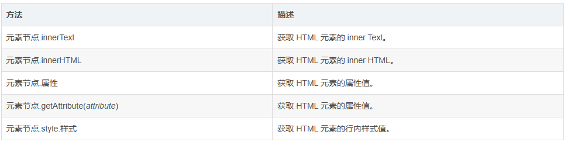
##### 2.方法演示

> 1. 需求描述：创建一个按钮，然后获取按钮的文本内容。

```html
<!DOCTYPE html>
<html lang="en">
<head>
	<meta charset="UTF-8">
	<title>Document</title>
</head>
<body>
	<button id="btn01">我是1号按钮</button>
	<script>
		var btn=document.getElementById("btn01");
		console.log(btn.innerText);
	</script>
</body>
</html>

```

> 2. 需求描述：创建一个div，然后在div中插入一个h1标题，获取div中的html代码。

```html
<!DOCTYPE html>
<html lang="en">
<head>
	<meta charset="UTF-8">
	<title>Document</title>
</head>
<body>
	<div id="div01">
		<h1>这是测试标题</h1>
		<button>测试按钮</button>
	</div>
	<script>
		var res=document.getElementById("div01");
		console.log(res.innerHTML);
	</script>
</body>
</html>
```

> 3. 需求描述：创建一个超链接，默认为空，设置href属性为https://www.baidu.com ，使用JavaScript代码读取href属性。

```html
<!DOCTYPE html>
<html lang="en">
<head>
	<meta charset="UTF-8">
	<title>Document</title>
</head>
<body>
	<a id="a01" href="https://www.baidu.com/">百度</a>
	<script>
		var res=document.getElementById("a01");
		console.log(res.href);
	</script>
</body>
</html>
```
4. 需求描述：创建一个正方形div，默认颜色为红色，使用JavaScript代码获取div的宽度。

> 注意：如果CSS的样式名中含有-，这种名称在JS中是不合法的比如background-color，需要将这种样式名修改为驼峰命名法，去掉-，然后将-后的字母大写，我们通过style属性设置的样式都是行内样式，同样的获取也是行内样式，而行内样式有较高的优先级，所以通过JS修改的样式往往会立即显示，但是如果在样式中写了!important，则此时样式会有最高的优先级，即使通过JS也不能覆盖该样式，此时将会导致JS修改样式失效，所以尽量不要为样式添加!important。

```html
<!DOCTYPE html>
<html lang="en">
<head>
	<meta charset="UTF-8">
	<title>Document</title>
</head>
<body>
	<div style="width: 100px;height: 100px;background: red;" id="box01"></div>
	<script>
		var res=document.getElementById("box01");
		console.log(res.style.width);
	</script>
</body>
</html>

```

```html
<!DOCTYPE html>
<html>
<head>
    <meta charset="UTF-8">
    <title></title>
    <style>
        /*样式表的样式*/
        #box {
            width: 200px;
            height: 200px;
            background-color: green;
        }
    </style>
</head>
<body>
<div style="width: 100px;height: 100px;" id="box"></div>

<!-- 在这里写JavaScript代码，因为JavaScript是由上到下执行的 -->
<script>
    /*通用的获取元素样式的方法*/
    function getStyle(obj, name) {
        if (window.getComputedStyle) {
            //正常浏览器的方式，具有getComputedStyle()方法
            return getComputedStyle(obj, null)[name];
        } else {
            //IE8的方式，没有getComputedStyle()方法
            return obj.currentStyle[name];
        }
    }

    var box = document.getElementById("box");

    console.log(getStyle(box, "width"));
    console.log(getStyle(box, "height"));
    console.log(getStyle(box, "background-color"));
</script>
</body>
</html>
```
#### 3.改变HTML的值
##### 1.方法介绍
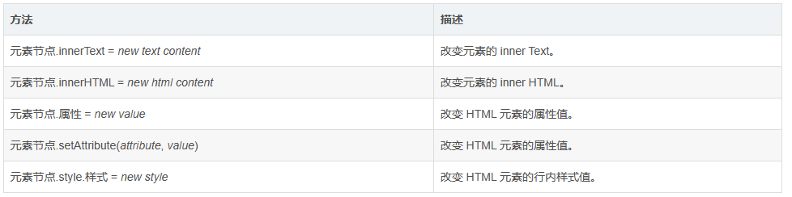
##### 2.方法演示

> 1. 需求描述：创建一个按钮，然后改变按钮的文本内容。
```html
<!DOCTYPE html>
<html>
<head>
    <meta charset="UTF-8">
    <title></title>
</head>
<body>
<button id="btn">我是按钮</button>

<!-- 在这里写JavaScript代码，因为JavaScript是由上到下执行的 -->
<script>
    var btn = document.getElementById("btn");
    btn.innerText = "我是JavaScript的按钮";
    console.log(btn);
</script>
</body>
</html>
```
> 2. 需求描述：创建一个div，然后在div中插入一个h1标题。

```html
<!DOCTYPE html>
<html>
<head>
    <meta charset="UTF-8">
    <title></title>
</head>
<body>
<div id="box"></div>
<!-- 在这里写JavaScript代码，因为JavaScript是由上到下执行的 -->
<script>
    var res = document.getElementById("box");
    res.innerHTML = "<h1>我是Box中的大标题</h1>";
    console.log(res);
</script>
</body>
</html>

```

> 3. 需求描述：创建一个超链接，默认为空，使用JavaScript代码设置href属性为https://www.baidu.com。

```html
<!DOCTYPE html>
<html>
<head>
    <meta charset="UTF-8">
    <title></title>
</head>
<body>
<a id="a">打开百度，你就知道!</a>
<!-- 在这里写JavaScript代码，因为JavaScript是由上到下执行的 -->
<script>
    var res = document.getElementById("a");
    res.href = "https://www.baidu.com";
    console.log(res);
</script>
</body>
</html>
```

> 4. 需求描述：创建一个正方形div，默认颜色为红色，使用JavaScript代码改变为绿色。
```html
<!DOCTYPE html>
<html>
<head>
    <meta charset="UTF-8">
    <title></title>
</head>
<body>
<div id="div01" style="background: red; width: 100px; height: 100px;"></div>
<!-- 在这里写JavaScript代码，因为JavaScript是由上到下执行的 -->
<script>
    var res = document.getElementById("div01");
    res.style.background="green";
    console.log(res);
</script>
</body>
</html>
```

```html
<!DOCTYPE html>
<html>
<head>
    <meta charset="UTF-8">
    <title></title>
</head>
<body>
<div id="insert">
    <p>你是我的小丫小苹果</p>
</div>

<!-- 在这里写JavaScript代码，因为JavaScript是由上到下执行的 -->
<script>
    var div = document.getElementById("insert");
    div.insertAdjacentHTML('beforeBegin', '你是我的小丫小苹果');
</script>
</body>
</html>

```
#### 4.修改HTML元素
##### 1.方法介绍
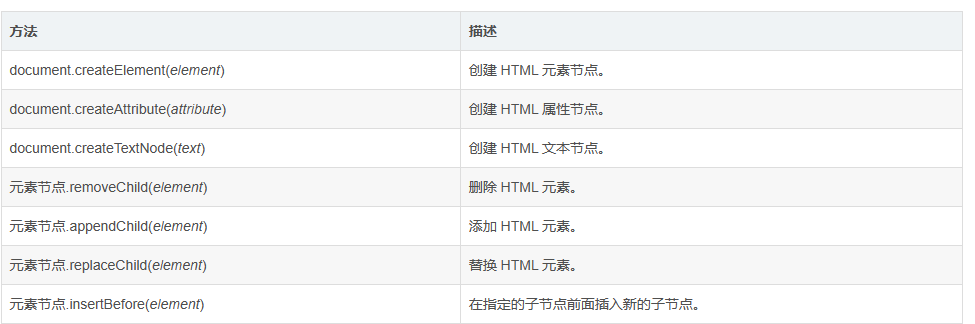
##### 2.方法演示

> 1. 需求描述：创建一个ul列表，然后在该列表中追加4个li标签。
> 
**方法1：**

```html
<!DOCTYPE html>
<html>
<head>
    <meta charset="UTF-8">
    <title></title>
</head>
<body>

<script>
	var ul=document.createElement("ul");

	var li1=document.createElement("li");
	var text1=document.createTextNode("列表项1");
	li1.appendChild(text1);
	ul.appendChild(li1);

	var li2=document.createElement("li");
	var text2=document.createTextNode("列表项2");
	li2.appendChild(text2);
	ul.appendChild(li2);

	var li3=document.createElement("li");
	var text3=document.createTextNode("列表项3");
	li3.appendChild(text3);
	ul.appendChild(li3);

	document.getElementsByTagName("body")[0].appendChild(ul);

</script>
</body>
</html>
```
**方法2：**

```html
<!DOCTYPE html>
<html>
<head>
    <meta charset="UTF-8">
    <title></title>
</head>
<body>

<!-- 在这里写JavaScript代码，因为JavaScript是由上到下执行的 -->
<script>
    var ul = document.createElement("ul");

    var li1 = document.createElement("li");
    li1.innerHTML = "列表项1";
    ul.appendChild(li1);

    var li2 = document.createElement("li");
    li2.innerHTML = "列表项2";
    ul.appendChild(li2);

    var li3 = document.createElement("li");
    li3.innerHTML = "列表项3";
    ul.appendChild(li3);

    var li4 = document.createElement("li");
    li4.innerHTML = "列表项4";
    ul.appendChild(li4);

    document.getElementsByTagName("body")[0].appendChild(ul);
</script>
</body>
</html>

```
**方法3：**

```html
<!DOCTYPE html>
<html>
<head>
    <meta charset="UTF-8">
    <title></title>
</head>
<body>

<!-- 在这里写JavaScript代码，因为JavaScript是由上到下执行的 -->
<script>
    var ul = document.createElement("ul");

    var li1 = "<li>列表项1</li>";
    var li2 = "<li>列表项2</li>";
    var li3 = "<li>列表项3</li>";
    var li4 = "<li>列表项4</li>";
    ul.innerHTML = li1 + li2 + li3 + li4;

    document.getElementsByTagName("body")[0].appendChild(ul);
</script>
</body>
</html>

```

> 2. 需求描述：创建一个ul列表，里边有四个li子元素，删除第一个li，替换最后一个li。

```html
<!DOCTYPE html>
<html>
<head>
    <meta charset="UTF-8">
    <title></title>
</head>
<body>
<ul id="ul">
    <li id="first">列表项1</li>
    <li>列表项2</li>
    <li>列表项3</li>
    <li id="last">列表项4</li>
</ul>

<!-- 在这里写JavaScript代码，因为JavaScript是由上到下执行的 -->
<script>
    var ul = document.getElementById("ul");
    var first = document.getElementById("first");
    var last = document.getElementById("last");

    /*删除第一个*/
    ul.removeChild(first);

    /*替换最后一个*/
    var replaceLi = document.createElement("li");
    replaceLi.innerHTML = "列表4的替换";
    ul.replaceChild(replaceLi, last);
</script>
</body>
</html>
```

> 3. 创建一个ul列表，里边有四个li子元素，在第一个li前边插入一个id为zero的li。

```html
<!DOCTYPE html>
<html>
<head>
    <meta charset="UTF-8">
    <title></title>
</head>
<body>
	<ul id="ul">
		<li id="first">1号</li>
		<li id="second">2号</li>
		<li>3号</li>
		<li>4号</li>
	</ul>
<script>
	var ul=document.getElementById("ul");
	var fisrtLi=document.getElementById("first");

	var zero=document.createElement("li");
	zero.innerHTML="列表0的新增";

	ul.insertBefore(zero,first);
</script>
</body>
</html>
```
#### 5.查找HTML父子
##### 1.方法介绍
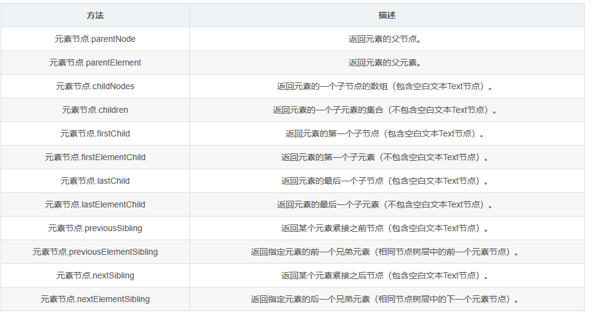
##### 5.方法演示

```html
<!DOCTYPE html>
<html>
<head>
    <meta charset="UTF-8">
    <title></title>
</head>
<body>
<div id="box">
    <ul id="ul">
        <li><a href="https://www.baidu.com">我是超链接1</a></li>
        <li id="two"><a href="https://www.baidu.com">我是超链接2</a></li>
        <li><a href="https://www.baidu.com">我是超链接3</a></li>
        <li><a href="https://www.baidu.com">我是超链接4</a></li>
    </ul>
</div>

<!-- 在这里写JavaScript代码，因为JavaScript是由上到下执行的 -->
<script>
    var box = document.getElementById("box");
    var ul = document.getElementById("ul");
    var two = document.getElementById("two");

    console.log(ul.parentNode);
    console.log(ul.parentElement);
    console.log("===============");

    console.log(box.childNodes);
    console.log(box.children);
    console.log("===============");

    console.log(ul.firstChild);
    console.log(ul.firstElementChild);
    console.log(ul.lastChild);
    console.log(ul.lastElementChild);
    console.log("===============");

    console.log(two.previousSibling);
    console.log(two.previousElementSibling);
    console.log(two.nextSibling);
    console.log(two.nextElementSibling);
</script>
</body>
</html>

```

```html
<!DOCTYPE html>
<html>
<head>
    <meta charset="UTF-8">
    <title></title>
</head>
<body>
<div id="container">
    <p>前面的P标签</p>
    <b>加粗文本</b>
    <a href="https://www.baidu.com" id="a">百度一下</a>
    <i>斜体文本</i>
    <p>最后的P标签</p>
</div>

<!-- 在这里写JavaScript代码，因为JavaScript是由上到下执行的 -->
<script>
    /*第一个子元素*/
    var firstNode = getfirstElementChild(document.getElementById("container"));
    console.log(firstNode.innerHTML);
    /*最后一个子元素*/
    var lastNode = getLastElementChild(document.getElementById("container"));
    console.log(lastNode.innerHTML);
    /*指定元素的前一个子元素*/
    var node1 = getPreviousElementSibling(document.getElementById("a"));
    console.log(node1.innerHTML);
    /*指定元素的后一个子元素*/
    var node2 = getNextElementSibling(document.getElementById("a"));
    console.log(node2.innerHTML);

    /*获取任意一个父级元素的第一个子元素*/
    function getfirstElementChild(element) {
        if (element.firstElementChild) {
            return element.firstElementChild;
        } else {
            var node = element.firstChild;
            while (node && node.nodeType != 1) {
                node = node.nextSibling;
            }
            return node;
        }
    }

    /*获取任意一个父级元素的最后一个子元素*/
    function getLastElementChild(element) {
        if (element.lastElementChild) {
            return element.lastElementChild;
        } else {
            var node = element.lastChild;
            while (node && node.nodeType != 1) {
                node = node.previousSibling;
            }
            return node;
        }
    }

    /*获取任意一个子元素的前一个兄弟元素*/
    function getPreviousElementSibling(element) {
        if (element.previousElementSibling) {
            return element.previousElementSibling;
        } else {
            var node = element.previousSibling;
            while (node && node.nodeType != 1) {
                node = node.previousSibling;
            }
            return node;
        }
    }

    /*获取任意一个子元素的后一个兄弟元素*/
    function getNextElementSibling(element) {
        if (element.nextElementSibling) {
            return element.nextElementSibling;
        } else {
            var node = element.nextSibling;
            while (node && node.nodeType != 1) {
                node = node.nextSibling;
            }
            return node;
        }
    }
</script>
</body>
</html>
```
### 3.DOM文档事件
#### 1.概述

> HTML事件可以触发浏览器中的行为，比方说当用户点击某个 HTML 元素时启动一段 JavaScript。
#### 2.窗口事件
##### 1.方法介绍
> 由窗口触发该事件 (同样适用于 < body> 标签)。
> 
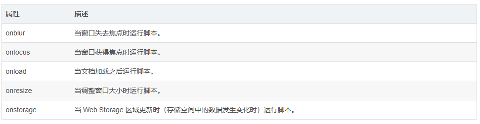
##### 2.方法演示
> 代码案例：

```html
<!DOCTYPE html>
<html>
<head>
    <meta charset="UTF-8">
    <title>Test</title>
</head>
<body>

<script>

	//窗口失去焦点时触发
	window.onblur=function(){
		console.log("窗口失去焦点");
	};

	//窗口获取焦点时触发
	window.onfocus=function(){
		console.log("窗口获取焦点");
	}

	//当文档加载之后运行脚本
	window.onload=function(){
		console.log("文档加载完成");
	}

	//调整窗口大小时触发
	window.onresize=function(){
		console.log("窗口大小正在改变");
	}
</script>
</body>
</html>
```
#### 3.表单事件
##### 1.方法介绍

> 表单事件在HTML表单中触发 (适用于所有 HTML 元素，但该HTML元素需在form表单内)。
> 
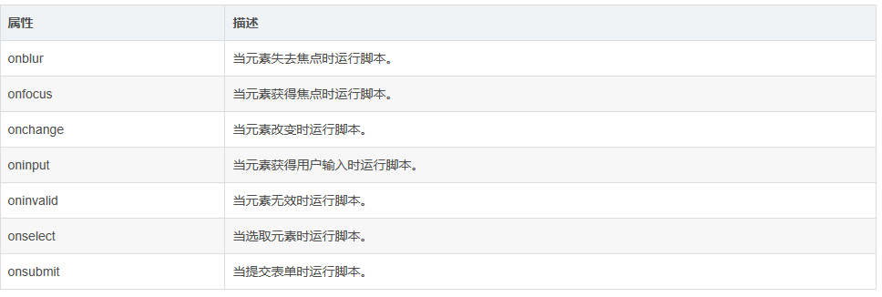
##### 2.方法演示
> 1. 需求描述：当文本框获取焦点，文本框背景为红色，当文本框失去焦点，文本框背景为黄色。

```html
<!DOCTYPE html>
<html>
<head>
    <meta charset="UTF-8">
    <title>Test</title>
</head>
<body>
<form>
	<input type="text" id="text01">
</form>

<script>
	var text01=document.getElementById("text01");
	text01.onfocus=function(){
		text01.style.background="red";
	}
	text01.onblur=function(){
		text01.style.background="green";
	}
</script>
</body>
</html>
```

> 2. 需求描述：当文本框内容改变时，鼠标离开文本框，自动将文本框的内容输出到控制台。

```html
<!DOCTYPE html>
<html>
<head>
    <meta charset="UTF-8">
    <title>Test</title>
</head>
<body>
<form>
	<input type="text" id="text01">
</form>

<script>
	var text01=document.getElementById("text01");
	text01.onchange=function(){
		console.log(text01.value);
	}
</script>
</body>
</html>
```

> 3. 需求描述：当文本框内容改变时，立即将改变的内容输出到控制台。

```html
<!DOCTYPE html>
<html>
<head>
    <meta charset="UTF-8">
    <title>Test</title>
</head>
<body>
<form>
	<input type="text" id="text01">
</form>

<script>
	var text01=document.getElementById("text01");
	text01.oninput=function(){
		console.log(text01.value);
	}
</script>
</body>
</html>

```

> 4. 需求描述：如果单击“submit”，则不填写文本字段，将发生警报消息。

```html
<!DOCTYPE html>
<html>
<head>
    <meta charset="UTF-8">
    <title></title>
</head>
<body>
<form>
    <input type="text" id="text" required>
    <input type="submit" value="submit">
</form>

<script>
    var textInput = document.getElementById("text");

    /* 如果单击“submit”，则不填写文本字段，将发生警报消息 */
    textInput.oninvalid = function () {
        console.log("请您完善表单内容！");
    };
</script>
</body>
</html>
```

> 5. 当选中文本框的内容时，输出“您已经选择了文本框内容!”。

```html
<!DOCTYPE html>
<html>
<head>
    <meta charset="UTF-8">
    <title></title>
</head>
<body>
<form>
    <input type="text" id="text">
</form>

<!-- 在这里写JavaScript代码，因为JavaScript是由上到下执行的 -->
<script>
    var textInput = document.getElementById("text");

    /* 当选中文本框的内容时，输出“您已经选择了文本框内容！” */
    textInput.onselect = function () {
        console.log("您已经选择了文本框内容！");
    };
</script>
</body>
</html>
```

> 6. 需求描述：当提交表单的时候，在控制台输出“表单提交”。

```html
<!DOCTYPE html>
<html>
<head>
    <meta charset="UTF-8">
    <title></title>
</head>
<body>
<form id="myform">
    <input type="submit" id="submit">
</form>

<!-- 在这里写JavaScript代码，因为JavaScript是由上到下执行的 -->
<script>
    var myform = document.getElementById("myform");

    /* 当提交表单的时候，在控制台输出“表单提交” */
    myform.onsubmit = function () {
        console.log("表单提交");
        return false;/* 用来阻止表单提交的，你不写它会跳转请求 */
    };
</script>
</body>
</html>
```
#### 4.键盘事件
##### 1.方法介绍
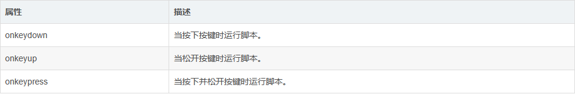
##### 2.方法演示

> 1. 需求描述：当键盘按下判断当前的按键是不是 a ，如果是就输出true，否则输出false。

```html
<!DOCTYPE html>
<html>
<head>
    <meta charset="UTF-8">
    <title></title>
</head>
<body>

<!-- 在这里写JavaScript代码，因为JavaScript是由上到下执行的 -->
<script>
    /* 当键盘按下判断当前的按键是不是 a ，如果是就输出true，否则输出false */
    window.onkeydown = function (event) {
        /* 解决兼容性问题 */
        event = event || window.event;

        if (event.keyCode == 65) {
            console.log("true");
        } else {
            console.log("false");
        }
    };
</script>
</body>
</html>
```
> 2. 需求分析：使div可以根据不同方向键向不同的方向移动。

```html
<!DOCTYPE html>
<html>
	<head>
		<meta charset="UTF-8">
		<title>登录页面</title>
	</head>
	<body>
		<div id="box" style="width: 100px; height: 100px; background: red;position: absolute;"></div>
		
		<script>
			var box=document.getElementById("box");

			//按键按下的事件
			document.onkeydown=function(event){
				event=event||window.event;

				var speed=10;
				switch(event.keyCode){
					case 37:
						box.style.left=box.offsetLeft-speed+"px";//左
						break;
					case 39:
						box.style.left=box.offsetLeft+speed+"px";//右
						break;
					case 38:
						box.style.top=box.offsetTop-speed+"px";//上
						break;
					case 40:
						box.style.top=box.offsetTop+speed+"px";//下
						break;
				}
			};
		</script>
	</body>
</html>
```
#### 5.鼠标事件
##### 1.方法介绍
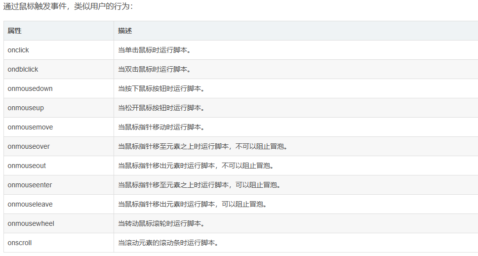
##### 2.方法演示
> 1. 需求描述：创建一个正方形div，默认颜色为黑色，当鼠标移入div，背景颜色变为红色，当鼠标移出div，背景颜色变为绿色。

```html
<!DOCTYPE html>
<html>
	<head>
		<meta charset="UTF-8">
		<title>登录页面</title>
	</head>
	<body>
		<div id="box" style="width: 100px; height: 100px; background: black;position: absolute;"></div>
		
		<script>
			var box=document.getElementById("box");

			box.onmouseenter=function(){
				box.style.background="red";
			};

			box.onmouseleave=function(){
				box.style.background="green";
			};
		</script>
	</body>
</html>
```

> 2. 需求描述：编写一个通用的拖拽元素函数，创建两个div，进行拖拽演示，要求兼容IE8、火狐、谷歌等主流浏览器。

```html
<!DOCTYPE html>
<html>
<head>
    <meta charset="UTF-8">
    <title></title>
</head>
<body>
<div id="box1" style="width: 100px;height: 100px;background: red;position: absolute;"></div>
<div id="box2" style="width: 100px;height: 100px;background: green;position: absolute;"></div>

<!-- 在这里写JavaScript代码，因为JavaScript是由上到下执行的 -->
<script>
    var box1 = document.getElementById("box1");
    var box2 = document.getElementById("box2");

    drag(box1);
    drag(box2);

    /*
     * 提取一个专门用来设置拖拽的函数
     * 参数：开启拖拽的元素
     */
    function drag(obj) {
        //当鼠标在被拖拽元素上按下时，开始拖拽
        obj.onmousedown = function (event) {
            // 解决事件的兼容性问题
            event = event || window.event;

            // 设置obj捕获所有鼠标按下的事件
            /**
             * setCapture()：
             * 只有IE支持，但是在火狐中调用时不会报错，
             * 而如果使用chrome调用，它也会报错
             */
            obj.setCapture && obj.setCapture();

            // obj的偏移量 鼠标.clentX - 元素.offsetLeft
            // obj的偏移量 鼠标.clentY - 元素.offsetTop
            var ol = event.clientX - obj.offsetLeft;
            var ot = event.clientY - obj.offsetTop;

            // 为document绑定一个鼠标移动事件
            document.onmousemove = function (event) {
                // 解决事件的兼容性问题
                event = event || window.event;
                // 当鼠标移动时被拖拽元素跟随鼠标移动
                // 获取鼠标的坐标
                var left = event.clientX - ol;
                var top = event.clientY - ot;
                // 修改obj的位置
                obj.style.left = left + "px";
                obj.style.top = top + "px";
            };

            // 为document绑定一个鼠标松开事件
            document.onmouseup = function () {
                // 取消document的onmousemove事件
                document.onmousemove = null;
                // 取消document的onmouseup事件
                document.onmouseup = null;
                // 当鼠标松开时，取消对事件的捕获
                obj.releaseCapture && obj.releaseCapture();
            };

            /*
             * 当我们拖拽一个网页中的内容时，浏览器会默认去搜索引擎中搜索内容，
             * 此时会导致拖拽功能的异常，这个是浏览器提供的默认行为，
             * 如果不希望发生这个行为，则可以通过return false来取消默认行为，
             * 但是这招对IE8不起作用
             */
            return false;
        };
    }
</script>
</body>
</html>
```
#### 6.媒体事件

> 通过视频（videos），图像（images）或音频（audio） 触发该事件。


#### 7.事件冒泡
##### 1.简介
> 事件的冒泡（Bubble）：所谓的冒泡指的就是事件的向上传导，当后代元素上的事件被触发时，其祖先元素的相同事件也会被触发，在开发中大部分情况冒泡都是有用的，如果不希望发生事件冒泡可以通过事件对象来取消冒泡。
##### 2.代码演示
> 1. 需求描述：创建两个div，叠放在一起，分别绑定单击事件，点击最里边的div，会触发两个div的单击事件。

```html
<!DOCTYPE html>
<html>
<head>
    <meta charset="UTF-8">
    <title></title>
    <style>
        #div1 {
            width: 200px;
            height: 200px;
            background: pink;
        }

        #div2 {
            width: 100px;
            height: 100px;
            background: coral;
        }
    </style>
</head>
<body>
<div id="div1">
    我是DIV1
    <div id="div2">
        我是DIV2
    </div>
</div>

<!-- 在这里写JavaScript代码，因为JavaScript是由上到下执行的 -->
<script>
    var div1 = document.getElementById("div1");
    var div2 = document.getElementById("div2");

    // 为div1绑定单击事件
    div1.onclick = function () {
        console.log("div1 的单击事件触发了！");
    };

    // 为div2绑定单击事件
    div2.onclick = function () {
        console.log("div2 的单击事件触发了！");
    };
</script>
</body>
</html>

```

> 2. 需求描述：创建两个div，叠放在一起，分别绑定单击事件，点击最里边的div，不会触发两个div的单击事件，只会触发自己的单击事件，这时候我们可以取消事件冒泡。

```html
<!DOCTYPE html>
<html>
<head>
    <meta charset="UTF-8">
    <title></title>
    <style>
        #div1 {
            width: 200px;
            height: 200px;
            background: pink;
        }

        #div2 {
            width: 100px;
            height: 100px;
            background: coral;
        }
    </style>
</head>
<body>
<div id="div1">
    我是DIV1
    <div id="div2">
        我是DIV2
    </div>
</div>

<!-- 在这里写JavaScript代码，因为JavaScript是由上到下执行的 -->
<script>
    var div1 = document.getElementById("div1");
    var div2 = document.getElementById("div2");

    // 为div1绑定单击事件
    div1.onclick = function () {
        console.log("div1 的单击事件触发了！");
        stopBubble();
    };

    // 为div2绑定单击事件
    div2.onclick = function () {
        console.log("div2 的单击事件触发了！");
        stopBubble();
    };

    // 取消事件冒泡
    function stopBubble(event) {
        // 如果提供了事件对象，则这是一个非IE浏览器
        if (event && event.stopPropagation) {
            // 因此它支持W3C的stopPropagation()方法
            event.stopPropagation();
        } else {
            // 否则，我们需要使用IE的方式来取消事件冒泡
            window.event.cancelBubble = true;
        }
    }
</script>
</body>
</html>

```

> 3. 需求描述：当点击a标签的时候，阻止a标签的默认跳转事件，采用事件阻止。

```html
<!DOCTYPE html>
<html>
<head>
    <meta charset="UTF-8">
    <title></title>
    <style>
        #div1 {
            width: 200px;
            height: 200px;
            background: pink;
        }

        #div2 {
            width: 100px;
            height: 100px;
            background: coral;
        }
    </style>
</head>
<body>
<a href="https://www.baidu.com" id="a">打开百度，你就知道！</a>

<!-- 在这里写JavaScript代码，因为JavaScript是由上到下执行的 -->
<script>
    var a = document.getElementById("a");

    // 为a绑定单击事件
    a.onclick = function () {
        stopDefault();
    };

    // 阻止浏览器的默认行为
    function stopDefault(event) {
        if (event && event.preventDefault) {
            // 阻止默认浏览器动作(W3C)
            event.preventDefault();
        } else {
            // IE中阻止函数器默认动作的方式
            window.event.returnValue = false;
        }
        return false;
    }
</script>
</body>
</html>

```
#### 4.事件委派
##### 1.简介

> 我们希望只绑定一次事件，即可应用到多个的元素上，即使元素是后添加的，我们可以尝试将其绑定给元素的共同的祖先元素，也就是事件的委派。事件的委派，是指将事件统一绑定给元素的共同的祖先元素，这样当后代元素上的事件触发时，会一直冒泡到祖先元素，从而通过祖先元素的响应函数来处理事件。事件委派是利用了事件冒泡，通过委派可以减少事件绑定的次数，提高程序的性能。
##### 2.代码演示
> 1. 需求描述：为ul列表中的所有a标签都绑定单击事件。

```html
<!DOCTYPE html>
<html>
<head>
    <meta charset="UTF-8">
    <title></title>
</head>
<body>
<ul id="u1">
    <li><a href="javascript:;" class="link">超链接一</a></li>
    <li><a href="javascript:;" class="link">超链接二</a></li>
    <li><a href="javascript:;" class="link">超链接三</a></li>
</ul>

<!-- 在这里写JavaScript代码，因为JavaScript是由上到下执行的 -->
<script>
    var u1 = document.getElementById("u1");

    // 为ul绑定一个单击响应函数
    u1.onclick = function (event) {
        event = event || window.event;
        // 如果触发事件的对象是我们期望的元素，则执行，否则不执行
        if (event.target.className == "link") {
            console.log("我是ul的单击响应函数");
        }
    };
</script>
</body>
</html>
```
## 14.JavaScript BOM
### 1.简介

> 浏览器对象模型（BOM）可以使我们通过JS来操作浏览器，在BOM中为我们提供了一组对象，用来完成对浏览器的操作，常见的BOM对象如下：
> 
> 1. Window：代表的是整个浏览器的窗口，同时window也是网页中的全局对象。
> 2. Navigator：代表的当前浏览器的信息，通过该对象可以来识别不同的浏览器。
> 3. Location：代表当前浏览器的地址栏信息，通过Location可以获取地址栏信息，或者操作浏览器跳转页面。
> 4. History：代表浏览器的历史记录，可以通过该对象来操作浏览器的历史记录，由于隐私原因，该对象不能获取到具体的历史记录，只能操作浏览器向前或向后翻页，而且该操作只在当次访问时有。
> 5. Screen：代表用户的屏幕的信息，通过该对象可以获取到用户的显示器的相关的信息。

> 这些BOM对象在浏览器中都是作为window对象的属性保存的，可以通过window对象来使用，也可以直接使用。

### 2.Window对象
#### 1.弹框

> JavaScript 有三种类型的弹出框：警告框、确认框和提示框。
##### 1.警告框
如果要确保信息传递给用户，通常会使用警告框。当警告框弹出时，用户将需要单击“确定”来继续。

```html
<script>
	//写法1：
		window.alert("这是一个警告框!");
	//写法2：也可以不带window前缀
		alert("这是一个警告框!");
</script>
```
##### 2.	确认框

> 如果您希望用户验证或接受某个东西，则通常使用“确认”框。当确认框弹出时，用户将不得不单击“确定”或“取消”来继续进行。如果用户单击“确定”，该框返回true。如果用户单击“取消”，该框返回 false。

```html
<script>
	//写法1：
		window.confirm("这是一个确认框!");
	//写法2：也可以不带window前缀
		confirm("这是一个确认框!");
</script>
```
##### 3.提示框

> 如果您希望用户在进入页面前输入值，通常会使用提示框。当提示框弹出时，用户将不得不输入值后单击“确定”或点击“取消”来继续进行。 如果用户单击“确定”，该框返回输入值。如果用户单击“取消”，该框返回 NULL。

```javascript
window.prompt("sometext","defaultText");
```

#### 2.定时事件
##### 1.简介
> window 对象允许以指定的时间间隔执行代码，这些时间间隔称为定时事件。
> 
> 通过 JavaScript 使用的有两个关键的方法：

> 1. 在等待指定的毫秒数后执行函数。

```javascript
setTimeout(function, milliseconds)//延时器
```

> 2. 每隔一段时间重复执行该函数。

```javascript
 setInterval(function, milliseconds)//定时器
```
##### 2.方法演示

> 1. 需求描述：单击按钮，等待 3 秒，然后控制台会输出 "Hello"。

```html
<!DOCTYPE html>
<html>
<head>
    <meta charset="UTF-8">
    <title></title>
</head>
<body>
<button id="btn">按钮</button>

<!-- 在这里写JavaScript代码，因为JavaScript是由上到下执行的 -->
<script>
    var btn = document.getElementById("btn");

    btn.onclick = function () {
        // 创建延时器
        var timer = setTimeout(function () {
            console.log("Hello");
        }, 3000);
        
        // 清除延时器
        // clearTimeout(timer);        
    };
</script>
</body>
</html>
```

> 2. 需求描述：单击按钮，每隔一秒向控制台输出 "Hello"。

```html
<!DOCTYPE html>
<html>
<head>
    <meta charset="UTF-8">
    <title></title>
</head>
<body>
<button id="btn">按钮</button>

<!-- 在这里写JavaScript代码，因为JavaScript是由上到下执行的 -->
<script>
    var btn = document.getElementById("btn");

    btn.onclick = function () {
        // 创建定时器
        var timer = setInterval(function () {
            console.log("Hello");
        }, 1000);

        // 清除定时器
        // clearInterval(timer);
    };
</script>
</body>
</html>
```
##### 3.综合案例

> 需求描述：做一个通用移动函数来实现小汽车（黑色方块）移动的效果。

```html
<!DOCTYPE html>
<html>
<head>
    <meta charset="UTF-8">
    <title>移动盒子</title>

	<style>
		.controller{
			width: 600px;
			height: 50px;
			line-height: 50px;
		}

		.controller button{
			outline: none;
			border: none;
			margin: 0px;
			padding: 0px;
			width: 200px;
			height: 50px;
			font-size: 16px;
			line-height: 50px;
			text-align: 50px;
			background-color: #e9e9e9;
			cursor: pointer;
			float: left; /* 使得元素间排列在一行 */
			-webkit-box-sizing: border-box;
			-moz-box-sizing: border-box;
			box-sizing: border-box;
			border: 2px solid #f0f0f0;
		}

		.controller button:hover{
			background-color: #f9f9f9;
		}

		.road{
			width: 100%;
			height: 100px;
			position: relative;
			margin-top: 50px;
			background: #3db1ff;
			opacity: .90;
		}

		.road800{
			width: 800px;
			height: 100px;
			background-color: pink;
			position: absolute;
			top: 0px;
			left: 0px;
			z-index: 1000;
			opacity: .75;
		}

		.road1200{
			width: 1200px;
			height: 100px;
			background-color: orange;
			position: absolute;
			top: 0px;
			left: 0px;
			z-index: 500;
		}

		#car {
            width: 135px;
            height: 100px;
            display: block;
            background: black;
            position: absolute;
            top: 0px;
            left: 0px;
            z-index: 1500;
            -webkit-box-sizing: border-box;
            -moz-box-sizing: border-box;
            box-sizing: border-box;
            /*border: 1px solid #F0F0F0;*/
        }
		
	</style>
</head>
<body>
	<div class="controller">
		<button id="btn01">移动到800px</button>
		<button id="btn02">移动到1200px</button>
		<button id="btn03">回家</button>
	</div>

	<div class="road">
		<div class="road800"></div>
		<div class="road1200"></div>
		<div id="car"></div>
	</div>

	<script>
		document.getElementById("btn01").onclick=function(){
			move(document.getElementById("car"),800);
		}

		document.getElementById("btn02").onclick=function(){
			move(document.getElementById("car"),1200);
		}

		document.getElementById("btn03").onclick=function(){
			move(document.getElementById("car"),0);
		}

		function move(element,target){
			//先清理定时器
			clearInterval(element.timeId);
			// 一会要清理定时器(只产生一个定时器)
			element.timeId=setInterval(function(){
				// 获取对象当前的位置
				var current=element.offsetLeft;
				// 每次移动多少像素
				var step=10;
				 // 判断是往正方向走还是往相反方向走
				step=current<target? step:-step;
				// 每次移动后的距离
				current+=step;

				// 判断当前移动后的位置是否到达目标位置
				if(Math.abs(target-current)>Math.abs(step)){
					element.style.left=current+"px";
				}else{
					clearInterval(element.timeId);
					element.style.left=target+"px";
				}
			},20);
		}
	</script>	
</body>
</html>
```
#### 3.常用窗口属性

> 用于确定浏览器窗口的尺寸的2个属性。

```html
window.innerHeight - 浏览器窗口的内高度（以像素计）
window.innerWidth - 浏览器窗口的内宽度（以像素计）
```

> 需求描述：显示浏览器窗口的高度和宽度（不包括工具栏和滚动条）。

```html
<!DOCTYPE html>
<html>
<head>
    <meta charset="UTF-8">
    <title></title>
</head>
<body>

<!-- 在这里写JavaScript代码，因为JavaScript是由上到下执行的 -->
<script>
    var w = window.innerWidth
        || document.documentElement.clientWidth
        || document.body.clientWidth;

    var h = window.innerHeight
        || document.documentElement.clientHeight
        || document.body.clientHeight;

    console.log(w);
    console.log(h);
</script>
</body>
</html>

```
#### 4.常用窗口方法
1. window.open() 

> 打开新的窗口。
> 

> 语法介绍：

```html
window.open(URL,name,specs,replace);
```
代码举例：

```html
<!DOCTYPE html>
<html>
<head>
    <meta charset="UTF-8">
    <title></title>
</head>
<body>
<button onclick="openWin()">打开窗口</button>

<!-- 在这里写JavaScript代码，因为JavaScript是由上到下执行的 -->
<script>
    function openWin() {
        myWindow = window.open('', '', 'width=200,height=100');
        myWindow.document.write("<p>这是新建窗口</p>");
    }
</script>
</body>
</html>
```
2. window.close() 

> 关闭当前窗口。

> 语法介绍：

```html
window.close();
```
代码举例：

```html
<!DOCTYPE html>
<html>
<head>
    <meta charset="UTF-8">
    <title></title>
</head>
<body>
<button onclick="openWin()">打开窗口</button>
<button onclick="closeWin()">关闭窗口</button>

<!-- 在这里写JavaScript代码，因为JavaScript是由上到下执行的 -->
<script>
    function openWin() {
        myWindow = window.open('', '', 'width=200,height=100');
        myWindow.document.write("<p>这是新建窗口</p>");
    }

    function closeWin() {
        myWindow.close();
    }
</script>
</body>
</html>
```
3. window.moveTo() 

> 移动当前窗口。

> 语法介绍：

```html
window.moveTo(x,y);
```
代码举例：

```html
<!DOCTYPE html>
<html>
<head>
    <meta charset="UTF-8">
    <title></title>
</head>
<body>
<button onclick="openWin()">打开窗口</button>
<button onclick="moveWin()">移动窗口</button>

<!-- 在这里写JavaScript代码，因为JavaScript是由上到下执行的 -->
<script>
    function openWin() {
        myWindow = window.open('', '', 'width=200,height=100');
        myWindow.document.write("<p>这是新建窗口</p>");
    }

    function moveWin() {
        myWindow.moveTo(300, 300);
        myWindow.focus();
    }
</script>
</body>
</html>
```
4. window.resizeTo() 

> 调整当前窗口。

> 语法介绍：

```html
window.resizeTo(width,height);
```
代码举例：

```html
<!DOCTYPE html>
<html>
<head>
    <meta charset="UTF-8">
    <title></title>
</head>
<body>
<button onclick="openWin()">打开窗口</button>
<button onclick="resizeWin()">调整窗口</button>

<!-- 在这里写JavaScript代码，因为JavaScript是由上到下执行的 -->
<script>
    function openWin() {
        myWindow = window.open('', '', 'width=200,height=100');
        myWindow.document.write("<p>这是新建窗口</p>");
    }

    function resizeWin() {
        myWindow.resizeTo(300, 300);
        myWindow.focus();
    }
</script>
</body>
</html>
```
### 3.Location对象
Location对象中封装了浏览器的地址栏的信息，如果直接打印location，则可以获取到地址栏的信息（当前页面的完整路径）。
#### 1.常用属性

```html
console.log(location);          //输出location对象
console.log(location.href);     //输出当前地址的全路径地址
console.log(location.origin);   //输出当前地址的来源
console.log(location.protocol); //输出当前地址的协议
console.log(location.hostname); //输出当前地址的主机名
console.log(location.host);     //输出当前地址的主机
console.log(location.port);     //输出当前地址的端口号
console.log(location.pathname); //输出当前地址的路径部分
console.log(location.search);   //输出当前地址的?后边的参数部分
```
#### 2.常用方法

> 1. assign()：用来跳转到其它的页面，作用和直接修改location一样。

```html
location.assign("https://www.baidu.com");
```

> 2. reload()：用于重新加载当前页面，作用和刷新按钮一样，如果在方法中传递一个true，作为参数，则会强制清空缓存刷新页面。

```html
location.reload(true);
```

> 3. replace()：可以使用一个新的页面替换当前页面，调用完毕也会跳转页面，它不会生成历史记录，不能使用回退按钮回退。

```html
location.replace("https://www.baidu.com");
```
### 4.History对象
History对象可以用来操作浏览器向前或向后翻页。
#### 1.常用属性
```html
console.log(history);           //输出history对象
console.log(history.length);    //可以获取到当成访问的链接数量
```
#### 2.常用方法
1. back()：可以回退到上一个页面，作用和浏览器的回退按钮一样。

```html
history.back();
```
2. forward()：可以跳转到下一个页面，作用和浏览器的前进按钮一样。

```html
history.forward();

```
3. go()：可以用来跳转到指定的页面，它需要一个整数作为参数

> 1：表示向前跳转一个页面，相当于forward()。
> 2：表示向前跳转两个页面。
> -1：表示向后跳转一个页面，相当于back()。
> -2：表示向后跳转两个页面。

```html
history.go(-2);
```
## 15.Exception
和C#、Java中的异常处理类似。

```csharp
        try{

        }catch{

        }finally{
            
        }
```
## 16.JSON
### 1.简介

> Json是一种存储和交换数据的语法。

> 当数据在浏览器与服务器之间进行交换时，这些数据只能是文本，JSON 属于文本并且我们能够把任何 JavaScript 对象转换为
> JSON，然后将 JSON 发送到服务器。我们也能把从服务器接收到的任何 JSON 转换为 JavaScript
> 对象。以这样的方式，我们能够把数据作为 JavaScript 对象来处理，无需复杂的解析和转译。

> 通过 JavaScript，能够创建对象并向其分配数据，就像这样：

```csharp
var person = {"name": "zhangsan", "age": 62, "city": "BeiJing"};
console.log(person);
```
### 2.语法

> 1. 通过JSON.parse()将JSON字符串转JS对象，它需要一个JSON字符串作为参数，会将该字符串转换为JS对象并返回。代码举例：

```html
var jsonStr = '{"name":"孙悟空","age":18,"gender":"男"}';
var obj = JSON.parse(jsonStr);
console.log(obj);
```

> 2. 通过JSON.stringify()将JS对象转JSON字符串，该方法可以将一个JS对象转换为JSON字符串，需要一个js对象作为参数，会返回一个JSON字符串。代码举例：

```html
var obj = {name: "猪八戒", age: 28, gender: "男"};
var jsonStr = JSON.stringify(obj);
console.log(jsonStr);
```
## 17.AJAX
### 1.简介

> 传统的web交互是用户触发一个http请求服务器，然后服务器收到之后，在做出响应到用户，并且返回一个新的页面，每当服务器处理客户端提交的请求时，客户都只能空闲等待，并且哪怕只是一次很小的交互、只需从服务器端得到很简单的一个数据，都要返回一个完整的HTML页，而用户每次都要浪费时间和带宽去重新读取整个页面。这个做法浪费了许多带宽，由于每次应用的交互都需要向服务器发送请求，应用的响应时间就依赖于服务器的响应时间，这导致了用户界面的响应比本地应用慢得多。

> AJAX 的出现,刚好解决了传统方法的缺陷，AJAX 是一种用于创建快速动态网页的技术，通过在后台与服务器进行少量数据交换，AJAX 可以使网页实现异步更新，这意味着可以在不重新加载整个网页的情况下，对网页的某部分进行更新。


### 2.AJAX的XMLHttpRequest对象
#### 1.简介

> AJAX 的核心是 XMLHttpRequest 对象。 所有现代浏览器都支持 XMLHttpRequest 对象。
> 
> XMLHttpRequest 对象用于幕后同服务器交换数据，这意味着可以更新网页的部分，而不需要重新加载整个页面。

#### 2.用法

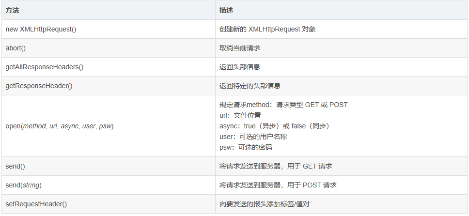

#### 3.属性

> 
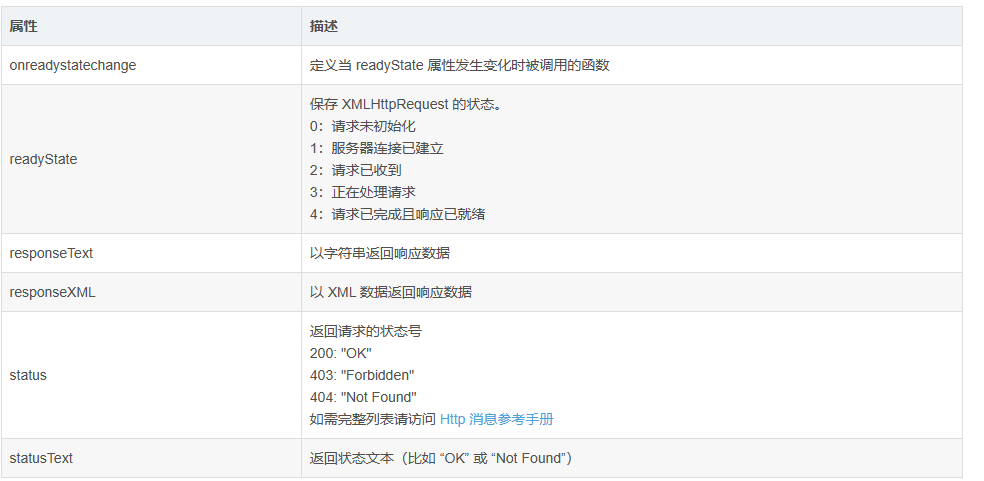
#### 4.AJAX的GET请求
> 工程结构：

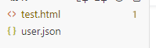
> user.json：

```bash
[
    {"name":"孙悟空","age":18,"gender":"男"},
    {"name":"猪八戒","age":19,"gender":"男"},
    {"name":"唐僧","age":20,"gender":"男"},
    {"name":"沙和尚","age":21,"gender":"男"}
  ] 
```

> test.html：

```html
<!DOCTYPE html>
<html>
<head>
    <meta charset="UTF-8">
    <title></title>
</head>
<body>
<button onclick="openWin()">btn01</button>
<button onclick="resizeWin()">btn02</button>

<!-- 在这里写JavaScript代码，因为JavaScript是由上到下执行的 -->
<script>
    function openWin() {
        //步骤一：创建异步对象
        var ajax = new XMLHttpRequest();
        //步骤二：设置请求的url参数，参数一是请求的类型，参数二是请求的url
        ajax.open("get", "user.json");
        //步骤三：发送请求
        ajax.send();
        //步骤四：注册事件 onreadystatechange 状态改变就会调用
        ajax.onreadystatechange = function () {
            if (ajax.readyState == 4 && ajax.status == 200) {
                //步骤五：如果能够进到这个判断，说明数据完美的回来了，并且请求的页面是存在的
                console.log(ajax.responseText);//输入响应的内容
            }
        };
    };

    function resizeWin() {
        history.forward();

    };
</script>
</body>
</html>
```
#### 5.AJAX的POST请求

> user.json：

```bash
[
  {"name":"孙悟空","age":18,"gender":"男"},
  {"name":"猪八戒","age":19,"gender":"男"},
  {"name":"唐僧","age":20,"gender":"男"},
  {"name":"沙和尚","age":21,"gender":"男"}
]
```
> test.html：

```html
<!DOCTYPE html>
<html>
<head>
    <meta charset="UTF-8">
    <title></title>
</head>
<body>
<button onclick="openWin()">btn01</button>
<button onclick="resizeWin()">btn02</button>

<!-- 在这里写JavaScript代码，因为JavaScript是由上到下执行的 -->
<script>
    function openWin() {
        //步骤一：创建异步对象
        var ajax = new XMLHttpRequest();
        //步骤二：设置请求的类型及url，注意：post请求一定要添加请求头才行不然会报错
        ajax.open("post", "user.json");
        ajax.setRequestHeader("Content-type", "application/x-www-form-urlencoded");
        //步骤三：发送请求
        ajax.send();
        //步骤四：注册事件 onreadystatechange 状态改变就会调用
        ajax.onreadystatechange = function () {
            //步骤五：如果能够进到这个判断，说明数据完美的回来了，并且请求的页面是存在的
            if (ajax.readyState == 4 && ajax.status == 200) {
                console.log(ajax.responseText);//输入响应的内容
            }
        };

    };

    function resizeWin() {
        history.forward();

    };
</script>
</body>
</html>
```
#### 6.AJAX的请求整合

> user.json：

```bash
[
  {"name":"孙悟空","age":18,"gender":"男"},
  {"name":"猪八戒","age":19,"gender":"男"},
  {"name":"唐僧","age":20,"gender":"男"},
  {"name":"沙和尚","age":21,"gender":"男"}
]
```

> test.html：

```html
<!DOCTYPE html>
<html>
<head>
    <meta charset="UTF-8">
    <title></title>
</head>
<body>
<button onclick="openWin()">btn01</button>
<button onclick="resizeWin()">btn02</button>

<!-- 在这里写JavaScript代码，因为JavaScript是由上到下执行的 -->
<script>
    function openWin() {
        var Ajax = {
    get: function (url, fn) {
        var xhr = new XMLHttpRequest();
        xhr.open('GET', url, true);
        xhr.onreadystatechange = function () {
            if (xhr.readyState == 4 && xhr.status == 200 || xhr.status == 304) {
                fn.call(this, xhr.responseText);
            }
        };
        xhr.send();
    },
    post: function (url, data, fn) {
        var xhr = new XMLHttpRequest();
        xhr.open("POST", url, true);
        xhr.setRequestHeader("Content-Type", "application/x-www-form-urlencoded");
        xhr.onreadystatechange = function () {
            if (xhr.readyState == 4 && (xhr.status == 200 || xhr.status == 304)) {
                fn.call(this, xhr.responseText);
            }
        };
        xhr.send(data);
    }
};

// 演示GET请求
Ajax.get("user.json", function (response) {
    console.log(response);
});

// 演示POST请求
Ajax.post("user.json", "", function (response) {
    console.log(response);
});

    };

    function resizeWin() {
        history.forward();

    };
</script>
</body>
</html>
```
## 17.Cookie
### 1.简介

> Cookie 是一些数据，存储于你电脑上的文本文件中，当 web 服务器向浏览器发送 web
> 页面时，在连接关闭后，服务端不会记录用户的信息，Cookie 的作用就是用于解决 “如何记录客户端的用户信息”。

> 当用户访问 web 页面时，它的名字可以记录在 cookie 中。 在用户下一次访问该页面时，可以在 cookie 中读取用户访问记录。

> Cookie 以名/值对形式存储，如下所示：

```bash
username=zhangsan
```

> 当浏览器从服务器上请求 web 页面时， 属于该页面的 cookie 会被添加到该请求中，服务端通过这种方式来获取用户的信息。

> JavaScript 可以使用 document.cookie 属性来创建 、读取、及删除 Cookie。
### 2.Cookie创建
1. 创建cookie
```html
document.cookie = "username=zhangsan";
```
2. 还可以在创建cookie的同时为cookie 添加一个过期时间（以 UTC 或 GMT 时间）。默认情况下，cookie 在浏览器关闭时删除。

```html
document.cookie = "username=zhangsan; expires=Thu, 18 Dec 2043 12:00:00 GMT";
```
3. 还可以使用 path 参数告诉浏览器 cookie 的路径。默认情况下，cookie 属于当前页面。

```html
document.cookie = "username=zhangsan; expires=Thu, 18 Dec 2043 12:00:00 GMT; path=/";
```
### 3.Cookie读取

```html
document.cookie = "username=zhangsan";
var cookies = document.cookie;
console.log(cookies);
```
### 4.Cookie修改

```html
document.cookie = "username=zhangsan";
document.cookie = "username=lisi";
var cookies = document.cookie;
console.log(cookies);
```
### 5.Cookie删除

> 删除 cookie 非常简单，只需要设置 expires 参数为以前的时间即可，如下所示，设置为 Thu, 01 Jan 1970 00:00:00 GMT:

```html
document.cookie = "username=zhangsan";
document.cookie = "username=; expires=Thu, 01 Jan 1970 00:00:00 GMT";
var cookies = document.cookie;
console.log(cookies);
```
### 6.Cookie值设置函数

```javascript
/**
 * Cookie值设置函数
 * @param cname     cookie名称
 * @param cvalue    cookie值
 * @param exdays    过期天数
 */
function setCookie(cname, cvalue, exdays) {
    var d = new Date();
    d.setTime(d.getTime() + (exdays * 24 * 60 * 60 * 1000));
    var expires = "expires=" + d.toGMTString();
    document.cookie = cname + "=" + cvalue + "; " + expires;
}
```
### 7.Cookie值获取函数

```javascript
/**
 * Cookie值获取函数
 * @param cname     cookie名称
 * @returns {string}
 */
function getCookie(cname) {
    var name = cname + "=";
    var ca = document.cookie.split(';');
    for (var i = 0; i < ca.length; i++) {
        var c = ca[i].trim();
        if (c.indexOf(name) == 0) return c.substring(name.length, c.length);
    }
    return "";
}
```
## 18.WebStorage
### 1.简介

> Web Storage是HTML5引入的一个非常重要的功能，可以将数据存储在本地，如保存用户的偏好设置、复选框的选中状态、文本框默认填写的值等。用户在浏览器中刷新网页时，网页通过Web
> Storage就可以知道用户之前所做的一些修改，而不需要将用户修改的内容存储在服务器端。

> Web Storage类似于Cookie,但相比Cookie可以减少网络流量，因为Web
> Storage存储的数据不会发送给服务器，而Cookie存储的数据会由浏览器通过HTTP请求自动发送给服务器。将数据存储在WebStorage可以减少数据在浏览器和服务器间不必要地来回传递。

> Web Storage中包含两个关键的对象，分别是localStorage对象和sessionStorage对象，它们都是Web
> Storage的实例，所以都能使用Web
> Storage接口提供的方法和属性。localStorage对象用于本地存储，sessionStorage对象用于区域存储。

> Web Storage具有以下5个特点：
> 1. 数据的设置和读取比较方便。
> 
> 2. 容量较大，可以存储大约5MB数据。
> 
> 3. 只能存储字符串，如果要存储JSON对象，则可以使用JSON.stringify()和JSON.parseO方法分别进行序列化和反序列化。
> 
> 4. 本地数据可以即时获得。借助浏览器的缓存，整个页面和数据都可以保存在本地，从本地读数据比通过网络从服务器获得数据快得多，可以立即显示网页中缓存的内容。
> 
> 5. 数据可以临时存储。很多时候数据只需要在用户浏览单个页面期间使用，关闭页面后数据就可以丢弃，这种情况使用sessionStorage非常方便。

> 目前，市面上主流的Web浏览器都在一定程度上支持HTML5的Web Storage,且iOS和Android两大平台对Web Storage都具有很好的支持。目前市面上的主流手机和平板计算机都依赖这两个平台，所以在实际开发中，基本不需要担心移动设备的Web浏览器对Web Storage的支持情况。

### 2.localStorage方法

> localStorage在本地永久性存储数据，除非显式将其删除或清空。

> 常见方法：
> 1. 保存单个数据：localStorage.setItem(key,value);
> 2. 读取单个数据：localStorage.getItem(key);
> 3. 删除单个数据：localStorage.removeItem(key);
> 4. 删除所有数据：localStorage.clear();
> 5. 获取某个索引的key：localStorage.key(index);

代码演示：

```javascript
// 保存数据
localStorage.setItem("username", "zhangsan");

// 读取单个数据
console.log(localStorage.getItem("username"));
console.log("===============");

// 删除单个数据
localStorage.removeItem("username");
console.log(localStorage.getItem("username"));
console.log("===============");

// 保存两个数据
localStorage.setItem("age", 18);
localStorage.setItem("sex", "男");
console.log("age=" + localStorage.getItem("age"));
console.log("sex=" + localStorage.getItem("sex"));
console.log("===============");

// 使用for-in循环来迭代localStorage中的键值对、属性和方法：
for (var key in localStorage) {
    console.log(key + "=" + localStorage[key]);
}
console.log("===============");

// 使用for循环来迭代localStorage中的键值对：
for (var i = 0; i < localStorage.length; i++) {
    var key = localStorage.key(i);
    var value = localStorage.getItem(key);
    console.log(key + "=" + value);
}
console.log("===============");

// 删除所有数据
localStorage.clear();
```
### 2.sessionStorage方法

> 常见方法：
> 1. 保存单个数据：sessionStorage.setItem(key,value);
> 2. 读取单个数据：sessionStorage.getItem(key);
> 3. 删除单个数据：sessionStorage.removeItem(key); 删除所有数据：sessionStorage.clear();
> 4. 获取某个索引的key：sessionStorage.key(index);

代码演示：

```javascript
// 保存数据
sessionStorage.setItem("username", "zhangsan");

// 读取单个数据
console.log(sessionStorage.getItem("username"));
console.log("===============");

// 删除单个数据
sessionStorage.removeItem("username");
console.log(sessionStorage.getItem("username"));
console.log("===============");

// 保存两个数据
sessionStorage.setItem("age", 18);
sessionStorage.setItem("sex", "男");
console.log("age=" + sessionStorage.getItem("age"));
console.log("sex=" + sessionStorage.getItem("sex"));
console.log("===============");

// 使用for-in循环来迭代sessionStorage中的键值对、属性和方法：
for (var key in sessionStorage) {
    console.log(key + "=" + sessionStorage[key]);
}
console.log("===============");

// 使用for循环来迭代sessionStorage中的键值对：
for (var i = 0; i < sessionStorage.length; i++) {
    var key = sessionStorage.key(i);
    var value = sessionStorage.getItem(key);
    console.log(key + "=" + value);
}
console.log("===============");

// 删除所有数据
sessionStorage.clear();
```
## 19.let关键字

> let 关键字用来声明变量，使用 let 声明的变量有几个特点：
> 
> 1. 不允许重复声明。
> 2. 块儿级作用域。
> 3. 不存在变量提升。
> 4. 不影响作用域链。

> **注意：以后声明变量使用 let 就对了。**

> 需求描述：创建四个div，单机每一个div让其变色。

```html
<!DOCTYPE html>
<html>
<head>
    <meta charset="UTF-8">
    <title></title>
    <style>
        .item {
            width: 100px;
            height: 50px;
            border: solid 1px rgb(42, 156, 156);
            float: left;
            margin-right: 10px;
        }
    </style>
</head>
<body>
<div class="item"></div>
<div class="item"></div>
<div class="item"></div>
<div class="item"></div>

<!-- 在这里写JavaScript代码，因为JavaScript是由上到下执行的 -->
<script>
    // 获取div元素对象
    let items = document.getElementsByClassName('item');

    // 遍历并绑定事件
    for (let i = 0; i < items.length; i++) {
        items[i].onclick = function () {
            // 以前的做法：this.style.background = "pink";
            items[i].style.background = "pink";
        };
    }
</script>
</body>
</html>
```
## 20.简化对象写法

> ES6 允许在大括号里面，直接写入变量和函数，作为对象的属性和方法，这样的书写更加简洁。

> **注意：对象简写形式简化了代码，所以以后用简写就对了。**

```javascript
let name = "张三";
let age = 18;
let speak = function () {
    console.log(this.name);
};

//属性和方法简写
let person = {
    name,
    age,
    speak
};

console.log(person.name);
console.log(person.age);
person.speak();

```
## 21.异步编程
### 1.简介

> javascript语言是一门“单线程”的语言，不像java语言，类继承Thread再来个thread.start就可以开辟一个线程，所以，javascript就像一条流水线，仅仅是一条流水线而已，要么加工，要么包装，不能同时进行多个任务和流程。

> 同步和异步，无论如何，做事情的时候都是只有一条流水线（单线程），同步和异步的差别就在于这条流水线上各个流程的执行顺序不同。

> 最基础的异步是setTimeout和setInterval函数，很常见，但是很少人有人知道其实这就是异步，因为它们可以控制js的执行顺序。

> 目前来说,JS实现异步编程的最好方法还是: 
> 1. Promise。
> 2. aysnc await。

> 基本原则: 如果只用Promise, 那异步过程只在Promise里, 如果想执行Promise后返回结果, 那就用 aysnc/await 调用Promise。

### 1.Promise方法

> 简单说，它的思想是，每一个异步任务返回一个Promise对象，该对象有一个then方法，允许指定回调函数。比如，f1的回调函数f2,可以写成：f1().then(f2);

下面这个例子是个非常经典的例子：

```html
<!DOCTYPE html>
<html>
<head>
    <meta charset="UTF-8">
    <title></title>
    <style>
        .item {
            width: 100px;
            height: 50px;
            border: solid 1px rgb(42, 156, 156);
            float: left;
            margin-right: 10px;
        }
    </style>
</head>
<body>

<script>

  //这是个普通函数
function read() {
  console.log('小明认真读书');
}


//这是个异步函数
function eat() {
  return new Promise((resolve, reject) => {
    console.log('好嘞，吃饭咯');
    setTimeout(() => {
      resolve('饭吃饱啦');
    }, 1000)
  })
}
 

//这是个异步函数
function wash() {
  return new Promise((resolve, reject) => {
    console.log('唉，又要洗碗');
    setTimeout(() => {
      resolve('碗洗完啦');
    }, 1000)
  })
}
 

//这是个异步函数
function mop() {
  return new Promise((resolve, reject) => {
    console.log('唉，还要拖地');
    setTimeout(() => {
      resolve('地拖完啦');
    }, 1000)
  })
}


//这是个异步函数 但写法和上面不太一样, 其实它是一个Promise对象
const cooking = new Promise((resolve, reject) => {
  console.log('妈妈认真做饭');

  setTimeout(() => {
    resolve('小明快过来，开饭啦');
  }, 3000);
  
})
 

//程序运行开始:
//1. 先执行这个异步函数
cooking.then(msg => {
  console.log(msg);
  return eat();
}).then(msg => {
  console.log(msg);
  return wash();
}).then(msg => {
  console.log(msg);
  return mop();
}).then(msg => {
  console.log(msg);
  console.log('终于结束啦，出去玩咯')
});


//2. 再执行这个普通函数
read();

</script>
</body>
</html>

```

运行结果：

```bash
妈妈认真做饭
小明认真读书
小明快过来，开饭啦
好嘞，吃饭咯
饭吃饱啦
唉，又要洗碗
碗洗完啦
唉，还要拖地
地拖完啦
终于结束啦，出去玩咯
```

> 来简单分析一下为什么会这么执行：
> 
> 1. 程序一开始,我们先执行了cooking，cooking里有一句console.log('妈妈认真做饭');是立即执行的语句,并不需要异步处理,所以会立即打印。
> cooking 里的定时器是需要一定的执行时间的,所以是一个异步方法,会呆一会才能执行到,后续的.then里的函数都要等这个方法resolve或者reject里才能执行。
> 2. 但程序不会等他 resolve，而是继续执行 ，于是执行到了 read() 所以会打印 小明认真读书。
> 3. 假设此时cooking的异步方法resolve了, 就会执行.then,从而触发eat。
> 4. eat里也是有同步,有异步, 以此类推....
### 2.async和await
> 如果,一个函数用async修饰,它return出来的就会是一个promise，执行函数时, 可以用 await修饰, 用以执行异步函数。

```html
<!DOCTYPE html>
<html>
<head>
    <meta charset="UTF-8">
    <title></title>
    <style>
        .item {
            width: 100px;
            height: 50px;
            border: solid 1px rgb(42, 156, 156);
            float: left;
            margin-right: 10px;
        }
    </style>
</head>
<body>

<script>
    async function test1() {         //因为里面返回的本身就是个promise,所以不用async修饰也可以
    return new Promise(resolve => {
        setTimeout(() => {
            resolve('hola')     //异步执行后,调用resolve()改变异步状态
        }, 3000);
     });
    }
    async function test2() {
        const v = await test1();   //等待异步方法test1执行完成把值传给v
        console.log(v);
    };

test2();   //执行时,会延时3秒打印 hola

</script>
</body>
</html>
```
## 22.动态 import

> 以前我们import导入模块是在一开始的时候就全部导入了，这样在模块很多的时候，会显得网页速度加载很慢，在ES11中就提供了一种动态import，案例演示如下：

> m1.js：

```javascript
//分别暴露
export let school = "西北工业大学";

export function study() {
    console.log("我们要学习！");
}

```

> index.html：

```html
<!DOCTYPE html>
<html>
<head>
    <meta charset="UTF-8">
    <title></title>
</head>
<body>

<button id="btn">点击我，加载m1.js模块</button>

<!-- 在这里写JavaScript代码，因为JavaScript是由上到下执行的 -->
<script type="module">
    const btn = document.getElementById("btn");

    btn.onclick = function(){
        import("./m1.js").then(module => {
            module.study();
        });
    };
</script>
</body>
</html>
```
## 23.关于let和var的区别

> 1. 作用域不同：
> * let定义的变量作用域仅限于定义该变量的代码块中。比如：if ... else，for...in...，switch...case...等等。
> * var定义的变量作用域为定义该变量的函数范围中（当在函数中定义时），或者为全局的范围（当定义为全局变量时）。
> 
> 比如以下面一段if条件判断代码为例：

```javascript
(function(){
  if (true) {
    var a = 13
  }
  console.log(a) //控制台输出：13
})()
```

> 在if代码块内使用var定义的变量a，在代码块外仍然可以访问，控制台打印出了a的值。
```javascript
(function(){
  if (true) {
    let a = 13
  }
  console.log(a) //控制台输出：ReferenceError: a is not defined
})()
```
> 当我们将var替换成let时，在if代码块外访问时，会直接报错。

> 2. 访问顺序的要求不同：
> * var定义变量，可以在未定义前访问。
> * let定义变量，必须先定义，后访问。

```javascript
(function(){
    console.log(a)
    console.log(b)
    var a = 10
    let b = 11
})()
```
控制台输出：
```javascript
undefined
ReferenceError: Cannot access 'b' before initialization
```

> a可以在var未定义前访问，值为undefined，b在let未定义前访问直接报错。

> 3. 是否可被重复定义：
> * let：同一代码块中，同名变量不可被重复定义。 
> * var：同一作用域下，同名变量可以被重复定义。
> 
>  还是以if条件语句为例：

> let:
```javascript
(function(){
    if (true) {
        let a = 11
        let a = 12
        console.log(a) // 控制台：SyntaxError: Identifier 'a' has already been declared
    }
})()
```
> var:
```javascript
(function(){
    if (true) {
        var a = 11
        var a = 12
        console.log(a) // 控制台：12
    }
})()
```
> js中的let相比var更严谨，也更符合我们的编程思维和习惯。应更偏向使用let而不是var。

## 24.js中dom元素的classList.toggle("")方法

> classList.toggle()方法用于在元素的class属性中添加或删除指定的类名。具体来说，该方法会检查元素的class属性中是否含有指定的类名，如果没有则添加该类名，如果有则删除该类名。 <br>
> 方法的语法：element.classList.toggle("classname"); <br>
> 其中，element为要操作的元素，classname为要添加或删除的类名。执行该方法后，如果元素中已经包含了该类名，则该方法会将该类名从元素的class属性中删除；如果元素中不包含该类名，则该方法会将该类名添加到元素的class属性中。例如：

> HTML代码：
```html
<div id="myDiv" class="box"></div>
```
> JS代码：
```javascript
var myDiv = document.getElementById("myDiv");
myDiv.classList.toggle("box"); //删除box类名
myDiv.classList.toggle("container"); //添加container类名
```
> 执行后，HTML代码为：
```html
<div id="myDiv" class="container"></div>
```
> 可以看到，原先元素中的box类名已经被删除，同时添加了container类名。如果再次执行该方法，container类名将被删除，恢复原先的状态。

## 25.
