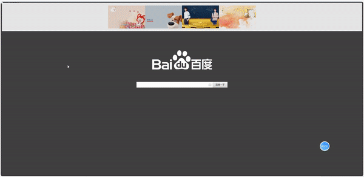

@[TOC](目录)

> 自己写过的一些前端界面设计Demo整理。


## 1.兴趣展示网站
### 1.效果


### 2.代码展示

> 1. 工程截图：


> 2.  index.html代码：

```html
<!DOCTYPE html>
<html lang="en" >
<head>
    <meta charset="UTF-8">
    <meta name="viewport" content="width=device-width, initial-scale=1.0">
    <title>去看看世界，欣赏令人心旷神怡的风景吧</title><!--设置标题-->
    <link rel="icon" href="head.jpg" type="image/x-icon">  <!--在网页标题左侧显示图标-->
    <link rel="stylesheet"  href="style.css"><!--<link>定义文档与外部资源的关系;href是超链接-->
</head>

<body>
    <header><!--header表示表头-->
        <a href="#" class="brand">主页</a><!--<a>用于定义锚；href="#"是指链接到当前页面-->
        <div class="menu_btn"></div>
        <div class="navigation"><!--定义菜单栏导航-->
                <div class="navigation-items">
                    <a href="#">主页</a>
                    <a href="#">关于</a>
                    <a href="#">探索</a>
                    <a href="#">旅行</a>
                    <a href="#">联系我们</a>
                </div>
        </div>
    </header>

    <section class="home">
        <video class="video-slide active" src="sea.mp4" active autoplay muted loop></video><!--主页播放的那几个视频；autoplay是自动播放；muted表示静音播放；loop是循环播放-->
        <video class="video-slide" src="train.mp4"  autoplay muted loop></video>
        <video class="video-slide" src="walk.mp4" autoplay muted loop></video>
        <video class="video-slide" src="mountain.mp4" autoplay muted loop></video>
        <video class="video-slide" src="bike.mp4"   autoplay muted loop></video>
        <div class="content active" >
            <h1>吹一吹夏日浅滩的海风
                <br><!-- br表示换行 --> 
            </h1>
                <p>蔚蓝壮阔的大海,宛如一幕倒挂的蓝天，你的渴望将会化成一片片小小的洁白的云朵,托起你朝朝幕幕的恋海梦想。</p>
                <a href="#">了解更多</a>
        </div>
        <div class="content">
            <h1>坐上火车来一场说走就走的旅行
                <br><!-- br表示换行 -->
            </h1>
                <p>绿皮火车的旅行，一辆优质的列车之旅，包含了窗外的风景、车内的体验、所遇之人和所逢之事，都能让一场旅行变成一场怀旧之旅。</p>
                <a href="#">了解更多</a>
        </div>
        <div class="content">
            <h1>脚踏云端，来一次接近天际的旅行
                <br><!-- br表示换行 -->
            </h1>
                <p>平缓的速度，开阔的视野，随性的方向让你体会在天空中翱翔的自由感觉，它让你伸手就能摸到白云，让你与蓬勃日出一起升起，与绚丽落日一起降落，是时候来场慢旅行，去实现你的云中梦。</p>
                <a href="#">了解更多</a>
        </div>
        <div class="content">
            <h1>带上家人和朋友去野餐
                <br><!-- br表示换行 -->
            </h1>
                <p>春天里所有美好的相遇故事，都在门外发生，春日短暂，可爱的食物和风景都值得被记录，今天拥有四份快乐，：周末、可乐、野餐和你</p>
                <a href="#">了解更多</a>
        </div>
        <div class="content">
            <h1>环海岛的骑行
                <br><!-- br表示换行 -->
            </h1>
                <p>坐车太快，徒步太慢，只有骑车才不会错过美丽的风景，不妨来一场环海岛的骑行吧</p>
                <a href="#">了解更多</a>
        </div>
        <div class="media-icons">
            <a href="#"></a>	<!--设置右侧那几个登录按钮的图标-->
            <a href="#"></a>
            <a href="#"></a>
        </div>
        <div class="slider-navigation"><!--设置底部中间部分的那几个小导航按钮-->
            <div class="nav-btn active"></div>
            <div class="nav-btn"></div>
            <div class="nav-btn"></div>
            <div class="nav-btn"></div>
            <div class="nav-btn"></div>
        </div>
    </section>

    <script type="text/javascript">/* 告诉浏览器里面的文本是属于javascript脚本。 */
        const menuBtn=document.querySelector(".menu_btn");/* document.querySelector是javascript中的选择器，在此行，通过传入元素的类名来获取元素，因为menu_btn是在上面代码中定义的一个类 */      
        const navigation=document.querySelector(".navigation");
        menuBtn.addEventListener("click",()=>   /* addEventListener()方法，即为事件监听 ;第一个参数是事件的类型（如'click 或 'mousedown'）,第二个参数是事件触发后调用的函数。*/
        {
            menuBtn.classList.toggle("active"); /* classList.toggle( className )切换到该类 */
            navigation.classList.toggle("active");
        });

        const btns=document.querySelectorAll(".nav-btn");/* 选取文档中所有的nav-btn元素，返回的结果是一个列表 */
        const slides=document.querySelectorAll(".video-slide");
        const contents=document.querySelectorAll(".content");
        var sliderNav=function(manual)/* 定义一个函数 */
        {
            btns.forEach(
                (btn)=> /* lamada表达式 */
                {
                    btn.classList.remove("active")/* 移除已经存在的active类名; */
                }
            );

            slides.forEach((slide)=>{
                slide.classList.remove("active")
            });

            contents.forEach((content)=>{
                content.classList.remove("active")
            });

            btns[manual].classList.add("active");/* classList.add方法用于添加新的类名，如已经存在，则取消添加 */
            slides[manual].classList.add("active");
            contents[manual].classList.add("active");
        }
        btns.forEach((btn,i)=>{
            btn.addEventListener("click",()=>{
                sliderNav(i);
            });
        });
    </script>

</body>
</html>
```

> 3. style.css代码：

```css

*{ /*表示对所有区域都生效*/
    margin: 0;
    padding: 0;
    box-sizing: border-box; /*  box-sizing: border-box就是将border和padding数值包含在width和height之内，这样的好处就是修改border和padding数值盒子的大小不变。 */
}

header /*设置header区域内的样式*/
{
    z-index: 999;/*z-index 属性设置元素的堆叠顺序。拥有更高堆叠顺序的元素总是会处于堆叠顺序较低的元素的前面。*/
    position: absolute;
    top: 0;
    left: 0;
    width: 100%;/*width: 100%;表示此区域宽度是其父区域宽度的100%*/
    display:flex;/*flex 是 Flexible Box 的缩写，就是弹性盒子布局的意思*/
    justify-content:space-between;/*justify-content 用于设置或检索弹性盒子元素在水平方向上的对齐方式；space-between是两端对齐*/
    align-items: center; /*align-items是垂直方向的对齐方式，*/
    padding: 30px 200px;/*padding: 30px 200px表示上下内边距30单位px,左右内边距200单位px*/
    transition: 0.5s ease;/*ease表示逐渐变慢*/
}

header .brand /*设置brand类的样式*/
{
    color:#fff;
    font-size: 3.0em;
    font-weight: 1000;
    text-transform: uppercase;/* 把文字转化为大写 */
    text-decoration:none;
}

header .navigation /*设置navigation类的样式*/
{
    position:relative;
}

header .navigation .navigation-items a/*设置navigation-items类中所有a部分的样式*/
{
    position: relative;
    color: #fff;
    font-size: 2em;/* 1em = ? px 由该节点的父元素的font-size决定。 */
    font-weight: 800;/* 字体粗细 */
    text-decoration: none;/* 字体无任何装饰，即取消字体下的下划线 */
    margin-left: 30px;/* 左边距为30px */
    transition: 2.3s ease;/*ease表示逐渐变慢*/
}

header .navigation .navigation-items a:before/*设置navigation-items类中所有a部分前面样式*/
{
    content:'';
    position: absolute;
    background: #fff;
    height: 3px;
    bottom: 0;
    left: 0;
    transition: 2.3s ease;
}

header .navigation .navigation-items a:hover:before/*设置navigation-items类中所有a部分前面,鼠标悬浮时的样式*/
{
    width: 100%;
}

section /* 设置section部分的样式 */
{
    padding: 100px 200px;
}

.home /* 设置home类的样式 */
{
    position: relative;
    width: 100;
    min-height: 100vh;
    display:flex;
    justify-content: center;
    flex-direction: column;
    background: #2696e9;
}

.home::before 
{
    z-index: 777;
    content: '';
    position: absolute;
    width: 100%;
    height: 100%;
    top: 0;
    left: 0;
}

.home .content /* 设置content类的样式 */
{
    z-index: 888;
    color: #fff;
    width: 100%;
    margin-top: 50px;
    display:none;
}

.home .content.active
{
    display: block;
}


.home .content h1/* 设置content类的样式 */
{
    font-size: 4em;
    font-weight: 900;
    text-transform: uppercase;
    letter-spacing: 5px;
    line-height: 75px;
    margin-bottom: 40px;
}

.home .content p/* 设置content类中p的样式 */
{
    font-size: 1.5em;
    margin-bottom: 65px;
}

.home .content a/* 设置content类中a的样式 */
{
    background: #fff;
    padding: 15px 25px;
    color: #1680ac;
    font-size: 1.1em;
    font-weight: 500;
    text-decoration: none;
    border-radius: 2px;
}

.home .media-icons/* 设置meida-icons类的样式 */
{
    z-index: 888;
    position: absolute;
    right: 40px;
    display: flex;
    flex-direction: column;
    transition: 2.3s ease;
}

.home .media-icons .telephone/* 设置meida-icons类的样式 */
{
    width: 45px;
    height: 45px;
}
.home .media-icons .wechat/* 设置meida-icons类的样式 */
{
    width: 45px;
    height: 45px;
}
.home .media-icons .qq/* 设置meida-icons类的样式 */
{
    width: 45px;
    height: 45px;
}
.home .media-icons a/* 设置meida-icons类中a的样式 */
{
    font-size: 1.6em;
}

.home .media-icons a:not(:last-child)/* 设置meida-icons类中a的样式;而:not(:last-child)作用是设置除最后一个以外其他的元素样式 */
{
    margin-bottom: 20px;
}

.home .media-icons a:hover/* 设置meida-icons类中a，当鼠标悬浮时的样式 */
{
    transform: scale(1.3);
}

.home video /* 设置视频的样式 */
{
    z-index: 000;
    position: absolute;
    top: 0;
    left: 0;
    width: 100%;
    height: 100%;
    object-fit: cover;/* object-fit 属性指定元素的内容应该如何去适应指定容器的高度与宽度。而cover则表示保持原有视频比例 */
}

.slider-navigation/*  设置slider-navigation类的样式 */
{
    z-index: 888;
    position:relative;
    display: flex;
    justify-content: left;
    align-items: center;
    transform: translateY(80px);
    margin-bottom: 12px;
}

.slider-navigation .nav-btn/*  设置导航按钮.nav-btn类的样式 */
{
    width: 16px;
    height: 16px;
    background: #fff;
    border-radius: 100%;
    cursor: pointer;
    box-shadow: 0 0 2px rgba(255,255,255,0.5);
    transition: 1.3s ease;
}

.slider-navigation .nav-btn.active /* 设置当导航按钮处于active激活状态时的样式 */
{
    background: #2696e9;
}

.slider-navigation .nav-btn:not(:last-child)
{
    margin-right: 20px;
}

.slider-navigation .nav-btn:hover
{
    transform: scale(1.5);/* 放大1.5倍 */
}

.video-slide
{
    position: absolute;
    width: 100%;
    clip-path: circle(0% at  0 70%);
}

.video-slide.active
{
    clip-path: circle(150.0% at  0 50%);/* clip-path CSS 属性可以创建一个只有元素的部分区域可以显示的剪切区域 ； circle(150.0% at  0 50%)表示圆形的半径是元素的150%，位于元素的水平0%，垂直50%的位置 */
    transition: 2s ease;
    transition-property: clip-path;/* transition-property是过渡属性，元素从一种样式变换为另一种样式时添加过渡效果。 */
}

@media(max-width:1040px)/* 当网页缩小至宽度1040以下时的页面样式设置 */
{
    header
    {
        padding: 12px 20px;
    }

    section
    {
        padding: 100px 20px;
    }

    .home .media-icons 
    {
        right: 15px;
    }

    header .navigation
    {
        display: none;
    }

    header .navigation.active
    {
        position: fixed;
        width: 100%;
        height: 100vh;
        top: 0;
        left: 0;
        display: flex;
        justify-content: center;
        align-items: center;
        background-color: rgba(1,1,1,0.5);
    }

    header .navigation .navigation-items a
    {
        color: #222;
        font-size: 1.2em;
        margin: 20px;
    }

    header .navigation .navigation-items a::before
    {
        background: #222;
        height: 5px;

    }

    header .navigation.active .navigation-items 
    {
        background: #fff;
        width: 600px;
        max-width: 600px;
        margin: 20px;
        padding: 40px;
        display: flex;
        flex-direction: column;
        align-items: center;
        border-radius: 5px;
        box-shadow: 0 5px 25px rgb(1 1 1 / 20% );

    }

    .menu_btn
    {    
        background: url(menu.png)no-repeat;
        background-size: 30px;
        background-position: center;
        width: 40px;
        height: 40px;
        cursor: pointer;
        transition: 0.3s ease;
    }

    .menu_btn.active
    {
        z-index: 999;
        background: url(close.png)no-repeat;
        background-size: 25px;
        background-position: center;
        transition: 0.3s ease;
    }
}
```
### 3.源代码

> 仓库地址：[链接](https://gitee.com/hezexi/HTML-CSS_JavaScriptCode)。
> 分支名称：Demo01-兴趣展示网站。

## 2.优美的登录网页
### 1.效果


### 2.代码展示
1. 工程结构：

> 2. index.html代码：

```html
<!DOCTYPE html>
<html lang="en">
<head>
    <meta charset="UTF-8">
    <meta http-equiv="X-UA-Compatible" content="IE=edge">
    <meta name="viewport" content="width=device-width, initial-scale=1.0">
    <title>beautiful login page</title>
    <link rel="stylesheet" type="text/css" href="style.css"><!--<link>定义文档与外部资源的关系;href是超链接-->
</head>
<body><!--<body>用于定义文档的主体。-->
    <section><!--<section> 标签定义文档中的节（section、区段）。比如章节、页眉、页脚或文档中的其他部分-->
        <div class="container"><!--<div> 可定义文档中的分区或节（division/section）-->
            <h2>Beautiful login page!</h2><!--<h1>到<h6>定义标题-->
        <div class="row100"><!--class 属性规定元素的类名-->
            <div class="col">
                <div class="inputBox">
                    <input type="text" name="" required="required"><!--<input>定义输入控件;required属性表明该控件为必填项-->
                    <span class="text">First Name</span><!--<span>定义文档中的节。-->
                    <span class="line"></span>
                </div>
            </div>

            <div class="col">
                <div class="inputBox">
                    <input type="text" name="" required="required"><!--<input>定义输入控件;required属性表明该控件为必填项-->
                    <span class="text">Last Name</span><!--<span>定义文档中的节。-->
                    <span class="line"></span>
                </div>
            </div>

            <div class="col">
                <div class="inputBox">
                    <input type="text" name="" required="required"><!--<input>定义输入控件;required属性表明该控件为必填项-->
                    <span class="text">Email</span><!--<span>定义文档中的节。-->
                    <span class="line"></span>
                </div>
            </div>

            <div class="col">
                <div class="inputBox">
                    <input type="text" name="" required="required"><!--<input>定义输入控件;required属性表明该控件为必填项-->
                    <span class="text">Mobile</span><!--<span>定义文档中的节。-->
                    <span class="line"></span>
                </div>
            </div>
        </div>

        <div class="row100">
            <div class="col">
                <div class="inputBox textarea">
                    <textarea required="required"></textarea><!--<textarea>	定义多行的文本输入控件。-->
                    <span class="text">Type Your Messages Here</span><!--<span>定义文档中的节。-->
                    <span class="line"></span>  
                </div>
            </div>
        </div>

        <div class="row100">
            <div class="col">
                <input type="submit" value="Send"><!--submit定义提交按钮-->
            </div>
        </div>
    </div>
    </section>
</body>
</html>
```

> 3. style.css代码：

```css
@import url('https://fonts.googleapis.com/css?family=Poppins:400,500,600,700,800&display=swap');
*
{
    margin: 0;/*margin设置所有外边距属性。*/
    padding: 0;/*margin设置所有内边距属性。*/
    box-sizing: border-box;/*box-sizing	定义元素的宽度和高度的计算方式：它们是否应包含内边距和边框。*/
    font-family: 'Poppins',sans-serif;/*规定文本的字体族（字体系列）*/
}

body
{
    overflow-x: hidden; /*overflow-x规定是否剪裁内容的左右边缘，如果它溢出了元素的内容区域*/
}

section
{
    display:flex;/*flex是弹性布局*/
    justify-content:center;/*justify-content 用于设置或检索弹性盒子元素在水平方向上的对齐方式。*/
    align-items: center;/*align-items是垂直方向的对齐方式，*/
    min-height: 100vh;
    padding: 20px;
    width: 100%;
    background: #001923;
}
section::before /* 设计左上角那个红黄色的渐变圆圈*/
{
    content: '';
    position: absolute;
    width: 400px;
    height: 400px;
    background: linear-gradient(#ffeb3b,#e91e63);
    border-radius: 50%;
    transform: translate(-420px,-180px);
}
section::after /* 设计右下角那个蓝色的渐变圆圈*/
{
    content: '';
    position: absolute;
    width: 350px;
    height: 350px;
    background: linear-gradient(#2196f3,#83d8ff);
    border-radius: 50%;
    transform: translate(400px,180px);
}
.container /*设计container类的样式*/
{
    position: relative;/*relative生成相对定位的元素，相对于其正常位置进行定位。*/
    z-index: 1000;/*z-index 属性设置元素的堆叠顺序。拥有更高堆叠顺序的元素总是会处于堆叠顺序较低的元素的前面。*/
    width: 80%;
    max-width: 1000px;
    padding: 50px;
    background: rgba(255, 255, 255, 0.1);
    box-shadow: 0 25px 45px rgba(0, 0, 0, 0.1);
    border: 1px solid rgba(255, 255, 255, 0.25);
    border-right: 1px solid rgba(255, 255, 255, 0.1);
    border-bottom: 1px solid rgba(255, 255, 255, 0.1);
    border-radius: 10px;
    overflow: hidden;/*overflow 属性规定当内容溢出元素框时发生的事情;hidden(超出部分被隐藏)*/
    backdrop-filter: blur(25px);/*backdrop-filte属性实现玻璃效果*/
}

.container::before
{
    content: '';
    position: absolute;
    top: 0;
    left: -40%;
    width: 100%;
    height: 100%;
    background: rgba(255, 255, 255, 0.05);
    pointer-events: none;/*pointer-events是点击鼠标事件，值分别是auto和none。·*/
    transform: skewX(-15deg);
}
.container h2 /*设计标题样式*/
{
    width: 100%;
    text-align: center;
    color:#fff;
    font: size 36px;
    margin-bottom: 20px;
}

.container .row100
{
position: relative;
width: 100%;
display: grid;
grid-template-columns: repeat(auto-fit,minmax(250px,1fr));/*grid-template-columns是网格模板*/
}

.container .row100 .col
{
    position:relative;
    width: 100%;
    padding: 0 10px;
    margin: 30px 0 20px;
}

.container .row100 .col .inputBox
{
    position:relative;
    width: 100%;
    height: 40px;
    color: #fff;
}

.container .row100 .col .inputBox input,
.container .row100 .col .inputBox textarea
{
    position:absolute;
    width: 100%;
    height: 100%;
    background: transparent;
    border: none;
    outline: none;
    font-size: 15px;
    padding: 0 10px;
    z-index: 1;
    color: #000;
}

.container .row100 .col .inputBox .text
{
    position: absolute;
    top: 0;
    left: 0;
    line-height: 40px;
    font-size: 18px;
    padding: 0 10px;
    display: block;
    transition: 0.5s;
    pointer-events: none;
}
.container .row100 .col .inputBox input:focus+.text,
.container .row100 .col .inputBox input:valid+.text,
.container .row100 .col .inputBox textarea:focus+.text,
.container .row100 .col .inputBox textarea:valid+.text
{
top: -35px;
left: -10px;
}

.container .row100 .col .inputBox .line /*设计输入框下划线的样式*/
{
    position: absolute;
    bottom: 0;
    display: block;
    width: 100%;
    height: 2px;
    background: #fff;
    transition: 0.5%;
    border-radius: 2px;
    pointer-events: none;
}

.container .row100 .col .inputBox input:focus ~ .line,
.container .row100 .col .inputBox input:valid ~ .line
{
    height: 100%;
}

.container .row100 .col .inputBox.textarea
{
    position: relative;
    width: 100%;
    height: 100px;
    padding: 10px 0;
}
.container .row100 .col .inputBox textarea:focus ~ .line,
.container .row100 .col .inputBox textarea:valid ~ .line
{
    height: 100%;
}

.container .row100 .col  input[type="submit"] /*设计发送按钮样式*/
{
border: none;
padding: 10px 40px;
cursor: pointer;
outline: none;
background: #fff;
color: #000;
font-weight: 600;
font-size: 18px;
border-radius: 2px;
}

@media(max-width:768px)
{
    section::before 
    {
        transform: translate(-200px,-180px);
    }

    section::after 
    {
        transform: translate(220px,180px);
    }

    .container
    {
        padding: 20px;
    }

    .container h2
    {
        font-size: 28px;
    }

}
```
### 3.源代码

> 仓库地址：[链接](https://gitee.com/hezexi/HTML-CSS_JavaScriptCode)。
> 分支名称：Demo02-优美登录页面。
## 3.美女相册
### 1.效果


### 2.代码展示

> 1. 工程结构：


> 2. index.html代码：

```html
<!DOCTYPE html>
<html>

	<head>
		<meta charset="utf-8" />
		<title>Sample001 - 美女相册</title>
		<link rel="stylesheet" type="text/css" href="css/index.css" />
	</head>

	<body>
		<div class="container">
			<div class="container-big">
				
			</div>
			<ul class="container-small" id="container_small">
				<li>
					<a href="img/big/1.jpg" title="girl1">
						
					</a></li>
				<li>
					<a href="img/big/2.jpg" title="girl2">
						
					</a>
				</li>
				<li>
					<a href="img/big/3.jpg" title="girl3">
						
					</a>
				</li>
				<li>
					<a href="img/big/4.jpg" title="girl4">
						
					</a>
				</li>
				<li>
					<a href="img/big/5.jpg" title="girl5">
						
					</a>
				</li>
			</ul>
		</div>
	</body>
	
	<!-- 当页面加载完成，载入JavaScript文件，为Html元素添加动作 -->
	<script src="js/index.js" type="text/javascript" charset="utf-8"></script>
	
</html>
```

> 3. index.css代码：

```css
body {
	background: #E0E0E0;
}

.container {
	box-sizing: border-box;
	-moz-box-sizing: border-box;/* Firefox */
	-webkit-box-sizing: border-box;/* Safari */
	width: 1060px;
	height: 830px;
	margin: 50px auto;
	background: #FFF;
	overflow: hidden;
}

.container-big {
	width: 100%;
	height: 700px;
}

.container-big>img {
	width: 100%;
	height: 100%;
}

.container-small {
	margin: 10px 0px 0px 0px;
	padding-left: 0px;
	width: 100%;
	height: 120px;
	list-style: none;
}

.container-small>li {
	width: 20%;
	height: 120px;
	float: left;
}

.container-small>li>a>img {
	width: 100%;
	height: 100%;
}
```

> 4. index.js代码：

```javascript
// 获取所有小图的a标签并返回一个a标签列表
var container_small_a_list = document.getElementById("container_small").getElementsByTagName("a");

// 循环遍历所有小图a标签并注册点击事件
for(var i = 0; i < container_small_a_list.length; i++) {
	// 注册点击事件
	container_small_a_list[i].onclick = function() {
		// 将小图的a标签的href属性赋值给大图的src属性
		document.getElementById("container_big_image").src = this.href;
		// 将小图的a标签的alt属性赋值给大图的alt属性
		document.getElementById("container_big_image").alt = this.title;
		//防止跳转页面
		return false;
	};
}
```
### 3.源代码

> 仓库地址：[链接](https://gitee.com/hezexi/HTML-CSS_JavaScriptCode)。
> 分支名称：Demo03-美女相册。

## 4.精美选项卡
### 1.效果


### 2.代码展示

> 1. 工程结构：


> 2. index.html代码：

```html
<!DOCTYPE html>
<html>
	<head>
		<meta charset="UTF-8"/>
		<title>精美选项卡</title>
		<link rel="stylesheet" type="text/css" href="css/index.css"/>
	</head>

	<body>
		<div class="tab" id="tab">

			<ul class="tab-nav" id="tab_nav">
				<li>选项卡1</li>
				<li>选项卡2</li>
				<li>选项卡3</li>
				<li>选项卡4</li>
				<li>选项卡5</li>
			</ul>

			<ul class="tab-item" id="tab_item">
				<li>选项卡1的内容</li>
				<li>选项卡2的内容</li>
				<li>选项卡3的内容</li>
				<li>选项卡4的内容</li>
				<li>选项卡5的内容</li>
			</ul>

		</div>		
	</body>
	<script src="js/index.js" type="text/javascript" charset="UTF-8"></script>
</html>
```

> 3. index.css代码：

```css
.tab {
	box-sizing: border-box;
	-moz-box-sizing: border-box;
	/* Firefox */
	-webkit-box-sizing: border-box;
	/* Safari */
	width: 960px;
	height: 730px;
	margin: 50px auto;
	border: 1px solid #E0E0E0;
	overflow: hidden;
	background: #FFF;
}

ul.tab-nav,
ul.tab-item {
	margin: 0px;
	padding: 0px;
	width: 100%;
	height: 50px;
	list-style: none;
	position: relative;
}

ul.tab-nav>li {
	width: 20%;
	height: 50px;
	display: block;
	line-height: 50px;
	text-align: center;
	float: left;
	border-bottom: 1px solid #E0E0E0;
	border-top: none;
	cursor: pointer;
}

ul.tab-nav>li:last-child {
	border-right: none;
}

ul.tab-item>li {
	width: 100%;
	height: 680px;
	position: absolute;
	left: 0px;
	top: 0px;
	/*保证li里边的字体居中*/
	line-height: 680px;
	text-align: center;
	font-size: 56px;
	color: #999;
}

.btn-active {
	color: #212121;
	background: #F0F0F0;
}
```

> 4. index.js代码：

```javascript
// 获取选项卡导航菜单所有li并返回一个li列表集合
var btn_nav_li_list = document.getElementById("tab_nav").getElementsByTagName("li");
// 获取选项卡项目内容所有li并返回一个li列表集合
var btn_item_li_list = document.getElementById("tab_item").getElementsByTagName("li");

// 初始化选项卡
for(var itemi = 0; itemi < btn_item_li_list.length; itemi++) {
	btn_item_li_list[itemi].style.display = "none";
}
// 默认第一个显示
btn_item_li_list[0].style.display = "block";

// 循环遍历选项卡导航菜单li
for(var i = 0; i < btn_nav_li_list.length; i++) {
	// 为所有li设置自定义属性index，用来检索选项卡项目
	btn_nav_li_list[i].setAttribute("index", i);

	// 为所有li注册单击事件
	btn_nav_li_list[i].onclick = function() {
		// 先清除所有选项卡导航样式
		for(var navi = 0; navi < btn_nav_li_list.length; navi++) {
			btn_nav_li_list[navi].removeAttribute("class");
		}

		// 设置单击时候样式
		this.className = "btn-active";

		// 获取当前选项卡导航li的自定义属性index
		var index = this.getAttribute("index");

		// 先隐藏所有选项卡项目
		for(var itemi = 0; itemi < btn_item_li_list.length; itemi++) {
			btn_item_li_list[itemi].style.display = "none";
		}

		// 单机选项卡导航时显示
		btn_item_li_list[index].style.display = "block";
	}
}
```

### 3.源代码
> 仓库地址：[链接](https://gitee.com/hezexi/HTML-CSS_JavaScriptCode)。
> 分支名称：Demo04-精美选项卡。

## 5.百度首页换肤功能
### 1.效果


### 2.代码展示

> 1. 工程结构：


> 2. index.html代码：

```html
<!DOCTYPE html>
<html>
    <head>
        <meta charset="UTF-8"/>
        <title>Demo05-百度首页换肤功能</title>
        <link rel="stylesheet" type="text/css" href="css/index.css"/>
    </head>

    <body>
        <div class="skin-container" id="skin_container"></div>
        <div class="container">
            <ul class="skin" id="skin">
                <li></li>
                <li></li>
                <li></li>
                <li></li>
            </ul>
        </div>

        <div class="logo"></div>
        <div class="search"></div>
    </body>

    <!-- 当页面加载完，载入JavaScript文件，为Html元素添加动作 -->
    <script src="js/index.js" type="text/javascript" charset="UTF-8"></script>
</html>
```

> 3. index.css代码：

```css
body{
    height: 100%;
    min-width: 1000px;
}

div.skin-container{
    position: fixed;
    top: 0;
    left: 0;
    width: 100%;
    height: 100%;
    z-index: -100;
    background-color: rgb(64, 64, 64);
}

div.skin-container>img{
    border: none;
    outline: none;
    width: 100%;
    height: 1200px;
    min-width: 1000px;
}

div.container{
    width: 100%;
    height: 200px;
    background: #fff;
    opacity: .87;
}

ul.skin{
    margin: 0px auto;
    padding: 0px;
    list-style: none;
    width: 1040px;
    height: 200px;
}

ul.skin>li{
    width: 260px;
    height: 163px;
    margin-top:18.5px;
    float: left;
    cursor: pointer;
}

ul.skin>li>img{
    border: none;
    outline: none;
    width: 100%;
    height: 100%;
}

div.logo{
    width: 540px;
    height: 258px;
    margin: 50px auto;
    background: url(../img/logo.png) no-repeat center center;
}

div.search{
    width: 641px;
    height: 40px;
    margin: 0px auto;
    background:url(../img/search.png) no-repeat center center;
}
```

> 4. index.js代码：

```javascript
var skin_img_list=document.getElementById("skin").getElementsByTagName("img");

for(var i=0;i<skin_img_list.length;i++){
    skin_img_list[i].onclick=function(){
        document.getElementById("skin_container").getElementsByTagName("img")[0].src=this.src.toString().replace("small","big");
    }
}
```
### 3.源代码
> 仓库地址：[链接](https://gitee.com/hezexi/HTML-CSS_JavaScriptCode)。
> 分支名称： Demo05-百度首页换肤功能。
## 6.百度首页搜索项目
### 1.效果

### 2.代码展示

> 1. 工程结构：


> 2. index.html代码：

```html
<!DOCTYPE html>
<html>
    <head>
        <meta charset="UTF-8"/>
        <title>百度首页搜索项目</title>
        <link rel="stylesheet" type="text/css" href="/css/index.css"/>
    </head>

    <body>
        <div class="search-container" id="search_container">
            <div class="logo"></div>
            <div class="search">
                <input type="text" id="search_value">
                <button id="search_btn">百度一下</button>
            </div>
        </div>
    </body>
    <script src="js/index.js" type="text/javascript" charset="UTF-8"></script>
</html>
```

> 3. index.css代码：

```css
body {
	height: 100%;
	min-width: 1000px;
	background-color: rgb(64, 64, 64);
}


/*核心代码*/

div.search-container {
	width: 641px;
	margin: 0px auto;
	border: 1px solid transparent;
	position: relative;
}

div.logo {
	width: 540px;
	height: 258px;
	margin: 50px auto;
	background: url(../img/logo.png) no-repeat center center;
	zoom: 0.5;
}

div.search {
	width: 641px;
	height: 40px;
	margin: 0px auto;
	background: url(../img/search.png) no-repeat center center;
}

div.search>[type='text'] {
	margin: 0px;
	padding: 0px;
	outline: none;
	border: none;
	width: 485px;
	height: 40px;
	line-height: 40px;
	font-size: 16px;
	color: #212121;
	padding-left: 10px;
}

div.search-result {
	width: 535px;
	background: #F9F9F9;
	border: 1px solid #E0E0E0;
	overflow: hidden;
	position: relative;
	z-index: 1000;
}

div.search-result>p {
	margin: 0px;
	padding: 0px 10px;
	height: 35px;
	line-height: 35px;
	display: block;
}

div.search-result>p:hover {
	color: #000;
	background: #E9E9E9;
	cursor: pointer;
}

div.search-container button {
	outline: none;
	border: none;
	width: 104px;
	height: 40px;
	background: #E6E6E6;
	cursor: pointer;
	float: right;
}
```

> 4. index.js代码：

```javascript
/*获取任意标签的内容*/
function getInnerText(element) {
	// 判断浏览器是否支持textContent,如果支持，则使用textContent获取内容，否则使用innerText获取内容。
	if(typeof element.textContent == "undefined") {
		return element.innerText;
	} else {
		return element.textContent;
	}
}

/*设置任意标签的内容*/
function setInnerText(element, text) {
	// 判断浏览器是否支持textContent,如果支持，则使用textContent设置内容，否则使用innerText设置内容。
	if(typeof element.textContent == "undefined") {
		return element.innerText = text;
	} else {
		return element.textContent = text;
	}
}

// 数据数组
var dataArray = ["变形金刚1", "变形金刚2", "变形金刚3", "变形金刚4", "变形金刚5", "变形记", "小可爱", "大可爱"];

// 获取search_container
var search_container = document.getElementById("search_container");

// 获取search_value
var search_value = document.getElementById("search_value");

// 定义搜索引擎（百度搜索）
var url = "https://www.baidu.com/s?ie=UTF-8&wd="

search_value.onkeyup = function() {
	// 每一次按键抬起都判断当前是否存在搜索区域框，如果存在则删除
	if(document.getElementById("search_result")) {
		search_container.removeChild(document.getElementById("search_result"));
	}

	// 获取搜索框的文本
	var search_input_value = this.value;

	// 缓存数据
	var tempArray = [];

	// 循环判断输入框的值是否为数据数组中的开头关键字
	for(var i = 0; i < dataArray.length; i++) {
		if(dataArray[i].indexOf(search_input_value) == 0) {
			tempArray.push(dataArray[i]);
		}
	}

	// 如果文本框内容为空或者临时数组为空则不显示搜索结果
	if(this.value.length == 0 || tempArray.length == 0) {
		if(document.getElementById("search_result")) {
			search_container.removeChild(document.getElementById("search_result"));
		}
		// 如果符合以上两个条件则终止下面的所有代码
		return;
	}

	// 创建search_result搜索结果显示区域
	var search_result = document.createElement("div");
	search_container.appendChild(search_result);
	search_result.className = "search-result";
	search_result.id = "search_result";

	// 循环遍历临时数组，创建对应的搜索结果p标签
	for(var i = 0; i < tempArray.length; i++) {
		//创建p标签
		var pObj = document.createElement("p");
		//把p加到div中
		search_result.appendChild(pObj);
		setInnerText(pObj, tempArray[i]);
	}

	// 循环遍历所有搜索结果p标签
	var pObjs = search_result.getElementsByTagName("p");
	for(var i = 0; i < pObjs.length; i++) {
		pObjs[i].onclick = function() {
			window.location.href = url + getInnerText(this);
		};
	}
};

/*附加功能*/
document.getElementById("search_btn").onclick = function() {
	var text = document.getElementById("search_value").value;

	window.location.href = url + text;
};
```
### 3.源代码
> 仓库地址：[链接](https://gitee.com/hezexi/HTML-CSS_JavaScriptCode)。
> 分支名称： Demo06-百度首页搜索项目。
## 7.可折叠侧边栏导航
### 1.效果


### 2.代码展示

> 1. 工程结构：
> 


> 2. index.html代码：

```html
<!DOCTYPE html>
<html lang="en">

<head>
    <meta charset="UTF-8">
    <title>可折叠侧边栏导航</title>
    <link rel="stylesheet" type="text/css" href="index.css" />
</head>

<body>
    <!-- 导航栏主体 -->
    <div class="left-menu hide-menu">
        <!-- 顶部标题 -->
        <div>导航栏</div>
        <!-- 链接 -->
        <div class="menu-item-hasChild menu-item">
            <p>菜单一</p>
            <span class="icon">&gt;</span>
        </div>
        <div class="menu-first-items">
            <ul>
                <li>
                    <div class="li-text li-underline">选项一</div>
                </li>
                <li>
                    <div class="li-text li-underline">选项二</div>
                </li>
                <li>
                    <div class="li-text li-underline">选项三</div>
                </li>
                <li>
                    <div class="li-text">选项四</div>
                </li>
            </ul>
        </div>

        <div class="menu-no-child menu-item">菜单二</div>
        <div class="menu-no-child menu-item">菜单三</div>

        <div class="menu-item-hasChild menu-item">
            <p>菜单四</p>
            <span class="icon">></span>
        </div>
        <div class="menu-first-items">
            <ul>
                <li>
                    <div class="li-text li-underline">选项一</div>
                </li>
                <li>
                    <div class="li-text li-underline">选项二</div>
                </li>
                <li>
                    <div class="li-text li-underline">选项三</div>
                </li>
                <li>
                    <div class="li-text">选项四</div>
                </li>
            </ul>
        </div>

        <div class="menu-item-hasChild menu-item">
            <p>菜单五</p>
            <span class="icon">></span>
        </div>
        <div class="menu-first-items">
            <ul>
                <li>
                    <div class="li-text li-underline">选项一</div>
                </li>
                <li>
                    <div class="li-text li-underline">选项二</div>
                </li>
                <li>
                    <div class="li-text li-underline">选项三</div>
                </li>
                <li>
                    <div class="li-text">选项四</div>
                </li>
            </ul>
        </div>

        <div class="menu-no-child menu-item">菜单六</div>
    </div>
    <!-- 展开与关闭导航区的模拟按键 -->
    <div class="open-close reverse-condition"> &lt; </div>
</body>

<script src="index.js" type="text/javascript" charset="UTF-8"></script>

</html>
```

> 3. index.css代码：

```css
:root {
    font-family: "Courier New", Courier, monospace;
}

* {
    box-sizing: border-box;
    overflow: hidden;
    color: black;
}

.left-menu {
    position: fixed;
    top: 0;
    left: 0;
    width: 175px;
    height: 100vh;
    background-color: rgb(246, 246, 246);
    border-right: 2px solid white;
    text-align: center;
    font-size: 1.2rem;
    transition: left 0.2s linear 0.1s;
}

.hide-menu {
    left: -180px;
}

/** 导航栏 */
.left-menu>div:nth-child(1) {
    margin-top: 2rem;
    margin-bottom: 1.5rem;
    border: 0px;
    font-size: 1.4rem;
    font-weight: 900;
}

/** 全部一级菜单 */
.menu-item {
    padding: 1rem;
    width: 100%;
    font-weight: 800;
    border-radius: 0.3rem;
    border-top: 0.1px solid rgb(201, 195, 195);
    border-bottom: 0.1px solid rgb(201, 195, 195);
}

.menu-item:hover {
    cursor: pointer;
    background-color: rgb(224, 224, 224);
}

/** 可打开的菜单 */
.menu-item-hasChild {
    position: relative;
    align-items: center;
}

.menu-item-hasChild>p {
    margin: 0;
}

.icon {
    position: absolute;
    right: 25px;
    top: 50%;
    font-size: 1rem;
    font-weight: 100;
    transition: transform 0.3s linear;
    transform: translate(0, -50%) rotate(90deg) scaleY(1.8);
    opacity: 0.5;
    z-index: 2;
}

/** 可打开的菜单被点击后icon的样式 */
.reverse-icon {
    transform: translate(0, -50%) rotate(270deg) scaleY(1.8);
}

/** 可打开的菜单的直属列表 */
.menu-first-items {
    height: 0px;
    margin: 0px;
    padding: 0px;
    overflow: hidden;
    transition: height 0.3s ease-out 0.1s;
}

ul {
    margin: 0px;
    padding: 0px;
}

.ul-active {
    height: 140px;
}

li {
    list-style: none;
}

.li-text {
    font-size: 1.1rem;
    line-height: 35px;
    height: 35px;
    width: 70%;
    margin: 0 auto;
}

.li-underline {
    border-bottom: 0.5px solid rgba(104, 104, 104, 0.2);
}

.li-text:hover {
    background-color: rgb(224, 224, 224);
    cursor: pointer;
    border-radius: 0.5rem;
}

/** 展开与关闭导航航 */
.open-close {
    position: fixed;
    padding: 20px;
    font-size: 2rem;
    font-weight: bolder;
    top: 50%;
    left: 156px;
    background-color: rgb(246, 246, 246);
    transition: left 0.2s linear 0.1s, transfrom 0.2s linear 0.1s;
    transform: translate(0, -50%) perspective(100px) rotateY(70deg) scaleY(1.6);
}

.open-close:hover {
    cursor: pointer;
    background-color: rgb(200, 200, 200);
}

.reverse-condition {
    margin: 0;
    left: -20px;
    transform: translate(0, -50%) perspective(100px) rotateY(70deg) scaleY(1.6) rotateZ(180deg);
}

.bg-color {
    background-color: #fecc90;
}
```

> 4. index.js代码：

```javascript
let menuItems = document.getElementsByClassName("menu-item-hasChild");
let items = document.getElementsByClassName("menu-first-items");
let noChildItem = document.getElementsByClassName('menu-no-child');
let icons = document.getElementsByClassName("icon");

/** 记录当前打开的一级菜单是哪个 没有打开任何菜单的状态 默认为-1 */
let currentDisplayIndex = -1;

for (let i = 0; i < menuItems.length; i++) {
    menuItems[i].onclick = function () {
        /** 再次点击已打开的菜单，关闭此菜单 */
        if (currentDisplayIndex === i) {
            items[currentDisplayIndex].classList.toggle("ul-active");
            icons[currentDisplayIndex].classList.toggle("reverse-icon");
            menuItems[currentDisplayIndex].classList.toggle('bg-color');
            currentDisplayIndex = -1
            return;
        }

        /** 关闭前一个被打开的菜单 打开当前要打开的菜单 */
        if (currentDisplayIndex != -1) {
            items[currentDisplayIndex].classList.toggle("ul-active");
            icons[currentDisplayIndex].classList.toggle("reverse-icon");
            menuItems[currentDisplayIndex].classList.toggle('bg-color');

            items[i].classList.toggle("ul-active");
            icons[i].classList.toggle("reverse-icon");
            menuItems[i].classList.toggle('bg-color');
        }
        /** 没有任何菜单被打开时 打开新菜单 */
        else{
            items[i].classList.toggle("ul-active");
            icons[i].classList.toggle("reverse-icon");
            menuItems[i].classList.toggle('bg-color');
        }

        // 清除没有下一级列表的菜单的背景
        if(currentDisplayIndex === -1){
            for(let e of noChildItem){
                if(e.classList.contains('bg-color')){
                    e.classList.toggle('bg-color');
                }
            }
        }
        
        currentDisplayIndex = i;   
    };
}

// 当没有子菜单的菜单被点击
for(let e of noChildItem){
    e.addEventListener('click',()=>{
        // 处理非同类菜单
        for(let i = 0 ; i < items.length ; i ++){
            if(items[i].classList.contains('ul-active')){
                items[i].classList.toggle('ul-active');
                icons[i].classList.toggle('reverse-icon');
                menuItems[i].classList.toggle('bg-color');
            }
        }
        // 去除其他同类子菜单的背景色
        for(let i = 0 ; i < noChildItem.length ; i ++){
            if(noChildItem[i].classList.contains('bg-color')){
                noChildItem[i].classList.toggle('bg-color');
            }
        }
        // 为自己添加背景色
        e.classList.toggle('bg-color');
        currentDisplayIndex = -1;
    })
}

// 导航栏的显现与隐藏
let OC = document.getElementsByClassName("open-close")[0];
let menu = document.getElementsByClassName("left-menu")[0];
OC.onclick = function () {
    OC.classList.toggle("reverse-condition");
    menu.classList.toggle("hide-menu");
};
```
### 3.源代码
> 仓库地址：[链接](https://gitee.com/hezexi/HTML-CSS_JavaScriptCode)。
> 分支名称： DDemo07-可折叠侧边导航栏。
## 8.侧向划入轮播图
### 1.效果


### 2.代码展示

> 1. 工程结构：


> 2. index.html代码：

```html
<!DOCTYPE html>
<html lang="en">

<head>
    <meta charset="UTF-8">
    <title>侧向划入轮播图</title>
    <link rel="stylesheet" type="text/css" href="index.css" />
</head>

<body>
    <div class="outest">
        <!-- 默认在未上第一层的位置开始 -->
        <div class="box">
            
        </div>
        <!-- 默认初始位置为在第一层 -->
        <div class="box">
            
        </div>
        <!-- 默认初始位置为第二层 -->
        <div class="box">
            
        </div>
        <!-- 默认初始位置为第三层 -->
        <div class="box">
            
        </div>
        <!-- 默认初始位置为舞台中间 -->
        <div class="box">
            
        </div>
</div>
</body>

<script src="index.js" type="text/javascript" charset="UTF-8"></script>

</html>
```

> 3. index.css代码：

```css
html,body{
    box-sizing: border-box;
    width: 100vw;
    height: 100vh;
    margin: 0;
    padding: 0;
    overflow: hidden;
    background-image: linear-gradient(to right top,#ccfbff , #ef96c5);
    
}
.outest{
    width: 100vw;
    height: 100vh;
    position: relative;
}
.box{
    width: 18vw;                /* 控制内容整体大小 */
    position: absolute;
    top: 50vh;
    left: 30vw;
    perspective: 400px;
}
.img{
    position: absolute;
    width: 100%;
    border-radius: 6px;
}
.img-0{
    animation: default-0 20s linear 0s infinite both;
}
.img-1{
    animation: default-1 20s linear 0s infinite both;
}
.img-2{
    animation: default-2 20s linear 0s infinite both;
}
.img-3{
    animation: default-3 20s linear 0s infinite both;
}
.img-center{
    animation: default-center 20s linear 0s infinite both;
}

@keyframes default-0 {         /* 初始位置为 全部在屏幕右侧外面 */
    0%{      /* 全部到屏幕右侧外面 贴边 */
        transform-origin: center;
        transform: translate(70vw,-50%) scale(1,1) rotateY(0deg);
        z-index: 0;
        opacity: 0;
    }
    1%{        /* 全部到屏幕左侧外面 贴边 */
        transform-origin: center;
        transform: translate(calc(-30vw - 100%),-50%) scale(1,1) rotateY(30deg);
        z-index: 0;
        opacity: 0;
    }
    10%{      /* 没到第一层 */
        transform-origin: center;
        transform: translate(calc(- 30vw - 300px),-50%) scale(0.9,0.9) rotateY(30deg);
        z-index: 0;
        opacity: 0;
    }
    20%,30%{      /* 第一层 */
        transform-origin: right top;
        transform: translate(-100%,-50%) scale(0.8,0.8) rotateY(30deg) ;
        z-index: 1;
        opacity: 0.1;
    }
    40%,50%{     /* 第二层 */
       transform-origin: right top;
        transform: translate(-73%,-50%) scale(0.9,0.9) rotateY(30deg);
        z-index: 2;
        opacity: 0.3;
    }
    60%,70%{     /* 第三层 */
        transform-origin: right top;
        transform: translate(-45%,-50%) scale(1,1) rotateY(30deg);
        z-index: 3;
        opacity: 0.6;
    }
    75%,90%{     /* 中间 */
        transform-origin: center;
        transform: translate(150%,-50%) scale(2.5,2.5) rotateY(0deg);
        z-index: 5;
        opacity: 1;
        box-shadow: 1px 1px 12px 1px rgba(150, 150, 150, 0.8);
    }
    95%,100%{     /* 全部到达屏幕右侧外面 */
        transform-origin: center;
        transform: translate(70vw,-50%) scale(1,1) rotateY(0deg);
        z-index: 0;
        opacity: 0;
    }
}
@keyframes default-1 {          /* 初始位置为第一层 */
    0%,10%{     /* 第一层 */
        transform-origin: right top;
        transform: translate(-100%,-50%) scale(0.8,0.8) rotateY(30deg);
        z-index: 1;
        opacity: 0.1;
    }
    20%,30%{     /* 第二层 */
        transform-origin: right top;
        transform: translate(-73%,-50%) scale(0.9,0.9) rotateY(30deg);
        z-index: 2;
        opacity: 0.3;
    }
    40%,50%{     /* 第三层 */
        transform-origin: right top;
        transform: translate(-45%,-50%) scale(1,1) rotateY(30deg);
        z-index: 3;
        opacity: 0.6;
    }
    55%,70%{     /* 中央 */
        transform-origin: center;
        transform: translate(150%,-50%) scale(2.5,2.5) rotateY(0deg);
        z-index: 5;
        opacity: 1;
        box-shadow: 1px 1px 12px 1px rgba(150, 150, 150, 0.8);
    }
    75%,80%{       /* 全部在屏幕右侧 */
        transform-origin: center;
        transform: translate(70vw,-50%) scale(1,1) rotateY(0deg);
        z-index: 0;
        opacity: 0;
    }81%{       /* 全部在屏幕左侧 */
        transform-origin: center;
        transform: translate(calc(-30vw - 100%),-50%) scale(1,1) rotateY(30deg);
        z-index: 0;
        opacity: 0;
    }
    90%{      /* 未到第一层 */
        transform-origin: center;
        transform: translate(calc(- 30vw - 300px),-50%) scale(0.9,0.9) rotateY(30deg);
        z-index: 0;
        opacity: 0.;
    }
    100%{      /* 第一层 */
        transform-origin: right top;
        transform: translate(-100%,-50%) scale(0.8,0.8) rotateY(30deg) ;
        z-index: 1;
        opacity: 0.1;
    }
}
@keyframes default-2 {          /* 初始位置为第二层 */
    0%,10%{      /* 在第二层 */
        transform-origin: right top;
        transform: translate(-73%,-50%) scale(0.9,0.9) rotateY(30deg);
        z-index: 2;
        opacity: 0.3;
    }
    20%,30%{     /* 第三层 */
        transform-origin: right top;
        transform: translate(-45%,-50%) scale(1,1) rotateY(30deg);
        z-index: 3;
        opacity: 0.6;
    }
    35%,50%{     /* 中央 */
        transform-origin: center;
        transform: translate(150%,-50%) scale(2.5,2.5) rotateY(0deg);
        z-index: 5;
        opacity: 1;
        box-shadow: 1px 1px 12px 1px rgba(150, 150, 150, 0.8);
    }
    55%,60%{        /* 全部在屏幕右侧 */
        transform-origin: center;
        transform: translate(70vw,-50%) scale(1,1) rotateY(0deg);
        z-index: 0;
        opacity: 0;
    }61%{       /* 全部在屏幕左侧 */
        transform-origin: center;
        transform: translate(calc(-30vw - 100%),-50%) scale(1,1) rotateY(30deg);
        z-index: 0;
        opacity: 0;
    }
    70%{      /* 未上第一层 */
        transform-origin: center;
        transform: translate(calc(- 30vw - 300px),-50%) scale(0.9,0.9) rotateY(30deg);
        z-index: 0;
        opacity: 0;
    }
    80%,90%{      /* 第一层 */
        transform-origin: right top;
        transform: translate(-100%,-50%) scale(0.8,0.8) rotateY(30deg) ;
        z-index: 1;
        opacity: 0.1;
    }100%{     /* 第二层 */
        transform-origin: right top;
        transform: translate(-73%,-50%) scale(0.9,0.9) rotateY(30deg);
        z-index: 2;
        opacity: 0.3;
    }
}
@keyframes default-3 {          /* 初始位置为第三层 */
    0%,10%{     /* 第三层 */
        transform-origin: right top;
        transform: translate(-45%,-50%) scale(1,1) rotateY(30deg);
        z-index: 3;
        opacity: 0.6;
    }
    15%,30%{     /* 中央 */
        transform-origin: right top;
        transform-origin: center;
        transform: translate(150%,-50%) scale(2.5,2.5) rotateY(0deg);
        z-index: 5;
        opacity: 1;
        box-shadow: 1px 1px 12px 1px rgba(150, 150, 150, 0.8);
    }
    35%,40%{       /* 全部在屏幕右侧 */
        transform-origin: center;
        transform: translate(70vw,-50%) scale(1,1) rotateY(0deg);
        z-index: 0;
        opacity: 0;
    }
    41%{        /* 全部在屏幕左侧 */
        transform-origin: center;
        transform: translate(calc(-30vw - 100%),-50%) scale(1,1) rotateY(30deg);
        z-index: 0;
        opacity: 0;
    }
    50%{      /* 未上第一层 */
        transform-origin: center;
        transform: translate(calc(- 30vw - 300px),-50%) scale(0.9,0.9) rotateY(30deg);
        z-index: 0;
        opacity: 0;
    }
    60%,70%{      /* 第一层 */
        transform-origin: right top;
        transform: translate(-100%,-50%) scale(0.8,0.8) rotateY(30deg) ;
        z-index: 1;
        opacity: 0.1;
    }80%,90%{     /* 第二层 */
        transform-origin: right top;
        transform: translate(-73%,-50%) scale(0.9,0.9) rotateY(30deg);
        z-index: 2;
        opacity: 0.3;
    }100%{     /* 第三层 */
        transform-origin: right top;
        transform: translate(-45%,-50%) scale(1,1) rotateY(30deg);
        z-index: 3;
        opacity: 0.6;
    }
}
@keyframes default-center {     /* 初始位置为中央 */
    0%,10%{     /* 中央 */
        transform-origin: center;
        transform: translate(150%,-50%) scale(2.5,2.5) rotateY(0deg);
        z-index: 5;
        opacity: 1;
        box-shadow: 1px 1px 12px 1px rgba(150, 150, 150, 0.8);
    }
    15%,20%{       /* 全部在屏幕右侧 */
        transform-origin: center;
        transform: translate(70vw,-50%) scale(1,1) rotateY(0deg);
        z-index: 0;
        opacity: 0;
    }
    21%{        /* 全部在屏幕左侧 */
        transform-origin: center;
        transform: translate(calc(-30vw - 100%),-50%) scale(1,1) rotateY(30deg);
        z-index: 0;
        opacity: 0;
    }
    30%{      /* 未上第一层 */
        transform-origin: center;
        transform: translate(calc(- 30vw - 300px),-50%) scale(0.9,0.9) rotateY(30deg);
        z-index: 0;
        opacity: 0;
    }
    40%,50%{      /* 第一层 */
        transform-origin: right top;
        transform: translate(-100%,-50%) scale(0.8,0.8) rotateY(30deg) ;
        z-index: 1;
        opacity: 0.1;
    }
    60%,70%{     /* 第二层 */
       transform-origin: right top;
        transform: translate(-73%,-50%) scale(0.9,0.9) rotateY(30deg);
        z-index: 2;
        opacity: 0.3;
    }
    80%,90%{     /* 第三层 */
        transform-origin: right top;
        transform: translate(-45%,-50%) scale(1,1) rotateY(30deg);
        z-index: 3;
        opacity: 0.6;
    }
    95%,100%{     /* 中央 */
        transform-origin: center;
        transform: translate(150%,-50%) scale(2.5,2.5) rotateY(0deg);
        z-index: 5;
        opacity: 1;
        box-shadow: 1px 1px 12px 1px rgba(150, 150, 150, 0.8);
    }
}
```
### 3.源代码
> 仓库地址：[链接](https://gitee.com/hezexi/HTML-CSS_JavaScriptCode)。
> 分支名称： Demo08-侧向划入轮播图。
## 9.点击按钮显示当前时间
### 1.效果

### 2.代码展示

> 1. 工程结构：
> 


> 2. index.html代码：

```html
<!DOCTYPE html>
<html>

<head>
	<meta charset="UTF-8">
	<meta name="viewport" content="width=device-width, initial-scale=1.0">
	<meta http-equiv="X-UA-Compatible" content="ie=edge">
	<title>Document</title>
	<style>
		div,
		p {
			width: 300px;
			height: 30px;
			line-height: 30px;
			color: #fff;
			background-color: pink;
		}
	</style>
</head>

<body>
	<button>显示当前系统时间</button>
	<div>某个时间</div>
	<p>1123</p>
	<script>
		// 当我们点击了按钮，  div里面的文字会发生变化
		// 1. 获取元素 
		var btn = document.querySelector('button');
		var div = document.querySelector('div');
		// 2.注册事件
		btn.onclick = function () {
			// div.innerText = '2019-6-6';
			div.innerHTML = getDate();
		}

		function getDate() {
			var date = new Date();
			// 我们写一个 2019年 5月 1日 星期三
			var year = date.getFullYear();
			var month = date.getMonth() + 1;
			var dates = date.getDate();
			var arr = ['星期日', '星期一', '星期二', '星期三', '星期四', '星期五', '星期六'];
			var day = date.getDay();
			return '今天是：' + year + '年' + month + '月' + dates + '日 ' + arr[day];
		}
		// 我们元素可以不用添加事件
		var p = document.querySelector('p');
		p.innerHTML = getDate();
	</script>
</body>

</html>
```
### 3.源代码
> 仓库地址：[链接](https://gitee.com/hezexi/HTML-CSS_JavaScriptCode)。
> 分支名称： Demo09-点击按钮显示当前时间。
## 10.按钮样式
### 1.效果

### 2.代码展示

> 1. 工程结构：

 


> 2. index.html代码：

```html
<!DOCTYPE HTML>
<html lang="en-US">
<head>
<meta charset="UTF-8">
<title>36种漂亮的CSS3网页按钮Button样式</title>
<style type="text/css">
body{
background: #f5faff;
}
.demo_con{
width: 960px;
margin:40px auto 0;
}
.button{
width: 140px;
line-height: 38px;
text-align: center;
font-weight: bold;
color: #fff;
text-shadow:1px 1px 1px #333;
border-radius: 5px;
margin:0 20px 20px 0;
position: relative;
overflow: hidden;
}
.button:nth-child(6n){
margin-right: 0;
}
.button.gray{
color: #8c96a0;
text-shadow:1px 1px 1px #fff;
border:1px solid #dce1e6;
box-shadow: 0 1px 2px #fff inset,0 -1px 0 #a8abae inset;
background: -webkit-linear-gradient(top,#f2f3f7,#e4e8ec);
background: -moz-linear-gradient(top,#f2f3f7,#e4e8ec);
background: linear-gradient(top,#f2f3f7,#e4e8ec);
}
.button.black{
border:1px solid #333;
box-shadow: 0 1px 2px #8b8b8b inset,0 -1px 0 #3d3d3d inset,0 -2px 3px #8b8b8b inset;
background: -webkit-linear-gradient(top,#656565,#4c4c4c);
background: -moz-linear-gradient(top,#656565,#4a4a4a);
background: linear-gradient(top,#656565,#4a4a4a);
}
.button.red{
border:1px solid #b42323;
box-shadow: 0 1px 2px #e99494 inset,0 -1px 0 #954b4b inset,0 -2px 3px #e99494 inset;
background: -webkit-linear-gradient(top,#d53939,#b92929);
background: -moz-linear-gradient(top,#d53939,#b92929);
background: linear-gradient(top,#d53939,#b92929);
}
.button.yellow{
border:1px solid #d2a000;
box-shadow: 0 1px 2px #fedd71 inset,0 -1px 0 #a38b39 inset,0 -2px 3px #fedd71 inset;
background: -webkit-linear-gradient(top,#fece34,#d8a605);
background: -moz-linear-gradient(top,#fece34,#d8a605);
background: linear-gradient(top,#fece34,#d8a605);
}
.button.green{
border:1px solid #64c878;
box-shadow: 0 1px 2px #b9ecc4 inset,0 -1px 0 #6c9f76 inset,0 -2px 3px #b9ecc4 inset;
background: -webkit-linear-gradient(top,#90dfa2,#84d494);
background: -moz-linear-gradient(top,#90dfa2,#84d494);
background: linear-gradient(top,#90dfa2,#84d494);
}
.button.blue{
border:1px solid #1e7db9;
box-shadow: 0 1px 2px #8fcaee inset,0 -1px 0 #497897 inset,0 -2px 3px #8fcaee inset;
background: -webkit-linear-gradient(top,#42a4e0,#2e88c0);
background: -moz-linear-gradient(top,#42a4e0,#2e88c0);
background: linear-gradient(top,#42a4e0,#2e88c0);
}
.round,
	.side,
	.tags{
padding-right: 30px;
}
.round:after{
position: absolute;
display: inline-block;
content: "\003c";
top:50%;
right:10px;
margin-top: -10px;
width: 17px;
height: 20px;
padding-left: 3px;
line-height:18px;
font-size: 10px;
font-weight: normal;
border-radius: 10px;
text-shadow:-2px 0 1px #333;
-webkit-transform:rotate(-90deg);
-moz-transform:rotate(-90deg);
transform:rotate(-90deg);
}
.gray.round:after{
box-shadow:1px 0 1px rgba(255,255,255,1) inset,1px 0 1px rgba(0,0,0,.2);
background:-webkit-linear-gradient(top,#dce1e6,#dde2e7);
background:-moz-linear-gradient(top,#dce1e6,#dde2e7);
background:linear-gradient(top,#dce1e6,#dde2e7);
text-shadow:-2px 0 1px #fff;
}
.black.round:after{
box-shadow:1px 0 1px rgba(255,255,255,.5) inset,1px 0 1px rgba(0,0,0,.9);
background:-webkit-linear-gradient(top,#333,#454545);
background:-moz-linear-gradient(top,#333,#454545);
background:linear-gradient(top,#333,#454545);
}
.red.round:after{
box-shadow:1px 0 1px rgba(255,255,255,.6) inset,1px 0 1px rgba(130,25,25,.9);
background:-webkit-linear-gradient(top,#b12222,#b42323);
background:-moz-linear-gradient(top,#b12222,#b42323);
background:linear-gradient(top,#b12222,#b42323);
}
.yellow.round:after{
box-shadow:1px 0 1px rgba(255,255,255,.8) inset,1px 0 1px rgba(148,131,4,.9);
background:-webkit-linear-gradient(top,#cf9d00,#d2a000);
background:-moz-linear-gradient(top,#cf9d00,#d2a000);
background:linear-gradient(top,#cf9d00,#d2a000);
}
.green.round:after{
box-shadow:1px 0 1px rgba(255,255,255,.8) inset,1px 0 1px rgba(51,126,66,.9);
background:-webkit-linear-gradient(top,#64c878,#6dcb80);
background:-moz-linear-gradient(top,#64c878,#6dcb80);
background:linear-gradient(top,#64c878,#6dcb80);
}
.blue.round:after{
box-shadow:1px 0 1px rgba(255,255,255,.8) inset,1px 0 1px rgba(18,85,128,.9);
background:-webkit-linear-gradient(top,#1e7db9,#2b85bd);
background:-moz-linear-gradient(top,#1e7db9,#2b85bd);
background:linear-gradient(top,#1e7db9,#2b85bd);
}
.side:after{
position: absolute;
display: inline-block;
content: "\00bb";
top:3px;
right:-4px;
width: 38px;
height:30px;
font-weight: normal;
line-height: 26px;
border-radius:0 0 5px 5px;
text-shadow:-2px 0 1px #333;
-webkit-transform:rotate(-90deg);
-moz-transform:rotate(-90deg);
transform:rotate(-90deg);
}
.gray.side:after{
text-shadow:-2px 0 1px #fff;
border-top: 1px solid #d4d4d4;
box-shadow:-2px 0 1px #eceef1 inset;
background:-webkit-linear-gradient(right,#e1e6ea,#f2f2f6 60%);
background:-moz-linear-gradient(right,#e1e6ea,#f2f2f6 60%);
background:linear-gradient(right,#e1e6ea,#f2f2f6 60%);
}
.black.side:after{
border-top: 1px solid #222;
box-shadow:-2px 0 1px #606060 inset;
background:-webkit-linear-gradient(right,#373737,#555 60%);
background:-moz-linear-gradient(right,#373737,#555 60%);
background:linear-gradient(right,#373737,#555 60%);
}
.red.side:after{
border-top: 1px solid #aa1e1e;
box-shadow:-2px 0 1px #c75959 inset;
background:-webkit-linear-gradient(right,#b82929,#d73f3f 60%);
background:-moz-linear-gradient(top,#b82929,#d73f3f 60%);
background:linear-gradient(top,#b82929,#d73f3f 60%);
}
.yellow.side:after{
border-top: 1px solid #ba8f06;
box-shadow:-2px 0 1px #deb842 inset;
background:-webkit-linear-gradient(right,#d5a406,#fdc40b 60%);
background:-moz-linear-gradient(right,#d5a406,#fdc40b 60%);
background:linear-gradient(right,#d5a406,#fdc40b 60%);
}
.green.side:after{
border-top: 1px solid #53b567;
box-shadow:-2px 0 1px #8ad599 inset;
background:-webkit-linear-gradient(right,#69ca7c,#91e5a5 60%);
background:-moz-linear-gradient(right,#69ca7c,#91e5a5 60%);
background:linear-gradient(right,#69ca7c,#91e5a5 60%);
}
.blue.side:after{
border-top: 1px solid #1971a8;
box-shadow:-2px 0 1px #559dca inset;
background:-webkit-linear-gradient(right,#2482bd,#3fa2e0 60%);
background:-moz-linear-gradient(right,#2482bd,#3fa2e0 60%);
background:linear-gradient(right,#2482bd,#3fa2e0 60%);
}
.tags:after{
font-weight: normal;
position: absolute;
display: inline-block;
content: "FREE";
top:-3px;
right: -33px;
color: #fff;
text-shadow:none;
width: 85px;
height:25px;
line-height: 28px;
-webkit-transform:rotate(45deg) scale(.7,.7);
-moz-transform:rotate(45deg) scale(.7,.7);
transform:rotate(45deg) scale(.7,.7);
}
.gray.tags:after{
background: #8c96a0;
border:2px solid #fff;
}
.black.tags:after{
background: #333;
border:2px solid #777;
}
.red.tags:after{
background: #b42323;
border:2px solid #df4141;
}
.yellow.tags:after{
background: #d2a000;
border:2px solid #fcc100;
}
.green.tags:after{
background: #64c878;
border:2px solid #9bebac;
}
.blue.tags:after{
background: #1e7db9;
border:2px solid #54b1e9;
}
.button.rarrow,
	.button.larrow{
overflow:visible;
}
.rarrow:after,
	.rarrow:before,
	.larrow:after,
	.larrow:before{
position:absolute;
content: "";
display: block;
width: 28px;
height: 28px;
-webkit-transform:rotate(45deg);
-moz-transform:rotate(45deg);
transform:rotate(45deg);
}
.rarrow:before{
width: 27px;
height: 27px;
top: 6px;
right: -13px;
clip: rect(auto auto 26px 2px);
}
.rarrow:after{
top: 6px;
right: -12px;
clip: rect(auto auto 26px 2px);
}
.gray.rarrow:before{
background: #d6dbe0;
}
.gray.rarrow:after{
box-shadow: 0 1px 0 #fff inset,-1px 0 0 #b7babd inset;
background:-webkit-linear-gradient(top left,#f2f3f7,#e4e8ec);
background:-moz-linear-gradient(top left,#f2f3f7,#e4e8ec);
background:linear-gradient(top left,#f2f3f7,#e4e8ec);
}
.black.rarrow:before{
background: #333;
}
.black.rarrow:after{
box-shadow: 0 1px 0 #8B8B8B inset,-1px 0 0 #3d3d3d inset,-2px 0 0 #8B8B8B inset;
background:-webkit-linear-gradient(top left,#656565,#4C4C4C);
background:-moz-linear-gradient(top left,#656565,#4C4C4C);
background:linear-gradient(top left,#656565,#4C4C4C);
}
.red.rarrow:before{
background: #B42323;
}
.red.rarrow:after{
box-shadow: 0 1px 0 #E99494 inset,-1px 0 0 #954B4B inset,-2px 0 0 #E99494 inset;
background:-webkit-linear-gradient(top left,#D53939,#B92929);
background:-moz-linear-gradient(top left,#D53939,#B92929);
background:linear-gradient(top left,#D53939,#B92929);
}
.yellow.rarrow:before{
background: #D2A000;
}
.yellow.rarrow:after{
box-shadow: 0 1px 0 #FEDD71 inset,-1px 0 0 #A38B39 inset,-2px 0 0 #FEDD71 inset;
background:-webkit-linear-gradient(top left,#FECE34,#D8A605);
background:-moz-linear-gradient(top left,#FECE34,#D8A605);
background:linear-gradient(top left,#FECE34,#D8A605);
}
.green.rarrow:before{
background: #64C878;
}
.green.rarrow:after{
box-shadow: 0 1px 0 #B9ECC4 inset,-1px 0 0 #6C9F76 inset,-2px 0 0 #B9ECC4 inset;
background:-webkit-linear-gradient(top left,#90DFA2,#84D494);
background:-moz-linear-gradient(top left,#90DFA2,#84D494);
background:linear-gradient(top left,#90DFA2,#84D494);
}
.blue.rarrow:before{
background: #1E7DB9;
}
.blue.rarrow:after{
box-shadow: 0 1px 0 #8FCAEE inset,-1px 0 0 #497897 inset,-2px 0 0 #8FCAEE inset;
background:-webkit-linear-gradient(top left,#42A4E0,#2E88C0);
background:-moz-linear-gradient(top left,#42A4E0,#2E88C0);
background:linear-gradient(top left,#42A4E0,#2E88C0);
}
.larrow:before{
top: 6px;
left: -13px;
width: 27px;
height: 27px;
clip: rect(2px 26px auto auto);
}
.larrow:after{
top: 6px;
left: -12px;
clip: rect(2px 26px auto auto);
}
.gray.larrow:before{
background: #d6dbe0;
}
.gray.larrow:after{
box-shadow: 0 -1px 0 #b7babd inset,1px 0 0 #fff inset;
background:-webkit-linear-gradient(top left,#f2f3f7,#e4e8ec);
background:-moz-linear-gradient(top left,#f2f3f7,#e4e8ec);
background:linear-gradient(top left,#f2f3f7,#e4e8ec);
}
.black.larrow:before{
background: #333;
}
.black.larrow:after{
box-shadow: 0 -1px 0 #3d3d3d inset,0 -2px 0 #8B8B8B inset,1px 0 0 #8B8B8B inset;
background:-webkit-linear-gradient(top left,#656565,#4C4C4C);
background:-moz-linear-gradient(top left,#656565,#4C4C4C);
background:linear-gradient(top left,#656565,#4C4C4C);
}
.red.larrow:before{
background: #B42323;
}
.red.larrow:after{
box-shadow: 0 -1px 0 #954B4B inset,0 -2px 0 #E99494 inset,1px 0 0 #E99494 inset;
background:-webkit-linear-gradient(top left,#D53939,#B92929);
background:-moz-linear-gradient(top left,#D53939,#B92929);
background:linear-gradient(top left,#D53939,#B92929);
}
.yellow.larrow:before{
background: #D2A000;
}
.yellow.larrow:after{
box-shadow: 0 -1px 0 #A38B39 inset,0 -2px 0 #FEDD71 inset,1px 0 0 #FEDD71 inset;
background:-webkit-linear-gradient(top left,#FECE34,#D8A605);
background:-moz-linear-gradient(top left,#FECE34,#D8A605);
background:linear-gradient(top left,#FECE34,#D8A605);
}
.green.larrow:before{
background: #64C878;
}
.green.larrow:after{
box-shadow: 0 -1px 0 #6C9F76 inset,0 -2px 0 #B9ECC4 inset,1px 0 0 #B9ECC4 inset;
background:-webkit-linear-gradient(top left,#90DFA2,#84D494);
background:-moz-linear-gradient(top left,#90DFA2,#84D494);
background:linear-gradient(top left,#90DFA2,#84D494);
}
.blue.larrow:before{
background: #1E7DB9;
}
.blue.larrow:after{
box-shadow: 0 -1px 0 #497897 inset,0 -2px 0 #8FCAEE inset,1px 0 0 #8FCAEE inset;
background:-webkit-linear-gradient(top left,#42A4E0,#2E88C0);
background:-moz-linear-gradient(top left,#42A4E0,#2E88C0);
background:linear-gradient(top left,#42A4E0,#2E88C0);
}
.gray:hover{
background: -webkit-linear-gradient(top,#fefefe,#ebeced);
background: -moz-linear-gradient(top,#f2f3f7,#ebeced);
background: linear-gradient(top,#f2f3f7,#ebeced);
}
.black:hover{
background: -webkit-linear-gradient(top,#818181,#575757);
background: -moz-linear-gradient(top,#818181,#575757);
background: linear-gradient(top,#818181,#575757);
}
.red:hover{
background: -webkit-linear-gradient(top,#eb6f6f,#c83c3c);
background: -moz-linear-gradient(top,#eb6f6f,#c83c3c);
background: linear-gradient(top,#eb6f6f,#c83c3c);
}
.yellow:hover{
background: -webkit-linear-gradient(top,#ffd859,#e3bb38);
background: -moz-linear-gradient(top,#ffd859,#e3bb38);
background: linear-gradient(top,#ffd859,#e3bb38);
}
.green:hover{
background: -webkit-linear-gradient(top,#aaebb9,#82d392);
background: -moz-linear-gradient(top,#aaebb9,#82d392);
background: linear-gradient(top,#aaebb9,#82d392);
}
.blue:hover{
background: -webkit-linear-gradient(top,#70bfef,#4097ce);
background: -moz-linear-gradient(top,#70bfef,#4097ce);
background: linear-gradient(top,#70bfef,#4097ce);
}
.gray:active{
top:1px;
box-shadow: 0 1px 3px #a8abae inset,0 3px 0 #fff;
background: -webkit-linear-gradient(top,#e4e8ec,#e4e8ec);
background: -moz-linear-gradient(top,#e4e8ec,#e4e8ec);
background: linear-gradient(top,#e4e8ec,#e4e8ec);
}
.black:active{
top:1px;
box-shadow: 0 1px 3px #111 inset,0 3px 0 #fff;
background: -webkit-linear-gradient(top,#424242,#575757);
background: -moz-linear-gradient(top,#424242,#575757);
background: linear-gradient(top,#424242,#575757);
}
.red:active{
top:1px;
box-shadow: 0 1px 3px #5b0505 inset,0 3px 0 #fff;
background: -webkit-linear-gradient(top,#b11a1a,#bf2626);
background: -moz-linear-gradient(top,#b11a1a,#bf2626);
background: linear-gradient(top,#b11a1a,#bf2626);
}
.yellow:active{
top:1px;
box-shadow: 0 1px 3px #816b1f inset,0 3px 0 #fff;
background: -webkit-linear-gradient(top,#d3a203,#dba907);
background: -moz-linear-gradient(top,#d3a203,#dba907);
background: linear-gradient(top,#d3a203,#dba907);
}
.green:active{
top:1px;
box-shadow: 0 1px 3px #4d7254 inset,0 3px 0 #fff;
background: -webkit-linear-gradient(top,#5eac6e,#72b37e);
background: -moz-linear-gradient(top,#5eac6e,#72b37e);
background: linear-gradient(top,#5eac6e,#72b37e);
}
.blue:active{
top:1px;
box-shadow: 0 1px 3px #114566 inset,0 3px 0 #fff;
background: -webkit-linear-gradient(top,#1a71a8,#1976b1);
background: -moz-linear-gradient(top,#1a71a8,#1976b1);
background: linear-gradient(top,#1a71a8,#1976b1);
}
.gray.side:hover:after{
background:-webkit-linear-gradient(right,#e7ebee,#f8f8f8 60%);
background:-moz-linear-gradient(right,#e7ebee,#f8f8f8 60%);
background:linear-gradient(right,#e7ebee,#f8f8f8 60%);
}
.black.side:hover:after{
background:-webkit-linear-gradient(right,#555,#6f6f6f 60%);
background:-moz-linear-gradient(right,#555,#6f6f6f 60%);
background:linear-gradient(right,#555,#6f6f6f 60%);
}
.red.side:hover:after{
background:-webkit-linear-gradient(right,#c43333,#dc4949 60%);
background:-moz-linear-gradient(right,#c43333,#dc4949 60%);
background:linear-gradient(right,#c43333,#dc4949 60%);
}
.yellow.side:hover:after{
background:-webkit-linear-gradient(right,#e1b21a,#fbc71d 60%);
background:-moz-linear-gradient(right,#e1b21a,#fbc71d 60%);
background:linear-gradient(right,#e1b21a,#fbc71d 60%);
}
.green.side:hover:after{
background:-webkit-linear-gradient(right,#85da95,#94e0a5 60%);
background:-moz-linear-gradient(right,#85da95,#94e0a5 60%);
background:linear-gradient(right,#85da95,#94e0a5 60%);
}
.blue.side:hover:after{
background:-webkit-linear-gradient(right,#338fc8,#56b2eb 60%);
background:-moz-linear-gradient(right,#338fc8,#56b2eb 60%);
background:linear-gradient(right,#338fc8,#56b2eb 60%);
}
.gray.side:active:after{
top:4px;
border-top: 1px solid #9fa6ab;
box-shadow:-1px 0 1px #a8abae inset;
background:-webkit-linear-gradient(right,#e4e8ec,#e4e8ec 60%);
background:-moz-linear-gradient(right,#e4e8ec,#e4e8ec 60%);
background:linear-gradient(right,#e4e8ec,#e4e8ec 60%);
}
.black.side:active:after{
box-shadow:-1px 0 1px #111 inset;
background:-webkit-linear-gradient(right,#414040,#4d4c4c 60%);
background:-moz-linear-gradient(right,#414040,#4d4c4c 60%);
background:linear-gradient(right,#414040,#4d4c4c 60%);
}
.red.side:active:after{
box-shadow:-1px 0 1px #4b0707 inset;
background:-webkit-linear-gradient(right,#b11a1a,#b11a1a 60%);
background:-moz-linear-gradient(right,#b11a1a,#b11a1a 60%);
background:linear-gradient(right,#b11a1a,#b11a1a 60%);
}
.yellow.side:active:after{
box-shadow:-1px 0 1px #816b1f inset;
background:-webkit-linear-gradient(right,#d3a203,#dba907 60%);
background:-moz-linear-gradient(right,#d3a203,#dba907 60%);
background:linear-gradient(right,#d3a203,#dba907 60%);
}
.green.side:active:after{
box-shadow:-1px 0 1px #33663d inset;
background:-webkit-linear-gradient(right,#63a870,#72b37e 60%);
background:-moz-linear-gradient(right,#63a870,#72b37e 60%);
background:linear-gradient(right,#63a870,#72b37e 60%);
}
.blue.side:active:after{
box-shadow:-1px 0 1px #114566 inset;
background:-webkit-linear-gradient(right,#1a71a8,#1976b1 60%);
background:-moz-linear-gradient(right,#1a71a8,#1976b1 60%);
background:linear-gradient(right,#1a71a8,#1976b1 60%);
}
.gray.rarrow:hover:after,
	.gray.rarrow:hover:after{
background:-webkit-linear-gradient(top left,#fefefe,#ebeced);
background:-moz-linear-gradient(top left,#fefefe,#ebeced);
background:linear-gradient(top left,#fefefe,#ebeced);
}
.black.rarrow:hover:after,
	.black.larrow:hover:after{
background:-webkit-linear-gradient(top left,#818181,#575757);
background:-moz-linear-gradient(top left,#818181,#575757);
background:linear-gradient(top left,#818181,#575757);
}
.red.rarrow:hover:after,
	.red.larrow:hover:after{
background:-webkit-linear-gradient(top left,#eb6f6f,#c83c3c);
background:-moz-linear-gradient(top left,#eb6f6f,#c83c3c);
background:linear-gradient(top left,#eb6f6f,#c83c3c);
}
.yellow.rarrow:hover:after,
	.yellow.larrow:hover:after{
background:-webkit-linear-gradient(top left,#ffd859,#e3bb38);
background:-moz-linear-gradient(top left,#ffd859,#e3bb38);
background:linear-gradient(top left,#ffd859,#e3bb38);
}
.green.rarrow:hover:after,
	.green.larrow:hover:after{
background:-webkit-linear-gradient(top left,#aaebb9,#82d392);
background:-moz-linear-gradient(top left,#aaebb9,#82d392);
background:linear-gradient(top left,#aaebb9,#82d392);
}
.blue.rarrow:hover:after,
	.blue.larrow:hover:after{
background:-webkit-linear-gradient(top left,#70bfef,#4097ce);
background:-moz-linear-gradient(top left,#70bfef,#4097ce);
background:linear-gradient(top left,#70bfef,#4097ce);
}
.gray.rarrow:active:after,
	.gray.larrow:active:after{
background:-webkit-linear-gradient(top left,#e4e8ec,#e4e8ec);
background:-moz-linear-gradient(top left,#e4e8ec,#e4e8ec);
background:linear-gradient(top left,#e4e8ec,#e4e8ec);
}
.black.rarrow:active:after,
	.black.larrow:active:after{
background:-webkit-linear-gradient(top left,#424242,#575757);
background:-moz-linear-gradient(top left,#424242,#575757);
background:linear-gradient(top left,#424242,#575757);
}
.red.rarrow:active:after,
	.red.larrow:active:after{
background:-webkit-linear-gradient(top left,#b11a1a,#bf2626);
background:-moz-linear-gradient(top left,#b11a1a,#bf2626);
background:linear-gradient(top left,#b11a1a,#bf2626);
}
.yellow.rarrow:active:after,
	.yellow.larrow:active:after{
background:-webkit-linear-gradient(top left,#d3a203,#dba907);
background:-moz-linear-gradient(top left,#d3a203,#dba907);
background:linear-gradient(top left,#d3a203,#dba907);
}
.green.rarrow:active:after,
	.green.larrow:active:after{
background:-webkit-linear-gradient(top left,#63a870,#72b37e);
background:-moz-linear-gradient(top left,#63a870,#72b37e);
background:linear-gradient(top left,#63a870,#72b37e);
}
.blue.rarrow:active:after,
	.blue.larrow:active:after{
background:-webkit-linear-gradient(top left,#1a71a8,#1976b1);
background:-moz-linear-gradient(top left,#1a71a8,#1976b1);
background:linear-gradient(top left,#1a71a8,#1976b1);
}
.gray.rarrow:active:after{
box-shadow: 0 1px 0 #b7babd inset,-1px 0 0 #b7babd inset;
}
.gray.larrow:active:after{
box-shadow: 0 -1px 0 #b7babd inset,1px 0 0 #b7babd inset;
}
.black.rarrow:active:after{
box-shadow: 0 1px 0 #333 inset,-1px 0 0 #333 inset;
}
.black.larrow:active:after{
box-shadow: 0 -1px 0 #333 inset,1px 0 0 #333 inset;
}
.red.rarrow:active:after{
box-shadow: 0 1px 0 #640909 inset,-1px 0 0 #640909 inset;
}
.red.larrow:active:after{
box-shadow: 0 -1px 0 #640909 inset,1px 0 0 #640909 inset;
}
.yellow.rarrow:active:after{
box-shadow: 0 1px 0 #816b1f inset,-1px 0 0 #816b1f inset;
}
.yellow.larrow:active:after{
box-shadow: 0 -1px 0 #816b1f inset,1px 0 0 #816b1f inset;
}
.green.rarrow:active:after{
box-shadow: 0 1px 0 #4d7254 inset,-1px 0 0 #4d7254 inset;
}
.green.larrow:active:after{
box-shadow: 0 -1px 0 #4d7254 inset,1px 0 0 #4d7254 inset;
}
.blue.rarrow:active:after{
box-shadow: 0 1px 0 #114566 inset,-1px 0 0 #114566 inset;
}
.blue.larrow:active:after{
box-shadow: 0 -1px 0 #114566 inset,1px 0 0 #114566 inset;
}
	</style>
</head>
<body>
<div class="page">
	<header id="header">
		<hgrounp class="white blank">
			<h1>36 Web Buttons</h1>
		</hgrounp>
	</header>
	<section class="demo">
<div class="demo_con">

	<button type="button" class="button gray">BUY NOW</button>
	<button type="button" class="button black">BUY NOW</button>
	<button type="button" class="button red">BUY NOW</button>
	<button type="button" class="button yellow">BUY NOW</button>
	<button type="button" class="button green">BUY NOW</button>
	<button type="button" class="button blue">BUY NOW</button>

	<button type="button" class="button gray round">DOWNLOAD</button>
	<button type="button" class="button black round">DOWNLOAD</button>
	<button type="button" class="button red round">DOWNLOAD</button>
	<button type="button" class="button yellow round">DOWNLOAD</button>
	<button type="button" class="button green round">DOWNLOAD</button>
	<button type="button" class="button blue round">DOWNLOAD</button>

	<button type="button" class="button gray side">DOWNLOAD</button>
	<button type="button" class="button black side">DOWNLOAD</button>
	<button type="button" class="button red side">DOWNLOAD</button>
	<button type="button" class="button yellow side">DOWNLOAD</button>
	<button type="button" class="button green side">DOWNLOAD</button>
	<button type="button" class="button blue side">DOWNLOAD</button>

	<button type="button" class="button gray tags">SIGN UP</button>
	<button type="button" class="button black tags">SIGN UP</button>
	<button type="button" class="button red tags">SIGN UP</button>
	<button type="button" class="button yellow tags">SIGN UP</button>
	<button type="button" class="button green tags">SIGN UP</button>
	<button type="button" class="button blue tags">SIGN UP</button>

	<button type="button" class="button gray rarrow">LEARN MORE</button>
	<button type="button" class="button black rarrow">LEARN MORE</button>
	<button type="button" class="button red rarrow">LEARN MORE</button>
	<button type="button" class="button yellow rarrow">LEARN MORE</button>
	<button type="button" class="button green rarrow">LEARN MORE</button>
	<button type="button" class="button blue rarrow">LEARN MORE</button>

	<button type="button" class="button gray larrow">GO BACK</button>
	<button type="button" class="button black larrow">GO BACK</button>
	<button type="button" class="button red larrow">GO BACK</button>
	<button type="button" class="button yellow larrow">GO BACK</button>
	<button type="button" class="button green larrow">GO BACK</button>
	<button type="button" class="button blue larrow">GO BACK</button>
</div>
	</section>
</div>
</body>
</html>
```
### 3.源代码
> 仓库地址：[链接](https://gitee.com/hezexi/HTML-CSS_JavaScriptCode)。
> 分支名称： Demo10-36种Button样式。

## 11.
