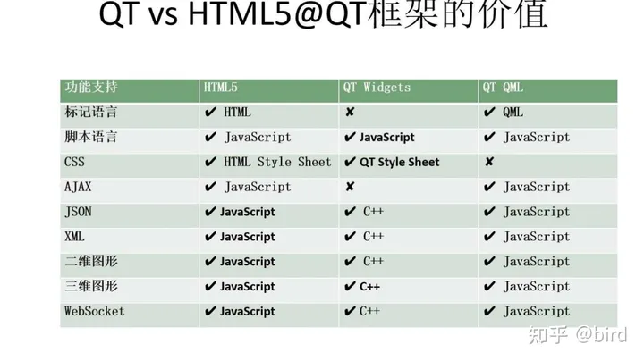

@[TOC](目录)

> 个人搜集资料并总结了一些跨平台开发技术，如有不足欢迎指正。

## 1.Qt
### 1.简介
> QT是一个跨平台的C++图形用户界面应用程序框架。它为应用程序开发者提供建立艺术级图形所需的所有功能。它是完全面向对象的，容易扩展，并且允许真正的组件编程。
### 2.优势
> 1. 使用Qt开发的程序可以运行在Windows、Linux、MAC、Android、IOS平台上，一套代码即可实现在多个系统平台上运行程序。
> 2. Qt支持图像渲染和OpenGL，可以支持软件渲染，也可以支持GPU硬件加速渲染。
> 3. QML提供更简单的基于3D渲染引擎高效的写跨平台GUI的方式。也就是说，HTML5支持的各种特性QT几乎全都支持了，如下图：
> 
>4. QT提供了一系列丰富的功能库，涵盖了图形界面、网络通信、数据库、多媒体、XML处理等多个领域。
> 5. Qt一共提供了两个版本，一个是用于商业化的商业版本，另外一个是为广大学习者和程序员提供的开源版本。这两个版本的功能差异很小，开发人员在遵循GPL协议的前提下完全可以使用开源版本来开发项目。

### 3.劣势

>1. Qt对Windows、Linux、Mac平台支持很好，但是对于Android、iOS、UWP等平台的支持目前还不是很完美。因为使用Qt来进行手机应用开发，制作出来的成品无论是界面、系统资源调用还是稳定性，肯定不如使用原生开发环境开发的要好。因此实际上还是很少人选择使用QT去开发Android和IOS应用。
>2. Qt的商业版权问题。如果公司用 Qt 开发闭源商业桌面软件，在 Windows/Mac/Linux上，可以使用动态库链接方式，遵循 LGPL 协议，是不用付费的，也不用开源你的代码。只需在你的商业软件的 about 等一些小角落，说明你使用了 Qt，遵循 LGPLV3 协议即可，你公司就可以开发闭源的商业软件。但是，如果使用静态库链接的方式开发 Windows/Mac/Linux上的闭源商业桌面软件，就要付费使用了，付费价格是 一年 3950 美元，三年 8400 美元。
## 2.NET Core+Vue
### 1.简介
> .NET Core是一个通用的跨平台软件开发框架，它允许开发人员构建各种软件，包括Web，桌面，移动，云，游戏，物联网等。主要特性包括开源、跨平台、现代、灵活、轻量级、快速、友好、可共享。

> Vue.js 是一个用于构建用户界面的 JavaScript 框架。
### 2.优点
> 1.ASP.NET Core可以灵活搭配各种前端框架,比如可以搭配Vue来实现前后端分离，可以搭配使用k8s，docker容器这些更令人着迷的新技术。
> 2. 使用.NETCore开发基于Web技术的应用程序，可以在WIndows、Linux、Macos、Android上以网页的方式运行。
## 3.Flutter
### 1.简介
> Flutter是一种用于构建用户界面的工具包，可以创建高度定制化的、响应式的移动应用。它包括了丰富的UI组件库、强大的渲染引擎和一套先进的开发工具，使开发者能够快速构建现代化的移动应用。
> 
### 2.优点
> 1.性能强大、流畅。
> 2. 支持插件，支持原生系统调用。
> 3. 开发者可以使用Dart语言只编写一次代码，然后将其编译到多个平台上，包括Windows桌面、Linux桌面、Android和iOS。
### 3.缺点
> 1.脱离不开原生，开发人员需要具备原生（Android、iOS）基础开发能力。
> 2. 原生集成第三方SDK后，兼容性适配很头疼。
> 3. 非真正跨平台，Flutter对Android和IOS开发友好，对WIndows开发不友好。Windows平台上的Flutter应用实际上只是Win32应用。如果想编写特定于平台的代码，就必须使用C++编写代码。然而，使用C++的NuGet包数量非常少。如果你想使用特定于平台的功能，就需要花费大量时间在Windows上用C++重新实现这些功能。参考链接：[Windows版Flutter应用开发体验远达不到Android和iOS的水平](https://baijiahao.baidu.com/s?id=1734246314449971802&wfr=spider&for=pc)
## 4.Maui
### 1.简介
> MAUI是微软最近2年新推出的一种跨平台应用程序的开源开发框架。
### 2.优点
> 1. MAUI构建在.NET生态系统的基础上，可以利用.NET的丰富工具和库来加速开发过程。
> 2. 开发人员可以编写一次UI代码，并在不同平台上复用，加快了开发速度并降低了代码复杂性。
### 3.缺点
> 1. 用vs搞MAUI工程，经常出现编译报错、清理工程后再次编译才成功的现象。另外，编译速度也很慢。
> 2. 使用Maui编写的代码可以再WIndows、Macos、Linux、IOS上运行，但无法在Linux上运行，无法做到真正跨平台。
> 3. 文档不完整，平台刚出来，文档还不够完整，特别是中文资料。
> 4. 社区支持不足：MAUI是一个相对较新的框架，开源的解决方案、案例比较少。

## 5.Avalonia
### 1.简介

> Avalonia是.NET的一个跨平台UI框架，提供了一个灵活的样式系统，支持广泛的操作系统，如Windows、Linux、macOS、Android、iOS。
### 2.优点
> 1. Avalonia的语法是比较适合WPF开发者的，前台是xaml界面，后台是C#代码，熟悉WPF的开发人员可以很快上手Avalonia开发。
> 2. 跨平台效果比较好。
### 3.缺点
> 1. dll比较多，资源占用比较大，简简单单的应用就要占用100多M的内存。
> 2. 商用要收费。
> 3. 国内使用人数较少，中文资料较少。
## 6. Cordova
### 1.简介
> Cordova 是一个基于 Apache 的开源框架，可以使用 HTML、CSS 和 JavaScript 创建移动应用程序，支持多个平台，包括 Android、iOS、Windows 和其他移动操作系统。
### 2.优点
> 1. 使用前端技术（例如 HTML、CSS 和 JavaScript）进行开发，易于学习。
> 2. 可以在多个平台上构建应用程序，并且可以通过插件扩展功能。
### 3.缺点
> 1. 应用程序性能可能不如其他跨平台框架。
> 2. 用户界面无法与原生应用程序媲美。
## 7.Electron
### 1.简介
> Electron 是一个用于构建跨平台桌面应用程序的开源框架，允许开发者使用 JavaScript、HTML 和 CSS来构建应用程序，支持 Windows、MacOS 和 Linux。
### 2.优点
> 1. 具有强大的支持和社区。
> 2. 可以使用前端技术进行开发，易于学习。
> 3. 可以构建跨平台桌面应用程序。
### 3.缺点
> 1. 应用程序大小可能较大。
> 2. 性能可能不如原生桌面应用程序。

